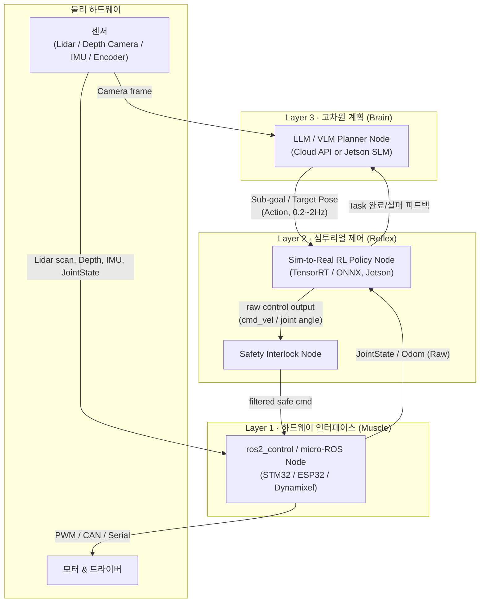
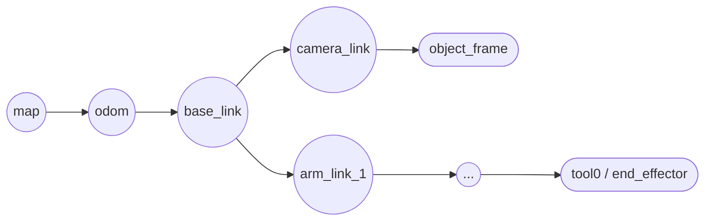
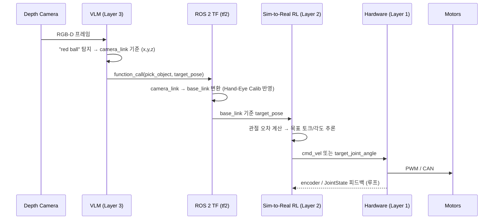
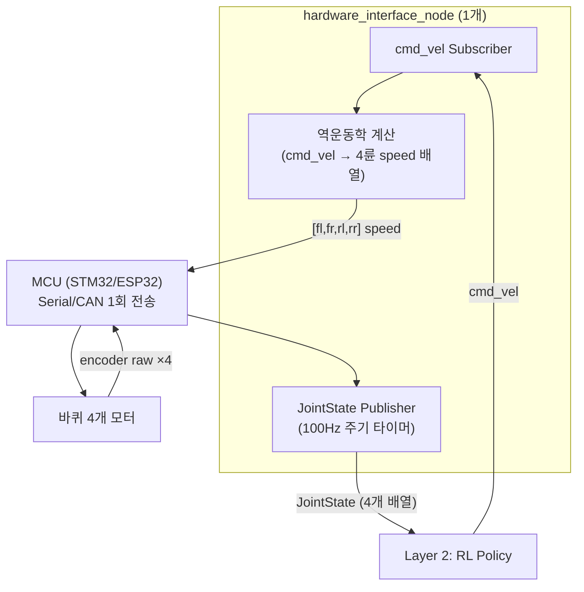

# ROS 2 자율주행/매니퓰레이터 시스템 아키텍처

> 출처: `ROS2 자율주행 시스템 구조 설명.pdf` (Gemini 대화 52페이지) 를 질문 의도 → 답변 요약 → 최종 통합 아키텍처 순으로 재구성한 문서.
> 검증 결과(과장/단순화된 부분)는 문서 맨 끝 [검증 노트](#검증-노트) 참고.

---

## 1. 대화 흐름 요약 (질문 의도 → 답변)

원본 대화는 "화이트보드 스케치 해석"에서 시작해 점점 상세한 질문으로 파고들며 아키텍처를 다듬어간 흐름입니다. 각 단계의 **질문 의도**와 **핵심 답변**을 정리합니다.

| # | 질문 의도 (사용자가 알고 싶었던 것) | 핵심 답변 |
|---|---|---|
| 1 | 화이트보드 그림이 어떤 ROS 2 구조를 뜻하는지 | 바퀴/IMU/라이다 → Odom/TF → 맵/위치추정으로 이어지는 표준 로봇 위치추정 구조. EKF 기반 센서 퓨전(`robot_localization`) 추정 |
| 2 | 그림 구조와 ROS 2 표준 설계의 차이 | 표준은 센서별로 TF를 각자 발행하고 중앙 EKF가 통합, Lifecycle Node로 센서 상태 관리, QoS(Best Effort/Reliable) 구분 필요 |
| 3 | Sim-to-Real로 배운 정책은 어디서 돌아가는지, 노드가 새로 생기는지, 결과는 어디로 가는지 | Jetson 온보드에 RL 추론 노드가 새로 생기고, 센서→RL→`cmd_vel`(모터 드라이버) 순으로 제어 루프 형성 |
| 4 | Nav2/MoveIt 대신 RL이 들어가는 구조인지 | 완전 대체(End-to-End)와 하이브리드(Nav2 글로벌 경로 + RL 로컬 제어) 두 방식이 있으며 실무는 하이브리드 선호 |
| 5 | 완전 대체 시 Sim-to-Real 입력/출력/보상 설계 | 입력=라이다·IMU·목표 상대좌표, 출력=`cmd_vel`(속도) 또는 관절 각도, 보상=목표 도달+진행+충돌+부드러움 |
| 6 | 모터 제어값 출력 형태 | 바퀴형은 `cmd_vel`(Twist), 관절형은 목표 관절각(Position) 또는 토크(Torque) — 안정성 때문에 목표각 방식 선호 |
| 7 | 계획(Task Planning)은 LLM이 담당 가능한지 | LLM/VLM(Layer3, 상위 계획) + RL(Layer2, 실시간 제어)의 **계층형(Hierarchical) 구조**로 역할 분담 |
| 8 | 레이어를 하드웨어제어/심투리얼/고차원계획 3개로 나누는 구조 정리 | 3-Tier 아키텍처 확정: Layer3 LLM(Brain) → Layer2 RL(Reflex) → Layer1 하드웨어(Muscle) |
| 9 | 다이어그램을 텍스트로 다시 | 3-Tier + 센서 피드백 흐름을 ASCII 다이어그램과 요약표로 정리 |
| 10 | 네비게이션/매니퓰레이션을 각각 학습시켜 전환하는지 | 상태 기반 스위칭(Task Switching)으로 Nav RL Policy ↔ Manipulator RL Policy를 전환. Lifecycle Node로 활성/비활성 관리 |
| 11 | 각각 학습 vs 통으로 학습(End-to-End VLA) | 실무는 모듈형(각각 학습 후 전환)이 80~90%, 통합 학습(VLA)은 최신 연구 단계(10~20%) |
| 12 | 바퀴 4개 인코더는 노드 1개? 여러 개? | 노드 1개(`hardware_interface_node`)로 통합, `sensor_msgs/JointState`에 4개 값을 배열로 담아 발행하는 것이 표준 |
| 13 | 바퀴 움직일 때(쓰기)도 마찬가지인지 | 제어 노드 1개가 `cmd_vel`을 받아 역운동학 계산 후 4개 바퀴 속도를 배열로 묶어 MCU에 한번에 전송 |
| 14 | 읽기/쓰기 노드를 분리해야 하는지 | 같은 시리얼/CAN 포트를 쓰면 1개 노드로 통합이 정석(포트 경합 방지, 타이밍 동기화) |
| 15 | Nav2를 빼면 맵파일도 필요 없는지 | Mapless RL은 맵 불필요(눈앞 센서로 반응). 단, 상위 LLM이 "201호로 가라" 같은 절대 목적지를 다루려면 위상지도(Topological Map)는 필요할 수 있음 |
| 16 | 위치보정(Localization)은 누가 하는지 | Mapless는 Odom(상대좌표)만으로 충분, Map-based는 EKF/AMCL/VIO 중 선택 |
| 17 | 라이다 대신 뎁스카메라만 써도 되는지 | 가능. 뎁스카메라는 3D 시야각+RGB 동시 활용 가능해 LLM/VLM 조합에 유리하나 FOV가 좁고(60~90도) 태양광에 약함 |
| 18 | 뎁스카메라 기반 위치보정은 누가 하는지 | Jetson GPU 가속 `isaac_ros_visual_slam`(VIO) 노드가 odom→base_link TF를 실시간 보정 |
| 19 | 오도메트리와 base_link TF의 관계 | `isaac_ros_visual_slam`이 `map→odom→base_link→camera_link` TF 트리 중 `odom→base_link`를 브로드캐스트 |
| 20 | 매니퓰레이터는 어떻게 처리하는지 | 이동 로봇과 동일한 3-Tier 패턴을 `base_link→end_effector` 기준으로 적용. Hand-Eye Calibration으로 카메라-손끝 좌표 연결 |
| 21 | Jetson 하나로 여러 노드를 동시에 조절하는 게 맞는지 | 맞음. Jetson 내부에 vSLAM/Pose Estimation/RL Inference/State Switch/Hardware Comm 노드가 병렬로 동작 |
| 22 | 로봇팔이 흔들리라는 명령을 예전엔 어떻게 했는지 | 과거: MoveIt 궤적 하드코딩 → 최신: LLM이 `pick()/shake()` 같은 Skill을 Function Calling으로 호출 |
| 23 | VLM 풀네임, Jetson에서 학습 가능 여부 | Vision-Language Model. Jetson에서 추론은 가능하나 학습(파인튜닝)은 PC/Colab 권장(LoRA로 몇 시간~며칠) |
| 24 | Sim-to-Real은 행동만 다루는 것인지 | 맞음. VLM(인지)과 Sim-to-Real RL(운동제어)은 역할이 완전히 다름 |
| 25 | VLM 파인튜닝 안 해도 되는지 | Zero-shot으로도 일반 객체 인식은 충분(95%+), 특수 부품/조명 예외 상황에서만 파인튜닝 고려 |
| 26 | 오픈CR을 안 써도 되는지, Layer1 대체재는? | Jetson-centric 구조에선 OpenCR 불필요. Dynamixel이면 U2D2, 그 외 모터면 ESP32/STM32(micro-ROS) |
| 27 | VLM 써도 맵파일이 필요 없는지 | 완전 Mapless 가능(VLM이 시각 랜드마크로 상대좌표 판단). 전역 탐색이 필요하면 위상지도 보조 필요 |
| 28 | VLM 입출력이 함수 호출 형태인지 | 맞음. 입력=이미지+자연어, 출력=`function_call` JSON(`pick_object(x,y,z)` 등) |
| 29 | 카메라가 실제 위치에서 벗어나 있으면? | ROS 2 TF + Hand-Eye Calibration이 카메라 좌표를 로봇 기준 좌표로 자동 보정, VLM은 몰라도 됨 |
| 30 | 그럼 실제 움직이는 건 VLA인지? | 아니오. 이 시스템은 VLM(인지)+RL(제어) 분리형이며 VLA(RT-2 등)와는 다른 패턴 |
| 31 | RL이 뭐고 좌표를 받아 어떻게 움직이는지 | Reinforcement Learning. 시뮬레이터에서 보상/벌점으로 수백만 번 시행착오해 학습한 정책이 좌표 오차를 관절 토크로 변환 |
| 32 | VLM을 여러 단계로 반복 호출(폐루프)하는 방법 | LLM 기반 에이전트 루프(ReAct 패턴): Perception→Decision→Action→Feedback을 반복 |
| 33 | Sim-to-Real에서 VLM/VLA도 학습 가능한지 | VLM은 Sim-to-Real 학습 불필요/불가(웹 데이터로 사전학습), VLA는 제한적, RL만 Sim-to-Real이 핵심/필수 |
| 34 | Sim-to-Real이 RL에만 국한되는지 | 아니오. 모방학습(Imitation Learning), 합성 데이터 비전학습, 전통 제어기 파라미터 튜닝도 Sim-to-Real 범주 |
| 35 | 결국 RL은 단일 목적 스킬만 잘하는 것 아닌지 | 맞음("외길 장인"). 그래서 상위 LLM/VLM의 계획 능력이 필수 |
| 36 | 지도 없이 A→B 이동 시 데이터 흐름 | 뎁스카메라+VIO로 상대좌표 추적, RL이 초당 20~50회 장애물/목표 벡터를 보고 속도 명령 출력 |
| 37 | 이동 중 QR코드 인식 시 즉시 멈추는 법 | 상위 LLM이 감시하면 반응이 느림(200~500ms) → 경량 OpenCV 노드가 QR 감지 즉시 RL에 Interrupt(0.01초 내) |
| 38 | "가는 도중 QR 인식" 같은 병렬 미션 처리 | 상위 레이어가 Main Task(이동)+Sub Trigger(백그라운드 스캔)를 동시에 계획, Behavior Tree로 구현 |
| 39 | VLM/VLA를 일반인이 학습시킬 수 있는지 | 거의 불가(파운데이션 모델). 오픈소스 모델 파인튜닝 정도만 현실적, 심투리얼(Isaac Sim)은 RL 학습용 |
| 40 | 로봇마다 VLA를 새로 만들어야 하는지 | 하드웨어(관절 수 등)가 다르면 출력 차원이 달라 기본적으로 필요. 단, Cross-Robot 사전학습(RT-X) 후 파인튜닝으로 해결 |
| 41 | VLM이 로봇 설계가 달라도 그대로 되는지 | 맞음. VLM은 로봇 관절과 무관하게 카메라 좌표만 다룸(하드웨어 의존성 0%) |
| 42 | Eye-in-Hand/Eye-to-Hand 카메라 위치 차이 문제 | VLM은 카메라 렌즈 기준 좌표만 내고, TF+Hand-Eye Calibration이 실제 오프셋을 수학적으로 흡수 → VLM 재사용 가능 |

---

## 2. 최종 통합 아키텍처 (3-Tier Hierarchical)

대화 전체를 관통하는 결론은 **"고차원 계획(LLM/VLM) + 심투리얼 제어(RL) + 하드웨어 인터페이스"** 3계층 구조입니다.

| 구분 | Layer 3 (계획) | Layer 2 (제어) | Layer 1 (하드웨어) |
|---|---|---|---|
| 주요 엔진 | LLM / VLM | Sim-to-Real RL Policy | Microcontroller / ros2_control |
| 입력값 | 음성/텍스트, 카메라 프레임 | Lidar/Depth, IMU, 목표 좌표 | cmd_vel, 관절 목표 각도 |
| 출력값 | 단계별 Sub-goal (function call) | cmd_vel 또는 관절 목표 각도 | 모터 PWM, 전기 신호 |
| 제어 주기 | 이벤트 기반 (~0.2~2Hz) | 20~100Hz | 100~1000Hz |
| 실행 위치 | Cloud API 또는 Jetson SLM | Jetson (TensorRT Engine) | MCU (STM32, ESP32 등) |

---

## 3. 좌표계 & TF 트리

- **odom → base_link**: 이동 로봇의 위치추정 노드(`isaac_ros_visual_slam`, EKF, 또는 wheel odometry)가 실시간 브로드캐스트.
- **base_link → camera_link / arm_link**: 로봇 설계 시점의 **고정값**(URDF 또는 `static_transform_publisher`, Hand-Eye Calibration으로 산출).
- VLM은 **camera_link 기준 좌표**만 출력하고, ROS 2 `tf2`가 이를 `base_link` 기준으로 자동 변환해 RL Policy에 전달 → VLM은 로봇 종류/카메라 위치에 무관하게 재사용 가능.

---

## 4. 센서/모터 노드 통합 원칙

바퀴 4개, 관절 여러 개라도 **하드웨어 통신 채널(시리얼/CAN 포트) 1개당 노드 1개**로 통합하는 것이 표준입니다.

이유: ① 4개 데이터의 **타임스탬프 동기화**, ② 시리얼/CAN 포트 하나를 두 노드가 나눠 쓰면 **통신 충돌(Race Condition)** 발생, ③ `sensor_msgs/JointState`가 애초에 배열(list) 구조로 설계됨.

---

## 5. VLM vs VLA vs Sim-to-Real RL 역할 비교

| 구분 | VLM (Vision-Language Model) | Sim-to-Real RL | VLA (Vision-Language-Action) |
|---|---|---|---|
| 담당 영역 | 시각 인지 & 고차원 판단 | 실제 물리적 신체 제어 | 인지+제어 통합 |
| 입력 | 이미지 + 자연어 | 센서 상태 + 목표 좌표 | 이미지 + 자연어 |
| 출력 | 텍스트 / 좌표 (JSON) | 관절 토크·속도 명령 | 관절 토크·속도 명령 (직접) |
| 학습 데이터 | 웹 텍스트+이미지 (Pre-training) | 시뮬레이터 물리 법칙+보상 | 실제 로봇 궤적 데이터 (대규모) |
| 하드웨어 의존성 | 없음 (100% 무관, 재사용 가능) | 로봇마다 재학습 필요 | 매우 높음 (관절 스펙에 종속) |
| Sim-to-Real 학습 여부 | ✗ 불필요/불가 | ✓ 핵심/필수 | △ 제한적, 실제 데이터 위주 |
| 실무 채택 비중(추정) | — | ~80~90% (모듈형) | ~10~20% (End-to-End, 연구 단계) |

**결론**: "VLM(눈/뇌) + TF(수학 변환) + Sim-to-Real RL(손발)" 분리형 하이브리드가 현재 Jetson 급 온보드 컴퓨팅에서 가장 현실적인 조합. VLA는 로봇마다 파인튜닝(Cross-Robot Training)이 필요해 재사용성이 낮음.

---

## 6. 안전장치 & Edge Case 체크리스트

- **Safety Interlock Node**: Layer2(RL)와 Layer1(하드웨어) 사이에 배치, RL이 이상 동작(임계값 초과 cmd_vel, 충돌 임박) 시 0.001초 단위로 강제 정지.
- **제어 주기 불일치**: 시뮬레이션(100Hz) vs 실제 Jetson 추론(20Hz 등) 괴리 시 로봇이 뒤뚱거림 → Loop rate를 반드시 실기기에서 재검증.
- **QR/이벤트 인터럽트**: 상위 LLM이 직접 감시하면 반응 지연(200~500ms) → 경량 OpenCV 노드가 즉시 Cancel Goal 전송.
- **바퀴 슬립 / IMU 드리프트**: Odom 단독 의존 시 오차 누적 → 스캔 매칭(ICP) 또는 IMU 가중치 조정 필요.
- **Task Switching 전환 버퍼**: Nav→Manip 전환 시 0.5~1초 정지+진동 흡수 구간 필요(급전환 시 하드웨어 흔들림).
- **Plan Validator**: LLM 환각(존재하지 않는 물리적 행동 계획) 방지를 위해 LLM 출력과 RL 사이에 행동 범위 검증 노드 권장.

---

## 검증 노트

원본 대화(및 위 요약)를 그대로 신뢰하지 말고 아래 관점에서 걸러서 볼 것:

1. **"3-Tier LLM+RL 구조가 업계 표준"이라는 표현은 과장.** 실제 배포된 ROS 2 로봇 다수는 여전히 Nav2/MoveIt 고전 스택을 사용합니다. 이 문서의 구조는 **연구 최전선 트렌드 중 하나**로 이해할 것.
2. VLM이 "3D 좌표를 직접 출력한다"는 서술은 문맥에 따라 부정확할 수 있음 — 실제로는 2D 픽셀 bbox + Depth 데이터 결합이 필요한 경우가 많음.
3. 제어 주기 수치(LLM 0.2~2Hz, RL 20~100Hz)는 참고용 경향치이며 모델/하드웨어에 따라 편차 큼.
4. VLA가 실시간 제어를 절대 못한다는 단정은 과함 — 경량 VLA(ACT, Diffusion Policy)는 30~50Hz도 가능.
5. 원본 대화는 사용자의 질문 방향이 바뀔 때마다 이전 주장과 다소 모순되는 내용에도 강하게 동의하는 패턴(sycophancy)이 있어, 설계 결정 전 개별 항목은 별도 검증 권장.
