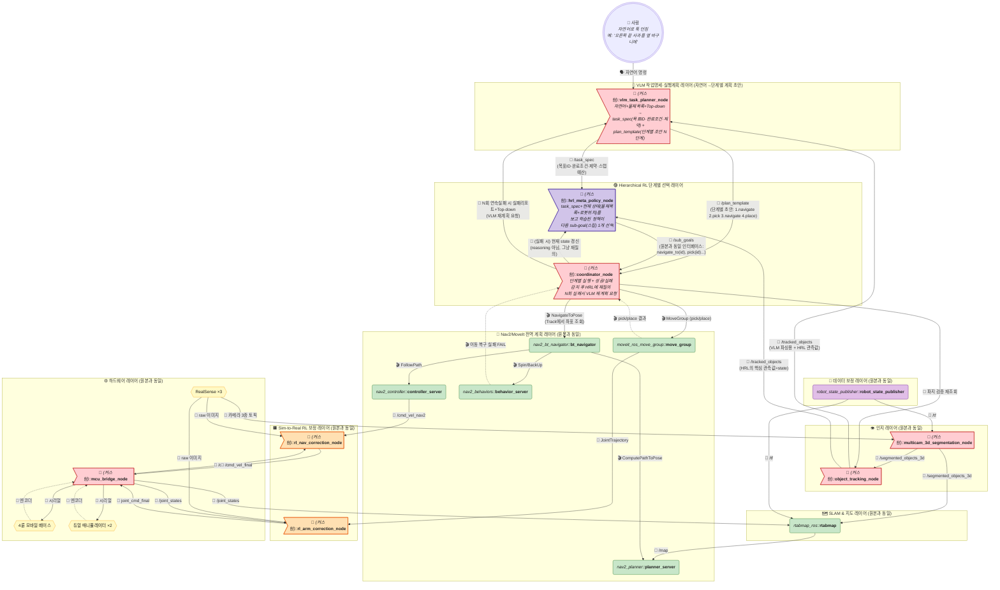
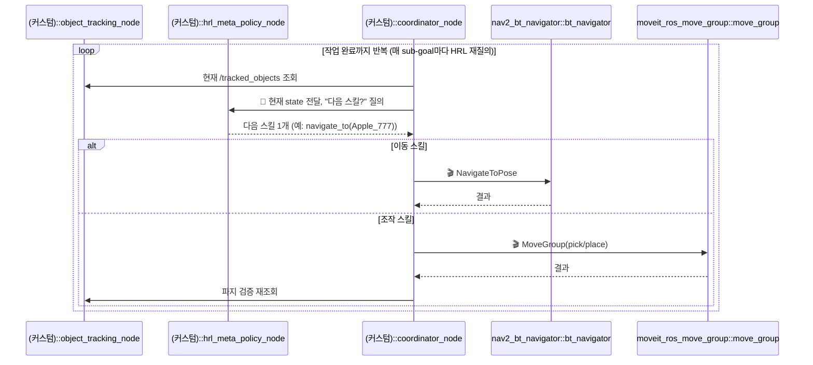
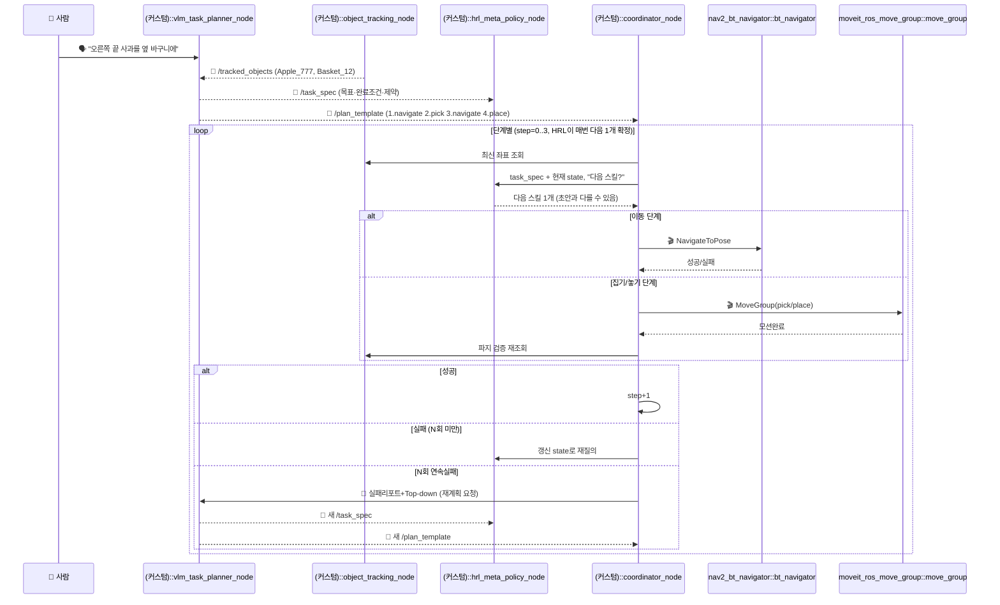
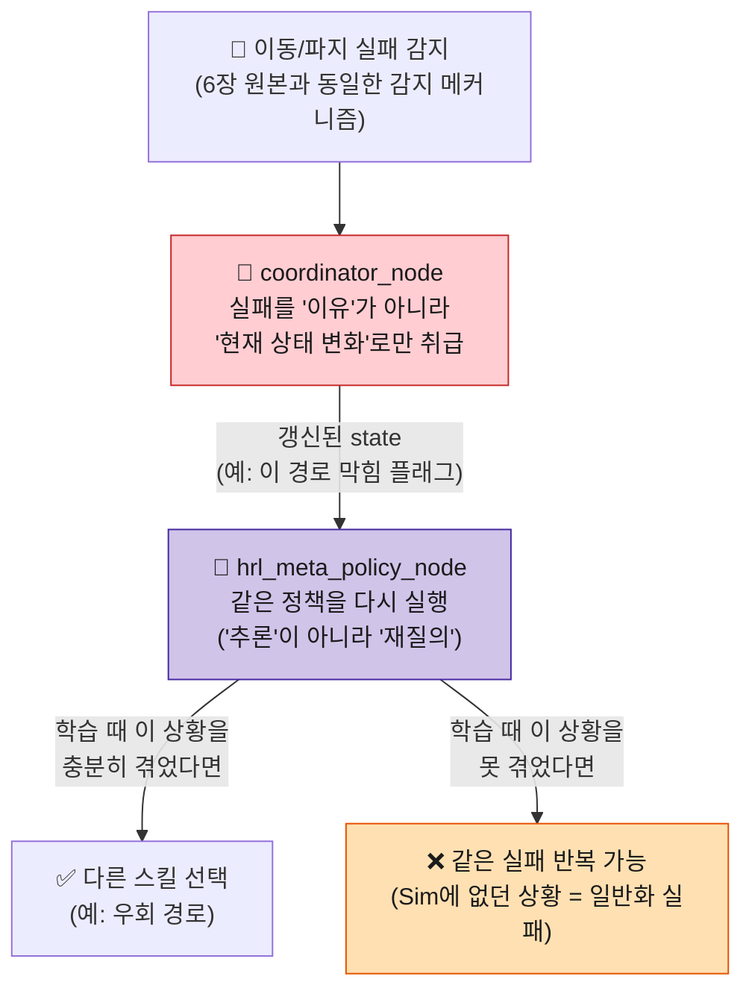

# 듀얼암 + 멀티카메라 + VLM+HRL 하이브리드 통합 로봇 조작 시스템

> 🧭 이 문서는 [ros2-dualarm-multicam-vlm-rl-architecture.md](./ros2-dualarm-multicam-vlm-rl-architecture.md)의 자매 문서입니다. **하드웨어·인지 파이프라인·SLAM·Nav2+RL 잔차보정 레이어는 100% 동일**하고, 최상위가 **VLM(`vlm_task_planner_node`: 자연어→작업명세·단계별 실행계획) + HRL(`hrl_meta_policy_node`: 단계별 다음 스킬 선택)** 2층 하이브리드인 버전입니다. 도형/색상/이모지 규칙도 동일합니다.
>
> 한 줄: **VLM은 "무슨 일을 몇 단계로 할지" 초안+작업명세를 뽑고, HRL은 매 단계 "지금 다음 스킬 하나"를 고릅니다.** 사용자는 자연어로 툭 던지면 됩니다 (예: "오른쪽 끝 사과를 옆 바구니에").
>
> 이 문서만 읽어도 이해되도록 전체 구조를 다시 그렸지만, 1~3장·5장(하드웨어/인지/SLAM/Nav2+RL 보정)은 원본 문서 내용을 그대로 가져온 것이니 세부 토픽/메시지 타입은 [원본 문서](./ros2-dualarm-multicam-vlm-rl-architecture.md)를 참고하세요.

---

## 0. 전체 구조 한눈에 보기

**이 문서(VLM+HRL 하이브리드)**: VLM이 최초 1회 자연어를 `task_spec`+`plan_template(단계별 초안)`으로 풀고, 이후 매 단계 HRL이 다음 스킬 1개를 고릅니다. HRL이 막히면 같은 state로 재질의하고, N회 연속실패시에만 VLM이 재계획합니다. 자연어→단계별 처리 전체 흐름은 4.5장 참고.

---

## 1~3장, 5장: 하드웨어 / 인지 / SLAM / Nav2+RL 보정

**원본과 100% 동일**합니다. 실제 토픽명·메시지 타입·다이어그램은 [원본 문서](./ros2-dualarm-multicam-vlm-rl-architecture.md)의 해당 장을 그대로 참고하세요:
- [1장 하드웨어 & TF](./ros2-dualarm-multicam-vlm-rl-architecture.md#1-하드웨어--tf-구성)
- [2장 인지 파이프라인](./ros2-dualarm-multicam-vlm-rl-architecture.md#2-인지-파이프라인-perception--tracking--실제-토픽메시지-타입)
- [3장 SLAM & Nav2 지도 연동](./ros2-dualarm-multicam-vlm-rl-architecture.md#3-slam--nav2-지도-연동)
- [5장 Nav2(전역)+RL(보정) 계층적 제어](./ros2-dualarm-multicam-vlm-rl-architecture.md#5-nav2전역--rl보정-계층적-제어)

---

## 4. `hrl_meta_policy_node` 상세

| 항목 | 내용 |
|---|---|
| 입력 (관측값/State) | `/tracked_objects`(물체 ID+3D좌표+부피 목록), 현재 로봇 위치(`/tf`의 map→base_link), 현재 진행 중인 sub-goal 인덱스, (선택) 사람의 언어 임베딩 |
| 출력 (Action) | `/sub_goals`와 **동일한 인터페이스** — `navigate_to(id)`, `pick(id)`, `place(id)` 등 스킬 함수호출. 다만 **한 번에 전체 시퀀스를 안 내놓고, 매 스텝(또는 매 sub-goal 완료 시)마다 "다음 스킬 하나"만 출력**하는 경우가 많음 (아래 참고) |
| 학습 방식 | 시뮬레이션에서 "전체 작업 완료까지 걸린 시간/이동거리"에 페널티를, "성공"에 보상을 주는 강화학습. `nav_rl_policy`/`manip_rl_policy`보다 **한 단계 위 추상도**(스킬 선택 자체가 행동 공간) |
| 학습 프레임워크 | Options Framework / Hierarchical RL (예: HIRO, Feudal Networks 계열 알고리즘) |

> **VLM처럼 "한 번에 전체 계획"을 안 내놓는 이유**: VLM은 언어 추론으로 한 번에 `[이동, 집기, 이동, 놓기]` 전체 시퀀스를 뽑아낼 수 있지만, RL 정책은 보통 **매 순간 "지금 상태에서 최선의 다음 행동 하나"만 판단**하도록 학습됩니다. 그래서 `coordinator_node`가 sub-goal 하나를 끝낼 때마다 HRL에게 "다음엔 뭐 할까?"를 **매번 다시 물어보는 구조**가 됩니다 — 아래 시퀀스 다이어그램 참고.

> VLM 버전(원본 4장)과 비교하면: VLM 단독은 **최초에 한 번** 전체 계획을 세우고 Coordinator가 그 리스트를 순서대로 소비했지만, 본 하이브리드는 **VLM이 초안+작업명세만 내고 매 스텝 HRL이 다음 1개를 확정**합니다 — HRL 정책 자체가 "지금 상태 → 다음 행동"만 아는 반응형(reactive) 정책이기 때문입니다.

---

## 4.5. VLM 자연어 → 단계별 실행계획 (본 문서 신규)

사용자가 "오른쪽 끝 사과를 옆 바구니에" 툭 던지면 아래 순서로 풀립니다.

| 단계 | 주체 | 입/출력 | 예시 |
|---|---|---|---|
| 0. 목표 파싱 | `vlm_task_planner_node` | 자연어 + `/tracked_objects` + Top-down 1장 → `/task_spec` | `target: Apple_777(오른쪽 끝), goal: Basket_12, done: Apple_777 in Basket_12, budget: 8스텝` |
| 1. 실행계획 초안 | `vlm_task_planner_node` | → `/plan_template` (참고용, 강제 아님) | `1.navigate_to(Apple_777) 2.pick 3.navigate_to(Basket_12) 4.place` |
| 2. 단계별 확정 | `hrl_meta_policy_node` | `task_spec` + 현재 state → 다음 스킬 1개 | `step=0 → navigate_to(Apple_777)` |
| 3. 실행 | `coordinator_node` | `plan_template`의 현재 단계와 HRL 제안을 대조 → `BT`/`MoveGroup` 호출 | 좌표는 `Track`에서 최신값 조회 |
| 4. 검증·전진 | `coordinator_node` | 성공 시 `step+1` → HRL 재질의 | 실패 시 같은 state 재질의, N회 실패 시 VLM 재계획 요청 |

> 포인트: VLM 초안(`plan_template`)은 **힌트**이지 강제 시퀀스가 아닙니다. HRL이 현재 state에서 더 효율적인順序를 알면 초안과 다르게 골라도 됩니다 (예: 바구니가 먼저 가까우면 placeable한 다른 물체부터). VLM 재호출은 N회 실패·모호지시 때만이라 실시간 루프 밖입니다.

---

## 6. 돌발상황 처리 — VLM의 "재계획"과 근본적으로 다름

**원본 문서(VLM 버전)**: 실패 발생 → Coordinator가 실패 리포트+이미지를 모아서 VLM에게 보냄 → VLM이 **"왜 실패했는지 추론해서 대안을 설계"**(예: "오른쪽이 막혔으니 왼쪽으로 우회") → 새 sub-goal 전달.

**이 문서(VLM+HRL 하이브리드)**: 1차는 HRL 재질의입니다. `coordinator_node`가 실패를 감지하면 **갱신된 현재 상태를 다시 HRL에 넣고 "다음 스킬?"을 한 번 더 물어봅니다**. HRL 정책이 학습 중에 "이 상황에서 이 행동은 실패했었다"는 걸 이미 체득했다면 알아서 다른 스킬을 고르지만, **그런 상황을 학습 때 충분히 경험하지 못했다면 같은 실패를 반복할 수 있어서 N회 연속실패 시에는 VLM에 실패리포트+Top-down을 보내 재계획**합니다 (4.5장 시퀀스 참고). VLM 단독 문서처럼 매 실패마다 VLM을 부르지 않는 게 차이입니다.

> **이게 VLM 대비 HRL의 가장 큰 약점입니다.** VLM은 학습 데이터에 없던 상황도 "추론"으로 그럴듯한 대안을 짜낼 수 있지만, RL 정책은 **시뮬레이션 학습 때 경험한 상황 분포를 벗어나면 무너집니다.** 그래서 실무에서는 이 실패 복구 로직에 "N번 연속 같은 실패 시 사람에게 알림" 같은 **하드코딩된 최후 안전장치**를 꼭 같이 넣습니다 (HRL 정책만 믿고 무한 루프 돌게 두면 안 됨).

---

## 7. 학습 파이프라인 (이 문서만의 신규 항목)

VLM 버전에는 없던, HRL 메타 정책 고유의 학습 준비 작업입니다.

| 항목 | 내용 |
|---|---|
| 시뮬레이션 환경 | 듀얼암+3카메라 로봇 전체를 Isaac Sim 등에 구성, 물체 스폰 랜덤화 |
| 상태 공간(State) 설계 | 물체 ID/좌표 목록을 **가변 개수**로 어떻게 고정 크기 텐서로 인코딩할지가 핵심 난제 (Set Transformer, Attention 기반 인코더 등 필요) |
| 보상함수 설계 | `R = R_task_success - R_time_penalty - R_distance_penalty - R_collision` — "얼마나 효율적으로 끝냈는가"가 핵심 |
| 실패 상황 커리큘럼 | 장애물 막힘/파지 실패 시나리오를 **의도적으로 다양하게 주입**해서 학습해야 6장의 "학습 못 한 상황" 문제가 줄어듦 (Domain/Task Randomization) |
| Sim-to-Real 검증 | 실기에서 "학습 때 못 본 배치"를 일부러 테스트해서 일반화 한계를 미리 파악 |

---

## 8. VLM 버전과 비교 + 현실적 하이브리드

| | VLM 기반 (원본 문서) | VLM+HRL 하이브리드 (이 문서) |
|---|---|---|
| 판단 방식 | 언어 추론 | VLM 추론(초안+명세) + 학습된 보상 최적화(단계 확정) |
| 자연어 명령 | ✅ 기본 지원 | ✅ 지원 (VLM이 파싱, 4.5장) |
| 계획 시점 | 최초 1회 전체 시퀀스 생성 | VLM 초안 1회 + 매 sub-goal마다 HRL 재질의 (반응형) |
| 실패 복구 | 추론 기반 재계획 (학습 안 한 상황에도 대응 가능) | HRL 재질의 우선, N회 실패 시 VLM 재계획 (2단 방어) |
| 학습 필요 | 파인튜닝 정도 | VLM 파인튜닝 + **HRL 전용 시뮬레이션 학습 전체** |
| 적합한 상황 | 지시가 매번 바뀌는 경우 | 지시는 자연어로 + 같은 작업 반복 효율 최적화 (예: 물류 피킹) |

**현실적 절충안**: VLM은 "언어→관련 물체 후보"까지만 추리고, "그 물체들을 어떤 순서로 처리해야 가장 효율적인지"라는 최적화 판단만 HRL에 맡기는 조합도 가능합니다 — 자세한 다이어그램은 [원본 문서 8장](./ros2-dualarm-multicam-vlm-rl-architecture.md#8-심화-rl을-상위-개념으로-쓰는-대안--hierarchical-rl)에 있습니다.

---

## 9. 노드 요약 & 제공 여부

| 노드 | 제공 여부 |
|---|---|
| (1~3, 5장 노드 전부) | 원본 문서와 동일 |
| `vlm_task_planner_node` | 🔧 **직접 구현 필요** (자연어→`task_spec`+`plan_template`, 4.5장 참고) |
| `hrl_meta_policy_node` | 🔧 **직접 구현 필요** (+ 전용 Hierarchical RL 학습 파이프라인, 7장 참고) |
| `coordinator_node` | 🔧 **직접 구현 필요** (VLM 초안+ HRL 확정 병합, N회 실패 시 VLM 재계획 요청) |

---

## 10. 참고: 다른 문서와의 관계

- **원본(VLM 기반)**: [ros2-dualarm-multicam-vlm-rl-architecture.md](./ros2-dualarm-multicam-vlm-rl-architecture.md) — 하드웨어/인지/SLAM/Nav2+RL 보정 레이어의 원본
- **단일암 TurtleBot3 5종 문서**: [룰베이스](./ros2-turtlebot3-manipulator-example.md) · [E2E](./ros2-turtlebot3-manipulator-e2e.md) · [RL(Mapless)](./ros2-turtlebot3-manipulator-simtoreal-rl.md) · [하이브리드](./ros2-turtlebot3-manipulator-hybrid.md) · [VLA](./ros2-turtlebot3-manipulator-vla.md)
- **개념적 원형**: [ros2-architecture.md](./ros2-architecture.md)
