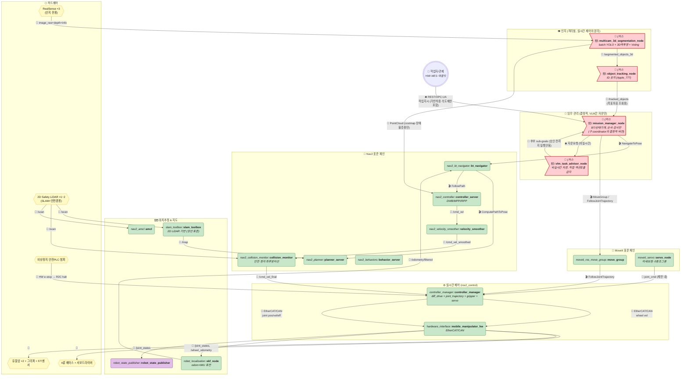
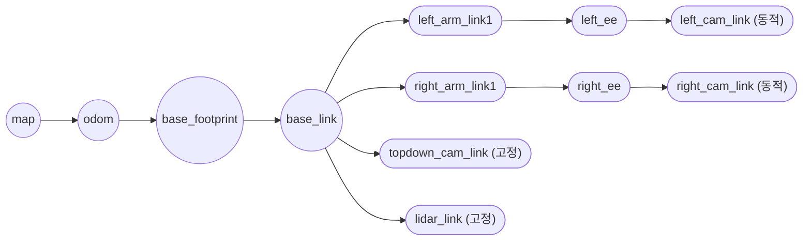
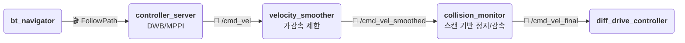
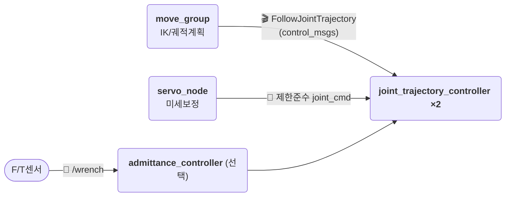
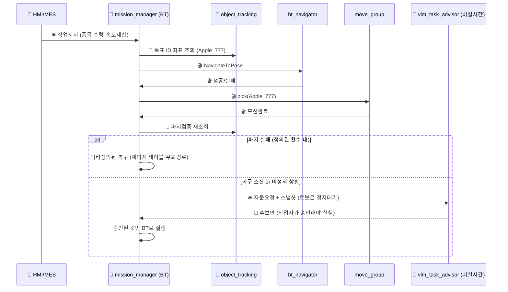
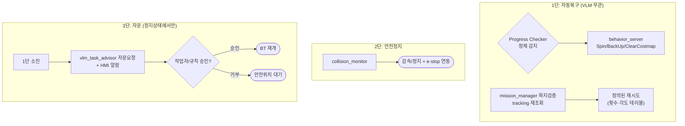

# 듀얼암 + 멀티카메라 모바일 매니퓰레이터 — 현업 표준 ROS 2 아키텍처

> [ros2-dualarm-multicam-vlm-rl-architecture.md](./ros2-dualarm-multicam-vlm-rl-architecture.md)의 연구형 구조(Nav2/MoveIt 뒤 RL 잔차보정 + 시리얼 `mcu_bridge`)를 **현업 양산형**으로 바꾼 버전입니다. 하드웨어(4륜 베이스 + 듀얼암 + RealSense 3대)는 동일 가정, 실행경로만 바꿉니다.
>
> 도형/이모지 규칙은 자매 문서와 동일: 💊 알약=노드, ⬡ 육각=하드웨어, 🚩 깃발=커스텀, 🛢️ 원기둥=데이터/지도, 📨 토픽·🎬 액션·🛎️ 서비스·🔌 필드버스(EtherCAT/CAN).
>
> 핵심 차이 한 줄: **RL을 실시간 경로에서 제거, VLM을 실시간 루프에서 격리, `mcu_bridge`를 `ros2_control`로 교체, 안전 체인을 추가.**

---

## 0. 전체 구조 한눈에 보기

**읽는 법:** 실시간 주행/조작 경로에는 학습 모델이 없음. VLM·YOLO는 경로 밖에서 자문·조회만 한다.

---

## 1. 하드웨어 & ros2_control & TF — 연구형과 가장 크게 달라지는 곳

| 항목 | 연구형(VLM-RL 문서) | 현업(본 문서) | 이유 |
|---|---|---|---|
| 모터 인터페이스 | `mcu_bridge_node` 시리얼 직접 read/write | `controller_manager` + `hardware_interface` → EtherCAT/CAN 서보드라이버 | 실시간성·동기·진단·안전정지. 시리얼은 지터·대역폭 한계 |
| 베이스 제어기 | RL이 `/cmd_vel` 가로채서 보정 | `diff_drive_controller` + `velocity_smoother` + `collision_monitor` | 결정적 속도프로파일 + 최후방어선 |
| 팔 제어기 | RL이 궤적을 토크로 덮어씀 | `joint_trajectory_controller` + `gripper_controller` (+ 필요시 `admittance_controller`) | MoveIt 제한(속도·가속·토크) 우회 금지 |
| 안전 | 없음 (Behavior 복구만) | Safety LiDAR + `collision_monitor` + HW e-stop + 안전PLC | ISO 10218 / ISO 3691-4 대응 |
| TF | `robot_state_publisher`만 | 동일 + `ekf_node(map→odom→base_footprint→base_link)` | `odom`을 EKF 퓨전값으로 통일 |

> Eye-in-Hand(암 카메라 동적 TF) / Eye-to-Hand(상부 고정 TF) 원리는 동일. 달라지는 건 `odom` 소스가 `mcu_bridge` 엔코더 직접값이 아니라 `ekf_node` 퓨전값이라는 점.

---

## 2. 인지 파이프라인 — 구조는 유지, 연결만 격리

| 노드 | 구독 | 발행 | 메시지 타입 |
|---|---|---|---|
| `realsense2_camera_node` ×3 | — | `/{ns}/color/image_raw`, `/{ns}/aligned_depth_to_color/image_raw`, `/{ns}/color/camera_info` | `sensor_msgs/Image`, `sensor_msgs/CameraInfo` |
| `multicam_3d_segmentation_node` 🚩 | 위 9개 + `/tf` | `/segmented_objects_3d` | `vision_msgs/Detection3DArray` (frame_id=`base_link`) |
| `object_tracking_node` 🚩 | `/segmented_objects_3d` | `/tracked_objects` | 커스텀 (`id`, `pose`, `velocity`, `class`, `volume`) |

현업식 격리 3원칙:

1. **인지 → SLAM 직접 주입 금지.** 연구형처럼 분할 pointcloud를 `rtabmap`에 넣지 않는다. 양산 SLAM(`slam_toolbox`)은 2D LiDAR `/scan` 기반. 카메라 pointcloud는 `costmap` 장애물층 보조 입력으로만 사용 (또는 미사용).
2. **인지 → 제어 직접 연결 금지.** YOLO/Tracking 출력이 `/cmd_vel`·`joint_cmd`를 직접 만들지 않는다. `mission_manager`가 좌표 조회용으로만 쓴다.
3. **GPU 분리 권장.** YOLO 배치 추론과 주행 컨트롤러를 같은 Jetson에 두면 지터 전파. 분리 보드 또는 QoS·우선순위 격리.

---

## 3. 주행 — Nav2 표준 체인 (RL 없음)

- `planner_server`: `SmacPlanner` / `NavFn`, `/map` 기반 전역경로.
- `controller_server`: DWB 또는 MPPI 그대로. 파라미터는 `nav2_params.yaml`로 관리·버전관리.
- `velocity_smoother`: 가반하중·적재 유무에 따라 프로파일 전환 (빈손/파지중 분리 — `mission_manager`가 파라미터 set).
- `collision_monitor`: Safety LiDAR `/scan` 직결. BT·Controller를 우회하는 최후 정지선이라 반드시 HW e-stop과 연동.

---

## 4. 조작 — MoveIt 표준 체인 (토크 오버라이드 없음)

- 듀얼암은 SRDF에 `left_arm` / `right_arm` / `both_arms` 그룹 분리. 양팔 협조 작업만 `both_arms` 사용.
- 파지 검증은 연구형과 동일하게 `mission_manager`가 `object_tracking` 재조회로 수행 (MoveIt result는 모션완료 의미뿐). 단, 판단 결과는 미리 정의된 복구 BT(재파지 각도 테이블)로 처리 — VLM 호출 아님 (6장 참고).
- 힘제어 필요시 RL 토크 보정 대신 `admittance_controller` + F/T센서 사용. 인증 가능한 선형 컴플라이언스.

---

## 5. 임무 관리 — VLM은 자문, 실행은 결정적 BT

연구형: `vlm_task_planner → coordinator` 가 실시간 루프 안에 있음.
현업: `mission_manager(BT)` 가 실행 전권, `vlm_task_advisor`는 비실시간 자문.

원칙:

- VLM 출력은 **승인 전 실행 금지 (human-in-the-loop 또는 rule-gate)**.
- 정상계·1차복구는 VLM 없이 100% 동작해야 함. VLM 장애 = 작업일시정지이지 폭주가 아님.
- `/sub_goals` 같은 자유형 함수호출 대신, 검증된 스킬 ID(`SKILL_PICK_APPLE`, `SKILL_PLACE_BASKET`) 열거형으로 제한.

---

## 6. 폐루프 예외처리 — 3단 방어선

---

## 7. RL은 어디에? — 실행경로 밖 3곳만

| 위치 | 용도 | 실행경로 영향 |
|---|---|---|
| 오프라인 파라미터 튜닝 | DWB/MPPI 가중치, smoother 프로파일 탐색 | 없음 (배포는 yaml로) |
| Shadow mode 로깅 | `/cmd_vel`·`JointTrajectory` 옆에서 추론만, 발행 안 함 | 없음 (기록·평가만) |
| 시뮬레이터(Issac Sim/Gazebo) 사전검증 | 자문안·신규 스킬 검증 | 없음 |

> 현장 갭이 크다면 RL 잔차노드 추가가 아니라 **캘리브레이션(엔코더·질량·마찰 식별) + controller 게인 스케줄링**을 먼저 한다. 그게 현업의 1순위 처방.

---

## 8. 노드 요약 & 제공 여부

| 노드 | 제공 여부 |
|---|---|
| `realsense2_camera_node` ×3 | ✅ 제공 (Intel 공식) |
| `slam_toolbox`, `amcl`, `ekf_node`, `robot_state_publisher` | ✅ 제공 |
| `bt_navigator`, `planner_server`, `controller_server`, `velocity_smoother`, `collision_monitor`, `behavior_server` | ✅ 제공 + `nav2_params.yaml` 필요 |
| `move_group`, `servo_node`, `controller_manager`, `diff_drive/joint_trajectory/gripper/admittance_controller` | ✅ 제공 + SRDF·`ros2_controllers.yaml` 필요 |
| `multicam_3d_segmentation_node`, `object_tracking_node` | 🚩 직접 구현 (인지 격리 원칙 준수) |
| `mission_manager_node` | 🚩 직접 구현 (BT 기반, Nav2 `bt_navigator` + `BehaviorTree.CPP` 권장) |
| `vlm_task_advisor_node` | 🚩 직접 구현 (비실시간, 승인게이트 필수) |
| RL 노드 | ❌ 실행경로에 두지 않음 (7장 위치만 허용) |
| `mcu_bridge_node` | ❌ 삭제, `hardware_interface`로 대체 |

### 주요 인터페이스

| 구간 | 타입 | 이름 |
|---|---|---|
| 작업지시 | 🛎️ Service/OPC-UA | `SubmitTask` (스킬ID 열거형) |
| 이동 | 🎬 Action | `NavigateToPose`, `FollowPath`, `ComputePathToPose` |
| 조작 | 🎬 Action | `FollowJointTrajectory` (`control_msgs`) |
| 속도 최종단 | 📨 Topic | `/cmd_vel` → `/cmd_vel_smoothed` → `/cmd_vel_final` (`geometry_msgs/Twist`) |
| 인지조회 | 📨 Topic | `/tracked_objects` (커스텀), `/segmented_objects_3d` (`vision_msgs/Detection3DArray`) |
| 안전 | 🔌 HW + 📨 | e-stop 하드와이어 + `/scan` → `collision_monitor` |

---

## 9. 자매 문서와의 관계

- [ros2-dualarm-multicam-vlm-rl-architecture.md](./ros2-dualarm-multicam-vlm-rl-architecture.md): 본 문서의 연구형 원본. RL 잔차보정 + `mcu_bridge` + VLM 실시간 루프 버전.
- [ros2-dualarm-multicam-hierarchical-rl-architecture.md](./ros2-dualarm-multicam-hierarchical-rl-architecture.md): 최상위를 HRL 메타정책으로 교체한 또 다른 연구형. 현업 전환 시 동일하게 실행경로에서 제거 대상.
- [ros2-rule-based-architecture.md](./ros2-rule-based-architecture.md): Nav2 표준 체인의 개념 원형. 본 문서는 그것을 듀얼암 모바일 매니퓰레이터에 확장한 것.
- [ros2-turtlebot3-manipulator-example.md](./ros2-turtlebot3-manipulator-example.md): 단일암 예제. Eye-in-Hand/Eye-to-Hand TF 원리 동일.

## 10. 현업 이식 체크리스트 (이 순서대로)

1. `mcu_bridge` → `ros2_control hardware_interface` + EtherCAT/CAN 교체, e-stop 하드와이어.
2. Safety LiDAR 추가 + `collision_monitor`를 최후방어선으로 배선.
3. SLAM을 `rtabmap`(3D 밀집) → `slam_toolbox`(2D LiDAR)로 전환, 카메라는 costmap 보조로 격리.
4. RL 노드를 실행경로에서 제거 → shadow 모드로 강등.
5. VLM을 실시간 루프에서 분리 → 승인게이트 + 스킬ID 열거형.
6. `coordinator`를 `mission_manager(BT)`로 재작성: 정상계·1차복구는 VLM 없이 완결.
7. 가반하중별 `velocity_smoother`·`controller` 파라미터 세트 분리 + F/T 기반 `admittance` 추가.
