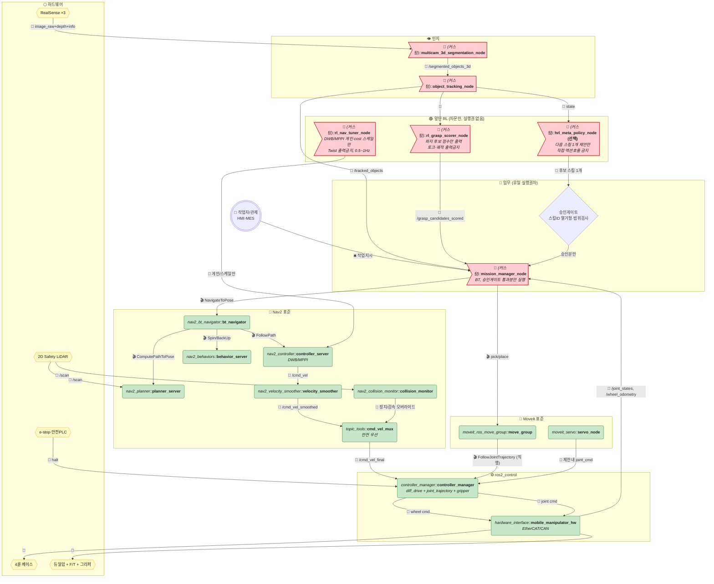

# 듀얼암 + 멀티카메라 — RL 업스트림(역전) 현업 아키텍처

> 연구형(`move_group → rl_arm_correction → MCU`, `controller → rl_nav_correction → MCU`)을 뒤집은 현업 버전입니다.
> 핵심 한 줄: **RL은 Nav2/MoveIt 뒤에서 덮어쓰지 않고, 앞에서 점수·게인 자문만 하고 최종 명령은 Nav2/MoveIt → ros2_control 직행.**
>
> 관련 문서: [VLM-RL 연구형](./ros2-dualarm-multicam-vlm-rl-architecture.md) · [HRL 연구형](./ros2-dualarm-multicam-hierarchical-rl-architecture.md) · [순수 현업](./ros2-dualarm-multicam-industry-standard-architecture.md) · [VLM·RL 포함 현업](./ros2-dualarm-multicam-vlm-rl-industry-architecture.md)
>
> 규칙 동일: 💊 알약=노드, ⬡ 육각=하드웨어, 🚩 깃발=커스텀, 🛢️ 원기둥=데이터/지도, 📨 토픽·🎬 액션·🛎️ 서비스·🔌 필드버스(EtherCAT/CAN).

---

## 0. 연구형 vs 역전(현업) 비교

| 구간 | 연구형 | 역전(본 문서) |
|---|---|---|
| 팔 | `move_group → rl_arm_correction → MCU` (RL이 최종 토크 덮어씀) | `rl_grasp_scorer → move_group → ros2_control → HW` (RL은 점수만, 최종은 MoveIt) |
| 이동 | `controller → rl_nav_correction → MCU` (RL이 `/cmd_vel` 가로챔) | `rl_nav_tuner(게인만) → controller → smoother → mux → collision_monitor → ros2_control` |
| 안전선 | 없음 (RL이 최후 실행자) | `collision_monitor` + `cmd_vel_mux` + e-stop이 최후, RL 우회 불가 |

---

## 1. 전체 다이어그램 (역전)

---

## 2. 예시 흐름 (사과 집기)

1. `Track` → `GScore`: `Apple_777` 후보 3개 전달.
2. `GScore` → `MGR`: `/grasp_candidates_scored` 점수 내림차순 (예: 0.91 / 0.72 / 0.45).
3. `MGR`가 0.91 선택 → `MoveGroup`에 `pick` 요청.
4. `MoveGroup` → `R2C`로 `FollowJointTrajectory` 직행. RL 경유 없음.
5. 이동은 `RLNav`가 `Controller` 게인만 미리 조정 → `Controller → Smoother → MUX → R2C` 직행.

---

## 3. 노드 요약

| 노드 | 위치 | 출력 |
|---|---|---|
| `rl_grasp_scorer_node` 🚩 | MoveIt 앞 | 점수만 |
| `rl_nav_tuner_node` 🚩 | Controller 앞 | 게인만 |
| `hrl_meta_policy_node` 🚩 (선택) | Coordinator 앞 | 다음 스킬 제안만 |
| `mission_manager_node` 🚩 + 승인게이트 | 실행권자 | 🎬 Action만 실행 |
| `rl_nav/arm_correction`, `mcu_bridge` | ❌ 삭제 | 연구형 잔재 |

## 4. 이식 순서

1. 뒷단 RL(`rl_nav/arm_correction`) 삭제 → `ros2_control` 직결.
2. 앞단 RL(스코어러·튜너)로 교체, 클램프+안전필터 추가.
3. `collision_monitor` + `cmd_vel_mux` + e-stop을 최후방어선으로 배선.
4. Shadow → 카나리 1대 → 전대 순서로 배포.
