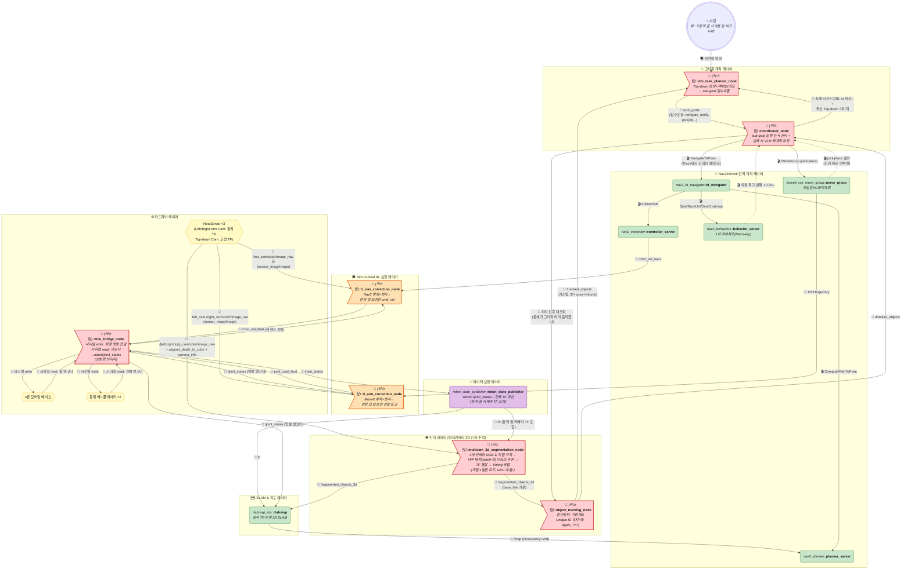
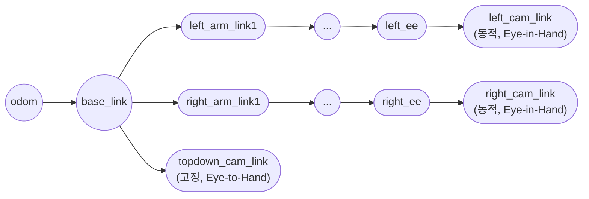
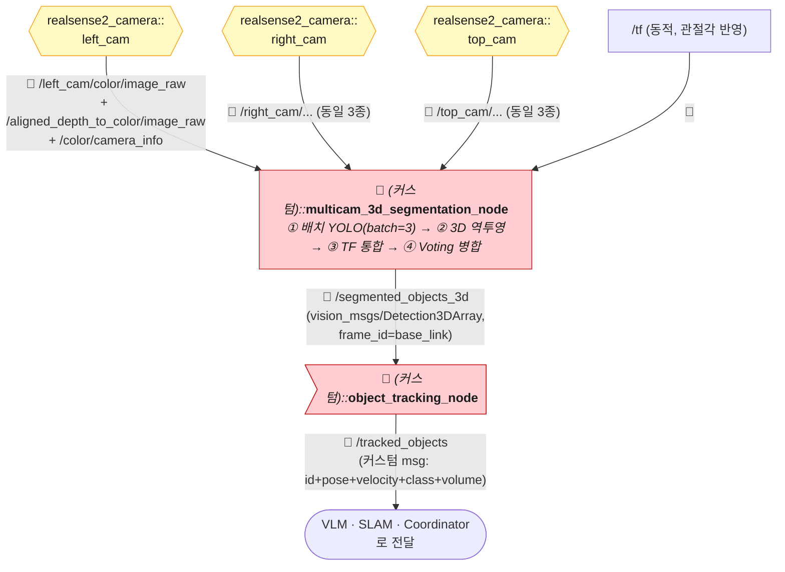
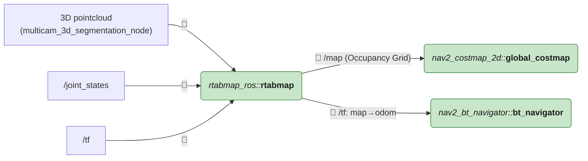
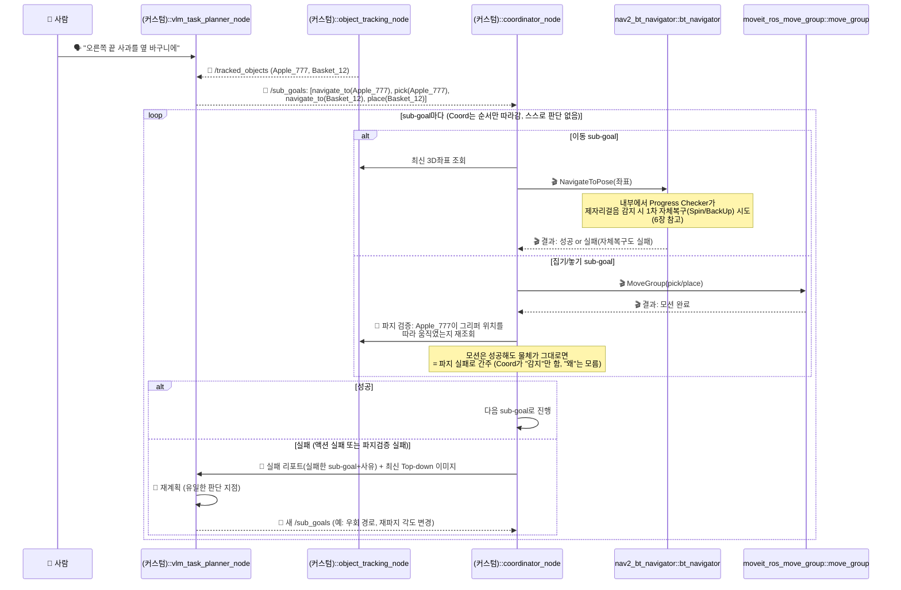
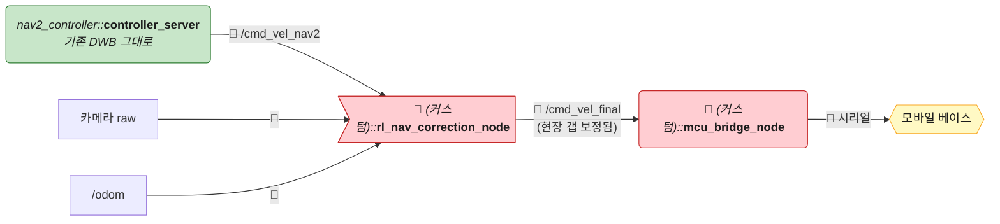
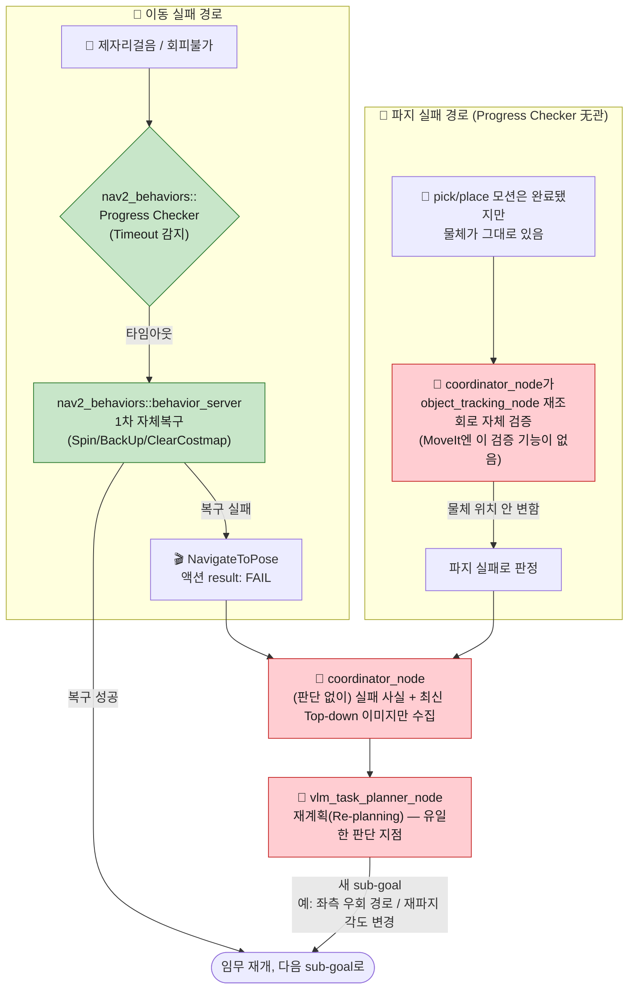

# 듀얼암 + 멀티카메라 + VLM/SLAM/Nav2+RL 통합 로봇 조작 시스템

> 🧭 이 문서는 별도로 제공된 **"다중 카메라 및 Embodied AI 기반 로봇 조작 시스템 설계 보고서"**를 다이어그램으로 재구성한 것입니다. [TurtleBot3 단일암 5종 문서](./ros2-turtlebot3-manipulator-example.md)와는 **다른 로봇**(4륜 베이스 + 듀얼 매니퓰레이터 + RealSense 3대 + SLAM)이지만, 도형/색상/화살표 이모지 규칙은 동일하게 적용했습니다: 💊 알약형=노드, ⬡ 육각형=하드웨어, 🚩 깃발=커스텀, 🛢️ 원기둥=데이터/지도, 📨 토픽·🎬 액션·🛎️ 서비스·🔌 시리얼.
>
> ⚠️ 원본 보고서는 개념 설계 문서라 일부 노드는 구체적 ROS 2 패키지명이 명시되지 않았습니다. 실존 패키지로 특정 가능한 것(RealSense, RTAB-Map, Nav2, MoveIt2)은 실제 패키지명을 달았고, 나머지(YOLO 병합, 투표, 추적, VLM, RL, Coordinator)는 🔧 커스텀으로 표시했습니다.

---

## 0. 전체 구조 한눈에 보기

---

## 1. 하드웨어 & TF 구성

| 부품 | 세부 | TF 특징 |
|---|---|---|
| 모바일 베이스 | 4륜 개조 TurtleBot Base | `odom → base_footprint → base_link` |
| 매니퓰레이터 ×2 | Robotis Manipulator (좌/우) | `base_link → left_arm_link1..N`, `base_link → right_arm_link1..N` |
| Left/Right Arm Camera | RealSense, 그리퍼 위쪽 장착 | **동적 TF** — `left_arm_tool0 → left_cam_link` (관절 움직이면 카메라도 같이 움직임, Eye-in-Hand) |
| Top-down Camera | RealSense, 로봇 상부 고정 | **고정 TF** — `base_link → topdown_cam_link` (Eye-to-Hand) |

> 좌/우 암 카메라는 팔이 움직일 때마다 `robot_state_publisher`가 관절각 기반으로 TF를 계속 갱신합니다 — [TurtleBot3 문서에서 다룬 Eye-in-Hand/Eye-to-Hand 원리](./ros2-turtlebot3-manipulator-example.md#layer-5--매니퓰레이터-계획-노드-moveit2)와 동일하되, 이번엔 **한 로봇 안에 두 방식이 동시에** 존재하는 경우입니다.

---

## 2. 인지 파이프라인 (Perception & Tracking) — 실제 토픽/메시지 타입

> `realsense2_camera` 노드는 `camera_name`/`camera_namespace` 파라미터로 카메라마다 네임스페이스를 분리해서 띄웁니다(`left_cam`, `right_cam`, `top_cam`). 아래는 그 실제 기본 토픽명입니다.

| 노드 | 구독(Sub) | 발행(Pub) | 메시지 타입 |
|---|---|---|---|
| `realsense2_camera::realsense2_camera_node` ×3 | — | `/{ns}/color/image_raw` `/{ns}/color/camera_info` `/{ns}/aligned_depth_to_color/image_raw` | `sensor_msgs/Image` `sensor_msgs/CameraInfo` `sensor_msgs/Image` |
| `(커스텀)::multicam_3d_segmentation_node` | 3개 카메라의 위 3종 토픽 (총 9개 구독) + `/tf` | `/segmented_objects_3d` | 노드 내부에서: ① 3장의 RGB를 **배치(batch=3)로 묶어 YOLO 추론 한 번 호출** → ② 각 카메라 depth+camera_info로 마스크 영역을 3D 역투영 → ③ tf2로 `base_link` 기준 통합 → ④ 겹침 Voting 병합 → `vision_msgs/Detection3DArray` (frame_id=base_link)로 발행 |
| `(커스텀)::object_tracking_node` | `/segmented_objects_3d` | `/tracked_objects` | 표준 메시지에 "여러 프레임에 걸친 지속 ID"라는 개념이 없어서 **커스텀 메시지**(`TrackedObjectArray`: `id`(string), `pose`, `velocity`, `class`, `volume`) 필요 |

> **왜 한 노드로 합쳤나?** 카메라 3대를 노드 3개로 나누면 GPU에 YOLO 모델이 3벌 올라가고 추론도 3번 따로 돕니다. `multicam_3d_segmentation_node` 하나가 3장을 배치로 묶어 처리하면 **모델은 1벌만 로드, 추론은 배치 1회**로 끝나서 Jetson급 단일 GPU에서 훨씬 효율적입니다. 대신 이 노드 하나가 죽으면 카메라 3대 인지가 동시에 멈추는 트레이드오프는 있습니다.
>
> **depth까지 같은 노드에서 같이 처리하는 이유**: 2D 마스크만 만들고 depth 역투영을 다른 노드에 미루면, 원본 depth 이미지 전체를 한 번 더 네트워크로 복사해야 합니다. 같은 노드 안에서 바로 `camera_info` 내부파라미터로 마스크 영역만 3D로 역투영하면, 그 다음부터는 압축된 3D 박스 몇 개(`Detection3DArray`)만 주고받으면 되어 대역폭이 훨씬 적게 듭니다.

---

## 3. SLAM & Nav2 지도 연동

> 이 시스템은 팔에 달린 카메라가 **계속 움직이면서** 지도를 그리기 때문에, `rtabmap`이 `/joint_states`+`/tf`로 "지금 이 포인트클라우드가 로봇 기준 어디서 찍혔는지"를 매번 정확히 알아야 합니다. 고정 카메라만 쓰는 일반 SLAM보다 계산이 더 복잡한 이유입니다.

---

## 4. VLM ↔ Coordinator 역할 분담 + 돌발상황 판단 흐름

**둘의 관계를 한 문장으로**: `vlm_task_planner_node`는 **"무엇을 할지" 판단을 100% 전담**하고, `coordinator_node`는 **판단을 전혀 하지 않고** VLM이 정해준 순서대로 하위 액션을 호출·감시하기만 합니다. 그래서 "돌발상황이 생기면 누가 판단하나?"의 답은 **항상 VLM 하나뿐**입니다 — Coordinator는 "성공했는지 실패했는지"만 감지해서 실패 시 무조건 VLM에게 그대로 떠넘깁니다.

| | 하는 일 | 안 하는 일 |
|---|---|---|
| `vlm_task_planner_node` | 최초 계획 수립, **모든 재계획(Re-planning) 판단** | 실시간 액션 호출/감시 (안 함) |
| `coordinator_node` | sub-goal 순서대로 액션 호출, 성공/실패 감지, 실패 시 VLM에 보고 | **왜 실패했는지 스스로 판단하거나 대안을 짜는 것 (절대 안 함)** |

> 원본 보고서의 핵심 아이디어: VLM은 "Apple_777을 어디로 가져갈지"만 말하고, **실제 3D 좌표는 매번 `object_tracking_node`에서 최신 값으로 다시 조회**합니다. 물체가 조금 움직였어도(예: 다른 로봇이나 사람이 건드림) 마지막으로 추적된 위치로 정확히 찾아갑니다 — [하이브리드 문서](./ros2-turtlebot3-manipulator-hybrid.md)의 "정적 semantic_waypoints.yaml 조회"보다 한 단계 더 동적인 버전입니다.
>
> **파지 실패는 Nav2 Progress Checker로 못 잡습니다.** MoveIt의 액션 결과는 "계획한 모션을 완료했다"는 뜻이지 "실제로 물건을 집었다"는 뜻이 아닙니다. 그래서 `coordinator_node`가 pick/place 직후 **`object_tracking_node`에 다시 물어봐서 물체가 그리퍼를 따라 움직였는지 확인**하는 별도 검증 단계가 필요합니다 — 이게 이 시스템에서 "파지 실패"를 감지하는 유일한 방법입니다.

---

## 5. Nav2(전역) + RL(보정) 계층적 제어

이 시스템의 RL은 [TurtleBot3 하이브리드 문서](./ros2-turtlebot3-manipulator-hybrid.md)처럼 **컨트롤러 플러그인을 교체**하는 방식이 아니라, Nav2/MoveIt이 낸 명령을 **한 번 더 사후 보정(residual correction)**하는 방식입니다.

| 구분 | [하이브리드 문서](./ros2-turtlebot3-manipulator-hybrid.md) 방식 | 이 시스템 방식 |
|---|---|---|
| RL 위치 | `controller_server`의 **플러그인**으로 교체 (Nav2 안에 흡수) | `controller_server` **뒤에** 별도 노드로 연결 (사후 보정) |
| Nav2 컨트롤러 | 없음 (DWB 자리를 RL이 완전히 대체) | DWB **그대로 유지**, RL은 그 출력을 미세 보정만 |
| 장점 | 구조가 깔끔 (Nav2 액션 한 번으로 끝) | Nav2 컨트롤러 로직을 안 건드려서 디버깅 쉬움 |
| 이 방식의 이름 | 대체형(Replacement) | **잔차 보정형(Residual Correction)** — Sim-to-Real 논문에서 흔한 패턴 |

---

## 6. 폐루프 예외 처리 (Closed-loop Recovery)

> 4장에서 본 큰 흐름 중 "실패 감지" 부분만 확대한 것입니다. **원인이 다른 두 갈래**(이동 실패 vs 파지 실패)가 있는데, 원본 보고서의 "Progress Checker" 언급은 **이동 쪽에만** 해당합니다 — 파지 실패는 애초에 Nav2 소관이 아니라서 별도 경로가 필요합니다.

**단계별 실제 구현 지점**:
1. **이동 실패 — Progress Checker**: `nav2_controller`/`nav2_behaviors`가 이미 제공하는 실존 기능 (`nav2_params.yaml`에서 임계값 설정) — ⚙️ 제공
2. **이동 실패 — 1차 자체복구**: `behavior_server`의 `Spin`/`BackUp`/`ClearCostmap` 액션 — ⚙️ 제공 (룰베이스 문서와 동일)
3. **파지 실패 — 자체 검증**: `coordinator_node`가 pick/place 액션 성공 직후 `object_tracking_node`에 재조회해서 "물체가 실제로 옮겨졌는지" 확인 — 🔧 **직접 구현 필요** (MoveIt/Nav2 어디에도 없는, 이 시스템만의 로직)
4. **공통 — 실패 전파**: 두 경로 모두 결국 `coordinator_node`로 모여서 동일하게 처리됨 — ⚙️(이동) / 🔧(파지) 혼합
5. **공통 — VLM 재계획**: `coordinator_node`가 실패 리포트+이미지를 VLM에 보내는 것과 VLM의 재계획 로직 — 🔧 **직접 구현 필요**

---

## 7. 노드 요약 & 제공 여부

| 노드 | 제공 여부 |
|---|---|
| `realsense2_camera_node` ×3 | ✅ 완전 제공 (Intel 공식 패키지) |
| `rtabmap` | ✅ 완전 제공 (`rtabmap_ros`) |
| `bt_navigator`, `planner_server`, `controller_server`, `behavior_server`, `global/local_costmap` | ⚙️ 제공 + 파라미터 필요 (Nav2, 룰베이스 문서와 동일) |
| `move_group` | ⚙️ 제공 + 듀얼암 SRDF 설정 필요 (MoveIt2) |
| `multicam_3d_segmentation_node`, `object_tracking_node` | 🔧 **직접 구현 필요** (인지 파이프라인 전체) |
| `vlm_task_planner_node`, `coordinator_node` | 🔧 **직접 구현 필요** |
| `rl_nav_correction_node`, `rl_arm_correction_node` | 🔧 **직접 구현 필요** (+ Sim-to-Real 학습 파이프라인) |
| `mcu_bridge_node` | 🔧 **직접 구현 필요** (또는 `ros2_control` 하드웨어 인터페이스로 대체 가능) |

---

## 8. 참고: 다른 문서와의 관계

- **RL을 "상위 개념"(Hierarchical RL)으로 쓰는 대안 버전**: [ros2-dualarm-multicam-hierarchical-rl-architecture.md](./ros2-dualarm-multicam-hierarchical-rl-architecture.md) — 이 문서의 `vlm_task_planner_node` 자리를 학습된 메타 정책(`hrl_meta_policy_node`)으로 교체한 자매 문서. 하드웨어/인지/SLAM/Nav2+RL 보정 레이어는 동일하고, 최상위 계획 방식과 돌발상황 재계획 로직만 다릅니다.
- 구조적으로 [ros2-turtlebot3-manipulator-hybrid.md](./ros2-turtlebot3-manipulator-hybrid.md)의 "Nav2 전역 + RL 지역" 아이디어를 **잔차 보정형**으로 변형하고, 여기에 **멀티카메라 인지(YOLO+Voting+Tracking)**와 **VLM 기반 물체ID 타겟팅**, **SLAM 폐루프 예외처리**를 추가로 결합한 상위 호환 시스템입니다.
- 단일암 TurtleBot3 5종 문서: [룰베이스](./ros2-turtlebot3-manipulator-example.md) · [E2E](./ros2-turtlebot3-manipulator-e2e.md) · [RL(Mapless)](./ros2-turtlebot3-manipulator-simtoreal-rl.md) · [하이브리드](./ros2-turtlebot3-manipulator-hybrid.md) · [VLA](./ros2-turtlebot3-manipulator-vla.md)
- 개념적 원형: [ros2-architecture.md](./ros2-architecture.md)
