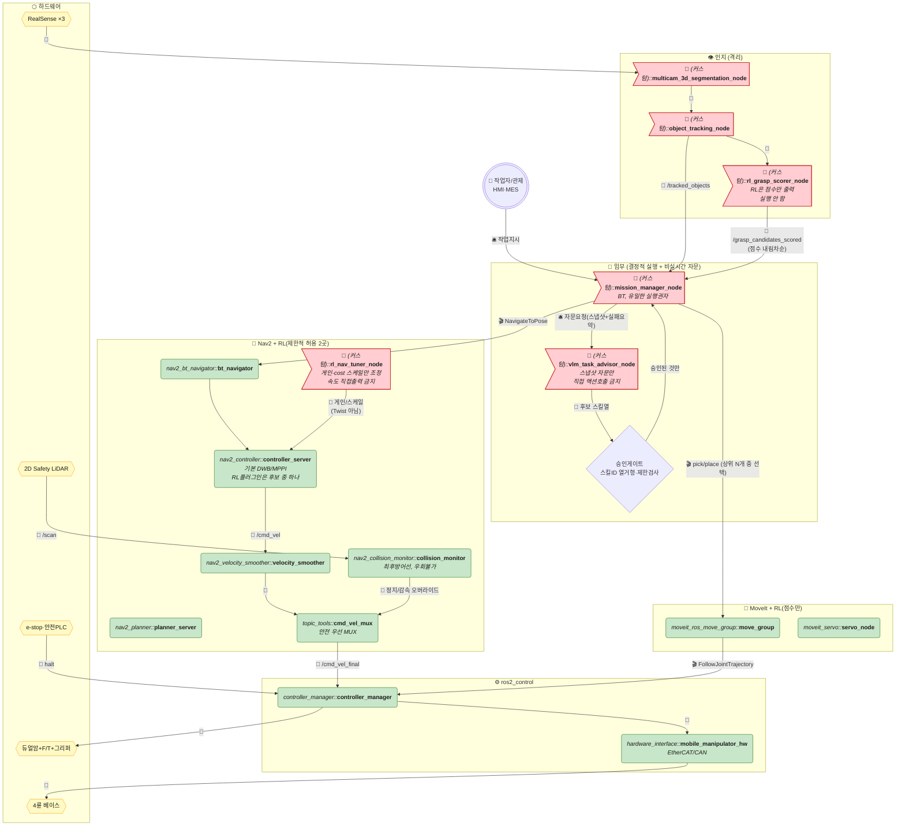
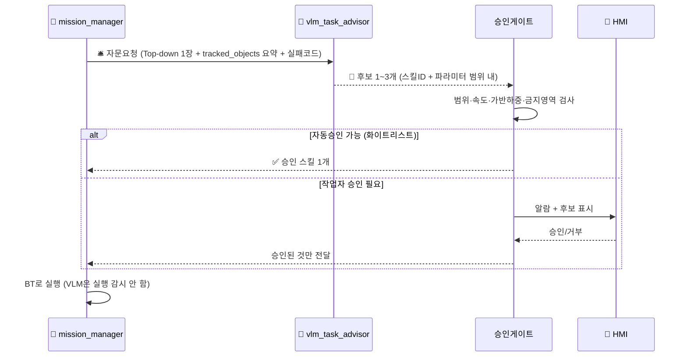
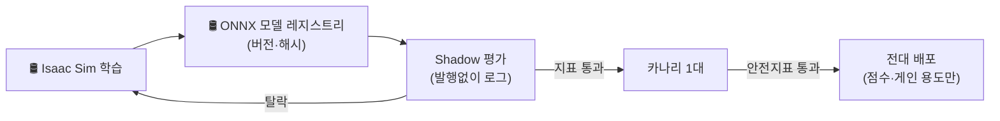
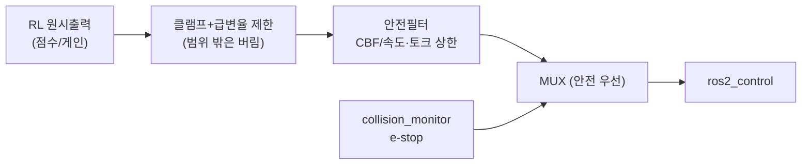

# 듀얼암 + 멀티카메라 — VLM·RL 포함 현업 표준 아키텍처

> [ros2-dualarm-multicam-industry-standard-architecture.md](./ros2-dualarm-multicam-industry-standard-architecture.md)의 현업 표준 구조에 VLM·RL을 **실행경로 밖(자문·오프라인·게이트 통과 후만)** 으로 넣어 실사용 가능하게 만든 버전입니다.
>
> [ros2-dualarm-multicam-vlm-rl-architecture.md](./ros2-dualarm-multicam-vlm-rl-architecture.md) 연구형과의 차이 한 줄: **VLM은 실시간 호출 금지(스냅샷 자문+승인게이트), RL은 토크/속도 직접출력 금지(점수·파라미터·제한된 보정만, 안전필터 뒤).**
>
> 규칙 동일: 💊 알약=노드, ⬡ 육각=하드웨어, 🚩 깃발=커스텀, 🛢️ 원기둥=데이터/지도, 📨 토픽·🎬 액션·🛎️ 서비스·🔌 필드버스.

---

## 0. 전체 구조 한눈에 보기

---

## 1. VLM 현업식 사용법 — 3원칙

| 원칙 | 연구형 | 현업(본 문서) |
|---|---|---|
| 호출 시점 | 매 sub-goal 실시간 호출 | **예외·모호지시 때만 스냅샷 1회 호출**, 정상계는 호출 없음 |
| 출력 형식 | 자유형 함수호출 문자열 | **스킬ID 열거형** (`SKILL_PICK_APPLE` 등) + 근거점수, 승인게이트 통과 전 실행금지 |
| 타임아웃 | 무제한 대기 | **타임아웃(예: 3s) 초과 시 정의된 폴백**으로 진행, 로봇은 정지대기 |

> 포인트: VLM 장애·할루시네이션 = 작업일시정지이지 오동작이 아님. 정상계·1차복구는 VLM 없이 100% 완결되게 설계한다.

---

## 2. RL 현업식 사용법 — 허용 3곳 + 금지 2곳

### 허용

1. **`rl_grasp_scorer_node` (파지 후보 점수만)** — `move_group`이 IK·궤적 N개를 만들면 RL은 성공확률 점수만 매김. 선택·실행은 `mission_manager`가 점수순+규칙(접근각·충돌여유)으로 결정. 토크 직접출력 금지.
2. **`rl_nav_tuner_node` (게인·cost 스케일만)** — `/cmd_vel`을 직접 만들지 않고 `controller_server`의 DWB/MPPI 가중치·inflation 스케일만 느리게(0.5~1Hz) 조정. 범위 클램프 + 급변율 제한 필수.
3. **오프라인·Shadow** — Isaac Sim/Gazebo 학습 → ONNX 버전관리 → Shadow 추론(발행 안 함) → 카나리(1대) → 전대 확대.

### 금지

- ❌ `rl_nav_correction_node`식 `/cmd_vel` 가로채기 + 카메라 raw 직결 보정 (지터·안전우회).
- ❌ `rl_arm_correction_node`식 `JointTrajectory` 토크 오버라이드 (MoveIt 제한 우회).

### 안전필터 (RL을 쓰면 필수)

---

## 3. 주행·조작 체인 (현업 표준 유지)

- 주행: `bt_navigator → controller_server(DWB/MPPI) → velocity_smoother → cmd_vel_mux → collision_monitor 오버라이드 → diff_drive_controller`. RL 튜너는 게인만 건드림.
- 조작: `move_group → FollowJointTrajectory → joint_trajectory_controller`. 미세보정은 `servo_node` + `admittance_controller(F/T)` 사용. RL은 후보 스코어러로만 참여.
- 안전: Safety LiDAR → `collision_monitor` → `cmd_vel_mux` + HW e-stop → `controller_manager` halt. 어떤 학습노드도 이 선을 우회 불가.
- 위치추정: `slam_toolbox` + `amcl` + `ekf_node`. 카메라 pointcloud는 costmap 보조층으로만, SLAM 직접주입 금지.
- TF: `map→odom(EKF)→base_footprint→base_link→arm/cam/lidar`. `odom` 소스는 EKF 퓨전값.

---

## 4. 노드 요약

| 노드 | 제공 여부 | 비고 |
|---|---|---|
| `realsense2_camera_node` ×3, `slam_toolbox`, `amcl`, `ekf_node` | ✅ 제공 | — |
| `bt_navigator`, `planner_server`, `controller_server`, `velocity_smoother`, `collision_monitor`, `cmd_vel_mux`, `behavior_server` | ✅ 제공+파라미터 | RL 튜너는 게인 입력만 |
| `move_group`, `servo_node`, `controller_manager`, `diff_drive/joint_trajectory/gripper/admittance_controller` | ✅ 제공+SRDF/yaml | — |
| `multicam_3d_segmentation_node`, `object_tracking_node` | 🚩 직접 구현 | 인지 격리 원칙 |
| `mission_manager_node` + 승인게이트 | 🚩 직접 구현 | BT 기반, 유일 실행권자 |
| `vlm_task_advisor_node` | 🚩 직접 구현 | 비실시간, 스냅샷+타임아웃+승인 |
| `rl_grasp_scorer_node`, `rl_nav_tuner_node` | 🚩 직접 구현+학습파이프라인 | 점수·게인만, 클램프+안전필터 필수 |
| 잔차보정 `rl_nav/arm_correction`, `mcu_bridge` | ❌ 사용금지 | 연구형 잔재, 본 문서에서 삭제 |

### 주요 인터페이스

| 구간 | 타입 | 이름 |
|---|---|---|
| 자문 | 🛎️ Service | `AskVLMAdvisor` (req: 이미지1+요약, resp: 스킬ID 후보) |
| 승인 | 🛎️ Service | `ApproveSkill` (작업자/HMI) |
| 파지점수 | 📨 Topic | `/grasp_candidates_scored` (pose+score 내림차순) |
| Nav튜닝 | 📨 Topic | `/nav_tuning_gains` (가중치, Twist 아님, 0.5~1Hz) |
| 실행 | 🎬 Action | `NavigateToPose`, `FollowJointTrajectory`만 실행용 |

---

## 5. 관계 + 이식 순서

- 원본 연구형: [ros2-dualarm-multicam-vlm-rl-architecture.md](./ros2-dualarm-multicam-vlm-rl-architecture.md)
- VLM·RL 제거 순수현업: [ros2-dualarm-multicam-industry-standard-architecture.md](./ros2-dualarm-multicam-industry-standard-architecture.md) — 본 문서는 여기에 VLM·RL을 안전하게 추가한 것.
- HRL 변형: [ros2-dualarm-multicam-hierarchical-rl-architecture.md](./ros2-dualarm-multicam-hierarchical-rl-architecture.md) — 최상위 메타정책도 본 문서처럼 점수·자문 용도로만 격리해야 현업 투입 가능.

1. 순수현업 문서대로 `ros2_control`+안전체인 먼저 완성.
2. RL은 Shadow 스코어러부터 (실행 영향 0으로 시작).
3. VLM은 예외 자문+승인게이트부터 (정상계 무호출).
4. 카나리 지표(충돌율·정지율·파지성공률·승인율) 통과 후에만 확대.
