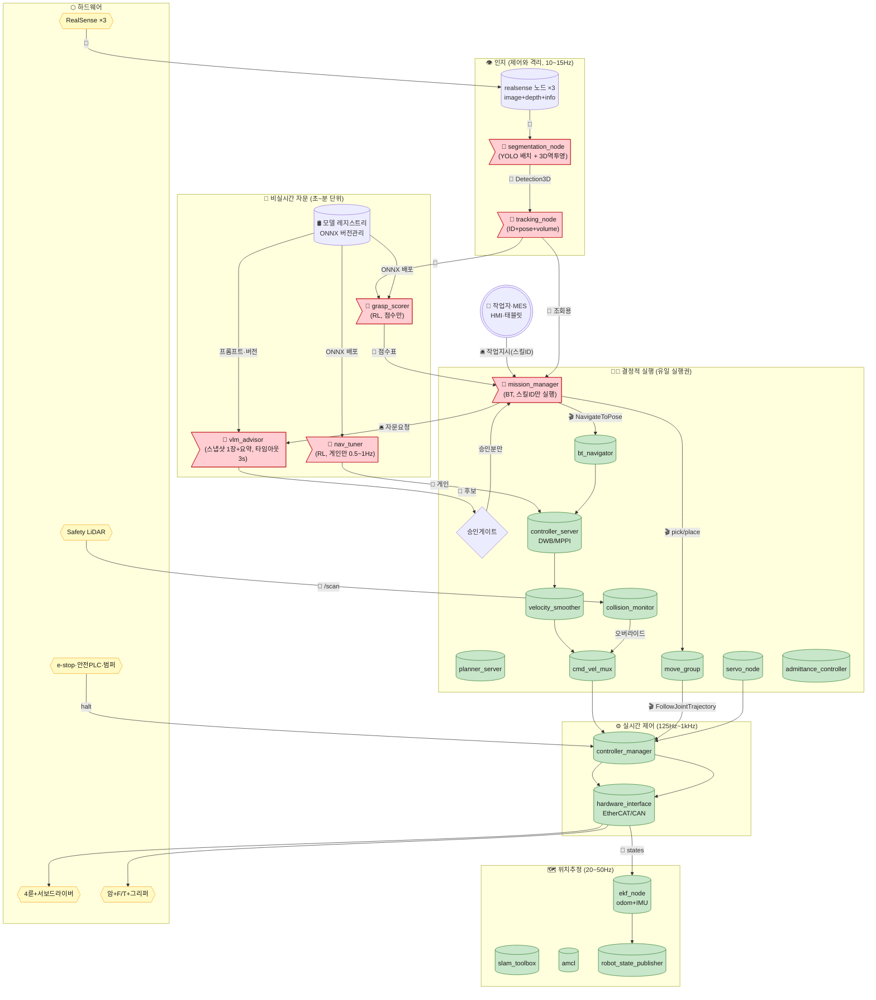
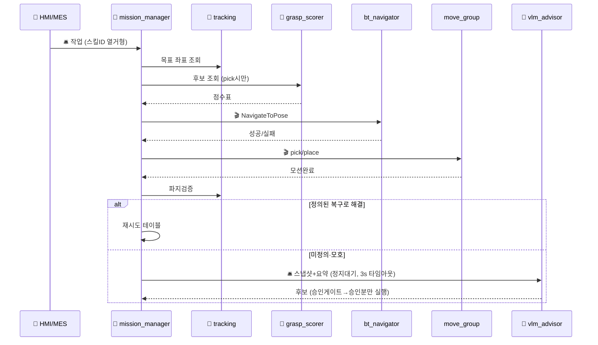
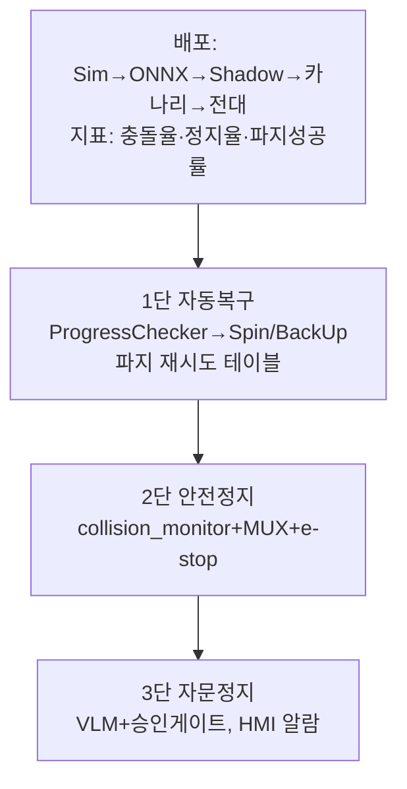

# Physical AI 현업 표준 아키텍처 (ROS 2 + VLM + RL)

> 전제: 바퀴 모바일 매니퓰레이터(4륜 베이스 + 암 1~2기 + 카메라 2~3대 + Safety LiDAR + F/T + 그리퍼). 연구용 잔차제어·시리얼 브리지·실시간 VLM 호출 없음.
> 원칙 3개: **① 실시간 실행경로는 결정적(학습모델 없음) ② VLM·RL은 자문·점수·게인으로만 참여 ③ 안전선은 학습경로 우회 불가.**

---

## 0. 전체 구조

---

## 1. 하드웨어·컴퓨트·네트워크 (현실 선택)

| 항목 | 선택 | 이유 |
|---|---|---|
| 베이스·암 인터페이스 | `ros2_control` + EtherCAT/CAN 서보 | 시리얼 대비 지터·동기·진단·STO. `mcu_bridge`식 직접 시리얼 금지 |
| 안전 센서 | Safety LiDAR 1~2대 (SLAM 겸용) + 범퍼 + e-stop 하드와이어 + 안전PLC | ISO 10218/3691-4. 카메라는 안전센서로 인정 안 됨 |
| 힘 제어 | 손목 F/T + `admittance_controller` | RL 토크 오버라이드 대신 인증 가능한 컴플라이언스 |
| 컴퓨트 분리 | 제어(x86 RT) / 인지·VLM(GPU 보드) 분리, PTP 시간동기 | YOLO·VLM 지터가 제어에 전파 차단. 같은 Jetson에 다 올리지 않음 |
| DDS QoS | 제어 `RELIABLE+DEADLINE`, 영상 `BEST_EFFORT`, TF `TRANSIENT_LOCAL` | 대역폭·지연 분리. 카메라 raw를 제어노드가 직접 구독 금지 |

TF: `map → odom(EKF) → base_footprint → base_link → {arm_links, cam_links, lidar_link}`. `odom`은 EKF 퓨전값으로 단일화.

---

## 2. 인지 — 구조는 YOLO+Tracking, 연결은 격리

| 노드 | 입/출력 | 타입 | 주기 |
|---|---|---|---|
| `realsense_node` ×3 | → `/{ns}/color/image_raw`, `aligned_depth_to_color/image_raw`, `camera_info` | `Image`, `CameraInfo` | 15~30Hz |
| `segmentation_node` 🚩 | 9토픽+`/tf` → `/segmented_objects_3d` | `vision_msgs/Detection3DArray` | 10~15Hz |
| `tracking_node` 🚩 | → `/tracked_objects` (커스텀 id+pose+vel+class+volume) | 커스텀 | 10Hz |

격리 3원칙: ① SLAM에 분할 pointcloud 직접주입 금지(LiDAR `/scan`이 정면, 카메라는 costmap 보조층만) ② 인지→`/cmd_vel`·토크 직접출력 금지 ③ GPU는 제어와 분리.

---

## 3. 주행·조작 — 결정적 표준 체인

주행: `bt_navigator → planner(Smac/NavFn) → controller(DWB/MPPI) → velocity_smoother → cmd_vel_mux → diff_drive_controller`. `collision_monitor`는 MUX로 오버라이드하는 최후선. 가반하중별 smoother 프로파일 분리.

조작: `move_group → FollowJointTrajectory → joint_trajectory_controller`. 미세보정 `servo_node`, 힘작업 `admittance_controller`. 듀얼암 SRDF 그룹 분리(`left/right/both`). 파지검증은 pick 직후 tracking 재조회(모션완료≠파지성공).

---

## 4. 임무 — BT가 유일 실행권, 나머지는 자문

- 정상계·1차복구는 VLM 없이 완결. VLM 장애=일시정지, 폭주 아님.
- VLM 출력은 스킬ID 열거형 + 파라미터 범위. 자유함수호출 문자열 금지.

---

## 5. VLM·RL — 허용 위치와 학습 파이프라인

### VLM (`vlm_advisor` 🚩)
호출: 예외·모호지시 때 스냅샷 1장+요약 1회. 정상계 0회. 타임아웃 초과 시 정의 폴백. 승인게이트(범위·속도·금지영역·화이트리스트) 또는 작업자 승인 후 실행.

### RL — 3곳만 허용
1. `grasp_scorer` 🚩: IK·궤적 N개 → 성공확률 점수만. 선택·실행은 MGR.
2. `nav_tuner` 🚩: DWB/MPPI 가중치·inflation 스케일만 0.5~1Hz, 클램프+급변율제한. Twist 출력금지.
3. 오프라인·Shadow: Isaac Sim 학습 → ONNX 레지스트리 → Shadow(미발행) → 카나리 1대 → 전대.

### Sim-to-Real 학습 내용 (예시)
- 주행: 마찰·하중·지연 랜덤화. 입력=명령·odom·IMU 히스토리, 출력=게인델타(±0.1 클램프). 미끄럼 센서 없이 차이로 역추정(teacher-student/RMA).
- 팔: 질량·마찰·오프셋 랜덤화. 입력=관절오차·effort·wrench, 출력=파지점수·어드미턴스 강성.
- 실기 데이터는 정답라벨이 아니라 갭 측정용(랜덤범위 보정).

### 금지
❌ `controller → RL → cmd_vel_final` 가로채기 ❌ `move_group → RL → 토크` 오버라이드 ❌ 카메라 raw 직결 RL 제어 ❌ 시리얼 브리지 최종단.

---

## 6. 안전 3단 + 배포 게이트

배포 게이트 지표 미달 시 자동 롤백. 모든 모델·파라미터 버전·해시 기록. `rosbag/mcap` 상시 로깅(제어 전주기 + 이벤트 스냅샷).

---

## 7. 노드·인터페이스 요약

| 노드 | 제공 |
|---|---|
| realsense, slam_toolbox, amcl, ekf, rsp, bt/planner/controller/smoother/collision_monitor/mux/behavior, move_group/servo/admittance, controller_manager+controllers | ✅ 제공+파라미터 |
| segmentation, tracking, mission_manager+게이트, vlm_advisor, grasp_scorer, nav_tuner | 🚩 직접 구현+학습파이프라인 |

| 구간 | 타입 | 이름 |
|---|---|---|
| 작업 | 🛎️ | `SubmitTask`(스킬ID), `AskVLM`(스냅샷), `ApproveSkill` |
| 실행 | 🎬 | `NavigateToPose`, `FollowJointTrajectory`만 |
| 속도 | 📨 | `/cmd_vel`→`/cmd_vel_smoothed`→`/cmd_vel_final` (`Twist`) |
| 인지 | 📨 | `/segmented_objects_3d`(`Detection3DArray`), `/tracked_objects`(커스텀), `/grasp_candidates_scored` |
| 튜닝 | 📨 | `/nav_tuning_gains`(가중치, 0.5~1Hz) |

## 8. 이식 순서

1. `ros2_control`+EtherCAT+ e-stop+Safety LiDAR+`collision_monitor` 먼저.
2. SLAM LiDAR화, 카메라 costmap 보조로 격리, 컴퓨트 분리.
3. RL은 Shadow 스코어러부터, VLM은 예외자문+게이트부터.
4. 카나리 지표 통과 후 확대. 뒷단 잔차·시리얼 브리지는 도입하지 않음.
