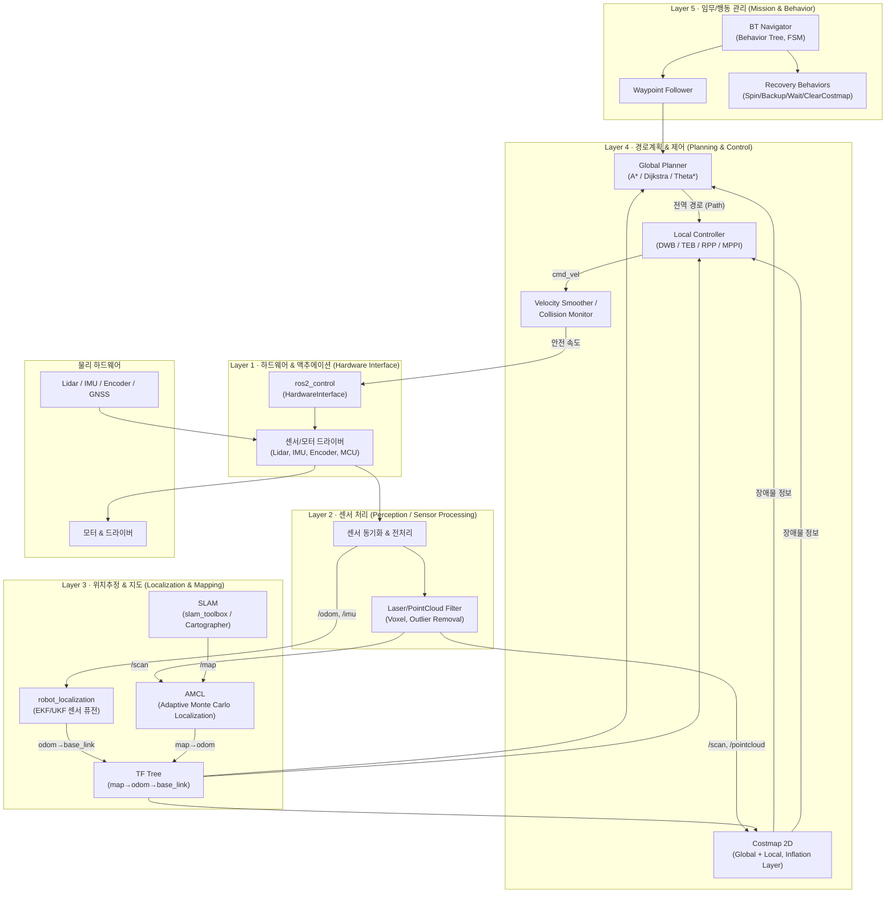
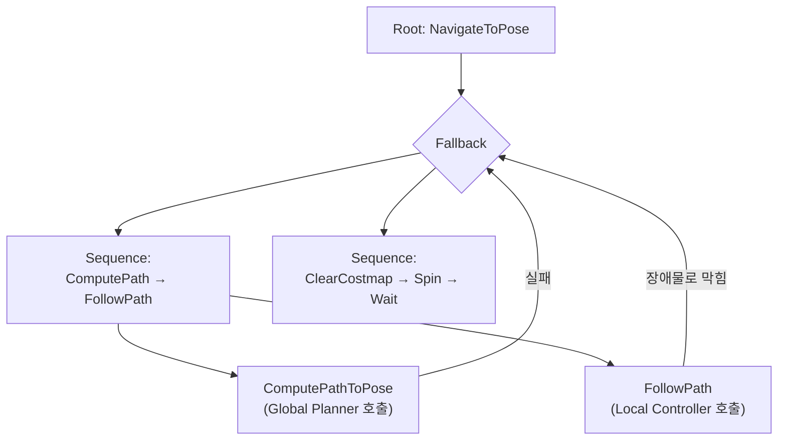
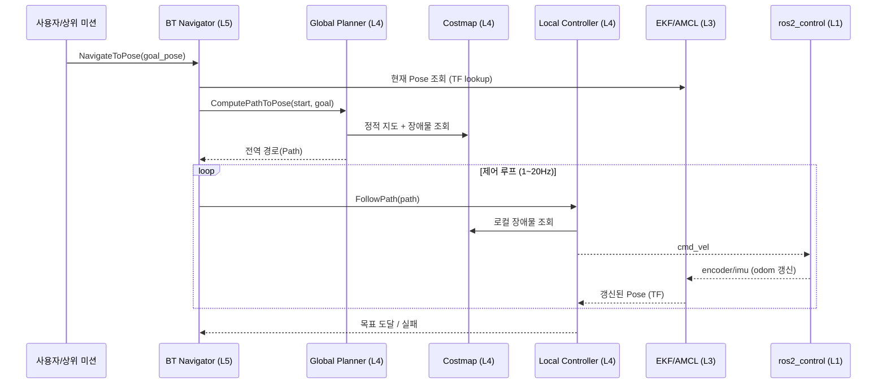

# ROS 2 순수 룰베이스(Rule-Based) 자율주행 아키텍처

> [ros2-architecture.md](./ros2-architecture.md) 의 LLM/RL 계층형 구조와 대비되는, **학습 모델 없이 규칙·수학·확률 알고리즘만으로 구성한 고전(Classical) ROS 2 Navigation 스택**입니다. 실제 현업 AMR/자율주행 로봇 대부분이 이 구조(Nav2 표준 스택)를 기반으로 합니다.

---

## 0. 룰베이스 vs 학습기반 핵심 차이

| 구분 | 룰베이스 (본 문서) | LLM/RL 학습기반 ([ros2-architecture.md](./ros2-architecture.md)) |
|---|---|---|
| 의사결정 방식 | 수학 공식·확률 필터·탐색 알고리즘(A*, DWB 등) | 신경망 추론(정책/가중치) |
| 예측 가능성 | 결정적(Deterministic), 디버깅 쉬움 | 확률적(Probabilistic), 블랙박스 |
| 사전 준비물 | 지도(Map), 파라미터 튜닝 | 학습 데이터, GPU 학습 인프라 |
| 새 환경 대응 | 지도 재작성(SLAM) 필요 | 재학습 없이도 일부 일반화 가능 |
| 안전성 검증 | 규칙 기반이라 인증/검증 용이 | 검증 어려움(엣지케이스 예측 불가) |
| 대표 스택 | **Nav2** (costmap, planner, controller, BT) | Isaac Sim RL Policy, VLA |

---

## 1. 레이어 구조 개요

| 구분 | Layer 5 (임무) | Layer 4 (계획/제어) | Layer 3 (위치추정) | Layer 2 (센서처리) | Layer 1 (하드웨어) |
|---|---|---|---|---|---|
| 주요 노드 | `bt_navigator`, `waypoint_follower` | `planner_server`, `controller_server`, `costmap_2d` | `slam_toolbox`, `amcl`, `robot_localization` | 센서 필터/전처리 노드 | `ros2_control`, MCU 펌웨어 |
| 알고리즘 | Behavior Tree, 상태머신, If-Else | A*/Dijkstra(전역), DWB/TEB/MPPI(지역) | Particle Filter(AMCL), EKF/UKF | 칼만 필터, Voxel Downsampling | PID, 역운동학 |
| 입력 | 목표 지점(Goal Pose), 임무 큐 | 전역 경로, Costmap, 현재 Pose | Lidar Scan, Odom, IMU, Map | Raw 센서 데이터 | cmd_vel, 관절 목표값 |
| 출력 | Action Goal(NavigateToPose) | cmd_vel, 경로(Path) | TF(map↔odom↔base_link), Pose | 정제된 Scan/PointCloud | PWM/CAN 신호 |
| 처리 주기 | 이벤트 기반 (Goal 갱신 시) | 1~20Hz | 10~50Hz | 센서 원본 주기(10~100Hz) | 100~1000Hz |

---

## 2. 레이어별 상세

### Layer 1 — 하드웨어 인터페이스 (Hardware Interface)
- **역할**: 센서 원시 데이터 수신, 모터 명령을 실제 PWM/CAN 신호로 변환.
- **표준 프레임워크**: `ros2_control`의 `HardwareInterface` 플러그인(C++)로 벤더별 하드웨어를 캡슐화. 바퀴 4개든 8개든 **드라이버 노드 1개**로 통합(엔코더 동기화, 시리얼 포트 경합 방지).
- **주요 토픽/메시지**: `sensor_msgs/JointState`(엔코더), `geometry_msgs/Twist` 또는 `control_msgs/JointTrajectory`(모터 명령).

### Layer 2 — 센서 처리 (Perception / Sensor Processing)
- **역할**: Raw 센서를 정제(노이즈 제거, 다운샘플링)해서 상위 레이어가 쓸 수 있는 형태로 가공. 학습 모델이 아니라 **결정론적 필터**만 사용.
- **대표 노드**: `laser_filters`(각도/거리 클리핑), PCL 기반 Voxel/Outlier 필터, 센서 타임스탬프 동기화(`message_filters`).
- **주요 토픽**: `/scan`(`sensor_msgs/LaserScan`), `/points`(`sensor_msgs/PointCloud2`), `/imu`(`sensor_msgs/Imu`), `/wheel/odom`(`nav_msgs/Odometry`).

### Layer 3 — 위치추정 & 지도 (Localization & Mapping)
- **매핑 단계(사전 작업, 1회)**: `slam_toolbox` 또는 `cartographer_ros`로 라이다 스캔을 누적해 `.yaml`/`.pgm` 지도 생성.
- **실시간 위치추정**:
  1. `robot_localization`(EKF/UKF)이 휠 오도메트리 + IMU를 융합해 `odom → base_link` TF를 고빈도(30~50Hz)로 발행.
  2. `AMCL`(Adaptive Monte Carlo Localization, 파티클 필터)이 저장된 지도와 라이다 스캔을 매칭해 `map → odom` TF(누적 오차 보정)를 저비용(1~5Hz)으로 발행.
- **TF 트리**: `map → odom → base_link → {laser_link, imu_link, camera_link}` — 순수 좌표변환 수학(`tf2`)이며 학습 요소 없음.
- **핵심 특징**: 지도가 필수(Map-based). 환경이 바뀌면(가구 이동 등) 재매핑 또는 costmap 갱신 필요.

### Layer 4 — 경로계획 & 제어 (Global/Local Planning)
- **Costmap 2D**: Static Layer(지도) + Obstacle Layer(실시간 장애물) + Inflation Layer(안전 여유거리)를 겹쳐 만든 점유격자. Global costmap(전역, 저빈도)과 Local costmap(로봇 주변, 고빈도) 두 개 운용.
- **Global Planner** (`planner_server`): 정적 지도 위에서 A*, Dijkstra, Theta*, Smac Planner 같은 **탐색 알고리즘**으로 최단 경로(Path) 계산. 딥러닝 없음, 순수 그래프 탐색.
- **Local Controller** (`controller_server`): 전역 경로를 따라가며 실시간 장애물을 회피하는 국소 제어. DWB(Dynamic Window Approach), TEB(Timed Elastic Band), Regulated Pure Pursuit, MPPI 등 **수학적 최적화/기하학 기반** 알고리즘 중 선택. 최종 출력은 `/cmd_vel`.
- **Velocity Smoother / Collision Monitor**: 급가속/급정지 방지 및 최종 안전 속도 제한(규칙 기반 임계값 체크) 후 Layer 1로 전달.

### Layer 5 — 임무/행동 관리 (Mission & Behavior)
- **BT Navigator** (`bt_navigator`): XML로 정의된 **Behavior Tree**가 "경로계획 → 이동 → 실패 시 복구" 흐름을 제어. 완전히 규칙 기반(조건 노드, 시퀀스 노드, 폴백 노드로 구성).
- **Waypoint Follower**: 여러 목표 지점을 순서대로 방문하는 임무를 상태머신으로 관리.
- **Recovery Behaviors**: 경로를 못 찾거나 막히면 `Spin`(제자리 회전), `BackUp`(후진), `Wait`, `ClearCostmap` 같은 **사전 정의된 규칙**으로 복구 시도(LLM의 즉흥 재계획과 대조적으로 고정 레퍼토리).
- **Lifecycle Manager**: 모든 Nav2 노드를 Unconfigured→Inactive→Active로 순차 관리(부팅 시퀀스 보장).

---

## 3. 대표 Behavior Tree 예시 (규칙 기반 의사결정)

- **의미**: 경로계획+추종을 우선 시도하고, 실패 시(경로 없음/충돌 위험) 정해진 복구 루틴을 순서대로 실행. LLM 같은 "즉흥 재계획"이 아니라 **사전에 프로그래밍된 유한한 경우의 수**만 처리.

---

## 4. 데이터 흐름 (Sequence Diagram)

---

## 5. 핵심 ROS 2 패키지 & 토픽 요약

| 레이어 | 패키지 | 주요 토픽/액션 |
|---|---|---|
| L5 | `nav2_bt_navigator`, `nav2_waypoint_follower` | Action: `NavigateToPose`, `FollowWaypoints` |
| L4 | `nav2_planner`, `nav2_controller`, `nav2_costmap_2d`, `nav2_velocity_smoother` | `/plan`, `/cmd_vel`, `/global_costmap/costmap`, `/local_costmap/costmap` |
| L3 | `slam_toolbox`, `nav2_amcl`, `robot_localization` | `/map`, `/amcl_pose`, `/odometry/filtered`, `/tf` |
| L2 | `laser_filters`, `pcl_ros`, `message_filters` | `/scan`, `/points`, `/imu`, `/wheel/odom` |
| L1 | `ros2_control`, `micro_ros`, 벤더 드라이버 | `/joint_states`, 하드웨어별 CAN/Serial |

---

## 6. 한계 (룰베이스가 못 하는 것 → 학습기반이 보완하는 영역)

- **자연어 명령 이해 불가**: "테이블 위 컵 가져다줘" 같은 명령은 Behavior Tree가 처리 못함 → 상위에 LLM/VLM 미션 파서를 얹어야 함([ros2-architecture.md](./ros2-architecture.md) 참고).
- **지도 없는 낯선 환경 대응 약함**: Mapless 상황에서는 Nav2 표준 스택이 아예 동작 불가(AMCL/Global Planner가 지도 필수) → Mapless RL 또는 SLAM 선행 필요.
- **복잡한 지형/동역학 제어 약함**: 4족 보행, 험지 주행처럼 비선형성이 큰 제어는 규칙 기반 파라미터 튜닝만으로 한계 → RL 정책이 유리.
- **극단적 예외 상황 일반화 어려움**: 사전에 정의되지 않은 장애물 패턴은 Recovery Behavior 레퍼토리 밖이라 실패할 수 있음.

즉, 실무에서는 본 문서의 **룰베이스 Nav2 스택을 기본 골격**으로 두고, 자연어 처리나 복잡한 동역학이 필요한 부분만 학습 기반 모듈을 부분적으로 얹는 하이브리드가 가장 현실적입니다.
