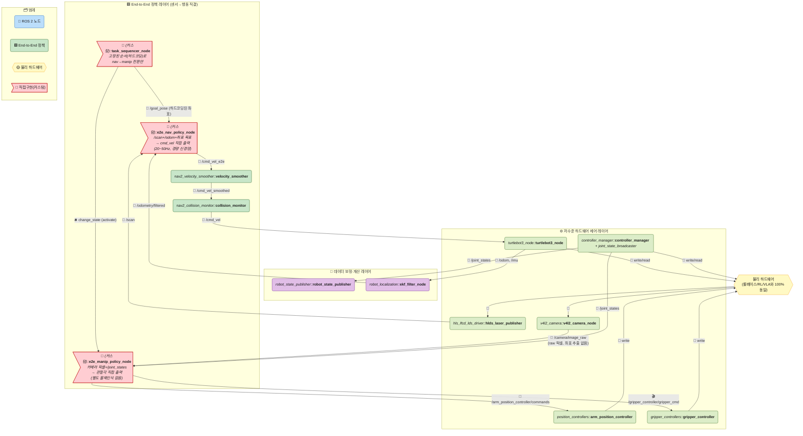
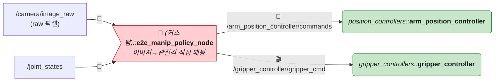
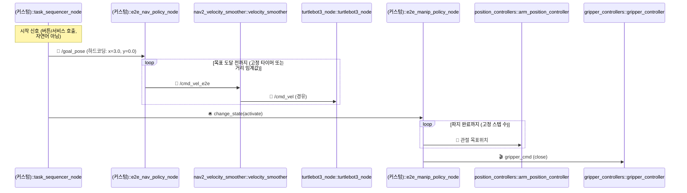

# TurtleBot3 + OpenMANIPULATOR-X 실전 예시 — End-to-End 버전 (순수 센서→행동 직결, 언어 없음)

> 🧭 **네 번째 자매 문서**입니다: [룰베이스](./ros2-turtlebot3-manipulator-example.md) · [RL(LLM/VLM+Sim-to-Real)](./ros2-turtlebot3-manipulator-simtoreal-rl.md) · [VLA](./ros2-turtlebot3-manipulator-vla.md)에 이어, **가장 원초적인 형태**를 다룹니다. 원래 PDF 대화에서 나온 "방식 A: 완전 대체(End-to-End)" — `[센서] → [RL Policy 노드] → [모터 드라이버]` — 를 그대로 구현한 버전입니다.
>
> ⚠️ 이 문서는 일부러 **가장 단순하고 원초적인 구조**를 보여줍니다. 자연어도, 물체 인식 모델도, 태스크 전환 로직도 없습니다 — 그래서 실무에 바로 쓰기엔 한계가 뚜렷합니다. 이 한계 자체가 [RL 버전](./ros2-turtlebot3-manipulator-simtoreal-rl.md)과 [VLA 버전](./ros2-turtlebot3-manipulator-vla.md)이 왜 필요한지를 보여주는 대조군입니다.

---

## 0. 전체 구조 한눈에 보기 (통합 마스터 다이어그램)

**한눈에 보이는 핵심**: VLA 버전의 `vla_policy_node`(언어+시각 대형 모델) 자리에, **언어를 전혀 모르는 훨씬 작고 빠른 정책 2개**(`e2e_nav_policy_node`, `e2e_manip_policy_node`)가 들어갑니다. `action_chunk_executor_node`도 필요 없습니다 — 정책이 가벼워서 그 자체로 고빈도(20~100Hz) 추론이 가능하기 때문입니다.

**빠진 것들 — 의도적으로**:
- **사람/자연어 입력이 없습니다.** `task_sequencer_node`가 시작 신호(예: 버튼, 서비스 호출) 하나만 받고, 목표는 전부 **하드코딩된 좌표**입니다. "저기 컵 가져다줘"처럼 매번 다른 명령은 처리 못 합니다.
- **`perception_node`가 없습니다.** `e2e_manip_policy_node`가 카메라 원시 픽셀을 직접 받아서 "어디에 뭐가 있는지"와 "어떻게 잡을지"를 분리하지 않고 하나의 정책으로 뭉뚱그려 학습합니다.
- **`llm_vlm_planner_node`가 없습니다.** 계획이라는 개념 자체가 없고, `task_sequencer_node`는 정말로 "1번 끝나면 2번"만 아는 스크립트입니다.

---

## 1. 물리 하드웨어 구성

**세 자매 문서와 100% 동일**합니다. [룰베이스 문서 1장](./ros2-turtlebot3-manipulator-example.md#1-물리-하드웨어-구성-개별-부품) 참고. 컴퓨팅 요구량은 **네 버전 중 가장 낮습니다** — VLA처럼 거대 백본을 안 쓰고, RL 버전처럼 별도 LLM/VLM 추론도 없어서 Jetson Orin Nano(8GB)로도 충분합니다.

---

## 2. ROS 2 노드 구성

### Layer 1 — 하드웨어 드라이버 노드 (RL·VLA 버전과 동일)

변경 없음. [RL 버전 Layer1](./ros2-turtlebot3-manipulator-simtoreal-rl.md#layer-1--하드웨어-드라이버-노드-거의-동일-팔-컨트롤러-타입만-변경) 참고.

### Layer 2/3 — 상태추정 노드 (RL·VLA 버전과 동일, Mapless)

`robot_state_publisher`, `ekf_filter_node`만 사용.

### Layer 4 — Nav End-to-End 정책

| 패키지 | 노드 | 역할 | 제공 여부 |
|---|---|---|---|
| (커스텀) | `e2e_nav_policy_node` | `/scan`(raw) + `/odometry/filtered` + `/goal_pose`(고정 좌표)를 입력받아 `/cmd_vel_e2e`를 직접 출력. 지도·경로계획·전역 탐색 전부 없음 | 🔧 **직접 구현 필요** |
| `nav2_velocity_smoother` | `velocity_smoother` | 안전망 (재사용) | ⚙️ 제공 |
| `nav2_collision_monitor` | `collision_monitor` | 안전망 (재사용) | ⚙️ 제공 |

> RL 버전의 `nav_rl_policy_node`와 **거의 같아 보이지만 차이가 있습니다**: RL 버전은 `mission_orchestrator`가 **매번 다른** `/target_pose`를 동적으로 계산해서 넣어주지만, 순수 E2E 버전은 `task_sequencer_node`가 **미리 정해둔 고정 좌표**만 넣어줍니다 — 목적지를 바꾸려면 코드/설정을 다시 배포해야 합니다.

### Layer 5 — Manip End-to-End 정책

| 패키지 | 노드 | 역할 | 제공 여부 |
|---|---|---|---|
| (커스텀) | `e2e_manip_policy_node` | `/camera/image_raw`(raw 픽셀) + `/joint_states`를 입력받아 관절 목표위치 직접 출력. 물체 좌표를 명시적으로 뽑아내는 중간 단계 없이, "이 이미지를 보면 이렇게 움직여라"를 통째로 학습 (Visual Servoing류) | 🔧 **직접 구현 필요** |
| `position_controllers` | `arm_position_controller` | 관절 목표위치 실시간 추종 | ⚙️ 제공 |
| `gripper_controllers` | `gripper_controller` | 그리퍼 개폐 | ⚙️ 제공 |

> **`/tf`(camera_link→base_link)조차 필요 없을 수 있습니다.** `e2e_manip_policy_node`가 카메라 좌표계를 아예 "명시적으로" 다루지 않고, 픽셀 패턴과 관절 움직임의 상관관계만 통째로 학습하기 때문입니다. 다만 이러면 **카메라를 1cm만 옮겨도 재학습이 필요**할 정도로 취약해서, 실무에서는 최소한 `/tf`를 같이 넣어주는 절충안을 많이 씁니다 (VLA 버전과 동일한 트레이드오프).

---

## 3. 전체 TF 트리

RL·VLA 버전과 동일 (Mapless, `map` 프레임 없음). [RL 버전 3장](./ros2-turtlebot3-manipulator-simtoreal-rl.md#3-전체-tf-트리-mapless--map-프레임-자체가-없음) 참고.

---

## 4. 통합 시나리오: "A지점으로 이동 후 물체 집기" (End-to-End 버전)

> **"목표 도달"을 어떻게 아는가?** 학습된 판단 신호가 따로 없어서, 대부분 **고정 타임아웃**이나 **단순 거리 임계값**으로 때웁니다. RL 버전처럼 정책이 스스로 "다 왔다"는 신호(`/distance_to_goal`)를 정교하게 주지 않는 경우가 많은 것도 순수 E2E의 한계입니다.

---

## 5. 실제 브링업 launch 구조

| 단계 | 내용 |
|---|---|
| 1~2. 베이스/팔 하드웨어 기동 | 세 버전과 동일 |
| 3. E2E 정책 기동 | `e2e_nav_policy_node` + `e2e_manip_policy_node` + `task_sequencer_node` + 안전망 2종만 기동 |
| (오프라인) | 시뮬레이션 RL 또는 소규모 실기 모방학습으로 **스킬별 개별** 학습 (VLA처럼 통합 학습 아님) |

---

## 6. 기능별 재분류

| 레이어 | 정의 | 이 안에 있는 것 |
|---|---|---|
| 🟩 **End-to-End 정책 레이어** | 센서→행동을 스킬별로 직접 매핑, 언어 이해 없음 | `task_sequencer_node`, `e2e_nav_policy_node`, `e2e_manip_policy_node`, `velocity_smoother`, `collision_monitor` |
| 🧮 **데이터 보정·계산 레이어** | 원시 센서 정제·융합 | `robot_state_publisher`, `ekf_filter_node` |
| ⚙️ **저수준 하드웨어 제어 레이어** | 센서 I/O 및 모터 구동 | Layer1 노드 전부 |

VLA 버전에 있던 "🧬 VLA 통합 제어"(언어+시각+계획+제어 하나) 대신, **스킬마다 쪼개진 여러 개의 작은 정책**이 있다는 게 핵심 차이입니다 — 통합도 면에서 RL 버전과 VLA 버전 사이 중간이 아니라, **오히려 RL 버전보다도 더 파편화**되어 있습니다(언어 계층이 아예 없어서 스킬 간 연결이 코드로 하드코딩되기 때문).

---

## 7. 직접 구현/준비해야 하는 것 총정리

### 🔧 직접 구현해야 하는 커스텀 노드

| 노드 | 역할 |
|---|---|
| `task_sequencer_node` | 고정된 순서로 nav→manip 전환 (하드코딩, 학습/추론 없음) |
| `e2e_nav_policy_node` | 좌표 목표 조건부 주행 정책 |
| `e2e_manip_policy_node` | 이미지 조건부 조작 정책 |

### ⚙️ 표준 패키지로 제공되는 것

Layer1 하드웨어 드라이버 전부, `velocity_smoother`, `collision_monitor`, `position_controllers`, `gripper_controllers`, `robot_state_publisher`, `ekf_filter_node` — 네 버전 전부 동일합니다.

### 학습 파이프라인 — RL/VLA보다 오히려 더 좁고 빠름

| 항목 | 내용 |
|---|---|
| 학습 방식 | 스킬별로 **개별** RL(시뮬레이션) 또는 소규모 모방학습 |
| 필요 데이터 | VLA보다 훨씬 적음 (언어 그라운딩 불필요, 단일 목표 유형만 커버) |
| 일반화 범위 | **가장 좁음** — 학습 때 본 좌표/물체 범위 밖으로 나가면 급격히 성능 저하 |
| 새 태스크 추가 | 매번 새 정책을 처음부터(또는 소규모 파인튜닝) 학습해야 함 |

### 결론

순수 End-to-End는 **"일단 되게만 만들기"엔 제일 빠릅니다** — 커스텀 노드도 적고, 학습 데이터도 적게 듭니다. 하지만 **일반화가 전혀 안 됩니다**: 목적지가 바뀌거나, 새로운 물체를 집어야 하거나, 사람이 다른 말로 명령하면 전부 재학습입니다. 이게 바로 [RL 버전](./ros2-turtlebot3-manipulator-simtoreal-rl.md)이 LLM/VLM 계획 레이어를 얹고, [VLA 버전](./ros2-turtlebot3-manipulator-vla.md)이 언어를 정책 안에 통째로 녹이려 한 이유입니다.

---

## 8. 네 버전 종합 비교

| 구분 | 룰베이스 | End-to-End (본 문서) | RL (LLM/VLM+Sim-to-Real) | VLA |
|---|---|---|---|---|
| 커스텀 노드 수 | 2개 | 3개 | 5개 | 2개 |
| 언어 이해 | 없음 | **없음** | 있음 (LLM/VLM) | 있음 (모델 내부 통합) |
| 목표 지정 방식 | 좌표/웨이포인트 | **하드코딩된 좌표** | 자연어 → sub-goal | 자연어 직접 입력 |
| 물체 인식 | (필요시 커스텀) | **정책에 암묵적으로 포함** | 별도 `perception_node` | 모델 내부 통합 |
| 태스크 전환 | BT 조건 분기 | **하드코딩 스크립트** | lifecycle 명시 전환 | 없음(암묵적) |
| 학습 필요 | 없음 | 스킬별 개별 (좁고 빠름) | 정책만 (Isaac Sim) | 전체 통합 (실로봇 데이터) |
| 일반화 범위 | 규칙 범위 내 | **가장 좁음** | 중간 | 가장 넓음(잠재적) |
| 제어 주기 | 20~100Hz | **20~100Hz (가장 빠름)** | 20~100Hz | 1~5Hz+청크 |
| 필요 컴퓨팅 | MCU~소형 SBC | **가장 낮음** (Orin Nano) | Orin Nano | Orin AGX급 |
| 새 명령/새 물체 대응 | 코드 추가 | **재학습 필요** | 비교적 유연 (LLM 재프롬프트) | 유연 (모델이 학습 범위 내면) |

**정리**: 이 네 문서는 "규칙(룰베이스) → 좁은 학습(E2E) → 계층형 학습+언어(RL) → 통합 학습+언어(VLA)"로 이어지는 하나의 스펙트럼입니다. 뒤로 갈수록 유연해지지만 개발·학습 비용과 필요 컴퓨팅이 같이 커집니다.

---

## 9. 참고: 다른 문서와의 관계

- **룰베이스 버전**: [ros2-turtlebot3-manipulator-example.md](./ros2-turtlebot3-manipulator-example.md)
- **RL(LLM/VLM+Sim-to-Real) 버전**: [ros2-turtlebot3-manipulator-simtoreal-rl.md](./ros2-turtlebot3-manipulator-simtoreal-rl.md)
- **VLA 버전**: [ros2-turtlebot3-manipulator-vla.md](./ros2-turtlebot3-manipulator-vla.md)
- **하이브리드(Nav2+RL) 버전**: [ros2-turtlebot3-manipulator-hybrid.md](./ros2-turtlebot3-manipulator-hybrid.md) — "방식 B", 지도를 유지한 채 지역 제어만 RL로 바꾼 절충안
- **개념적 원형**: [ros2-architecture.md](./ros2-architecture.md) — "방식 A: 완전 대체(End-to-End)" 논의의 추상 버전
