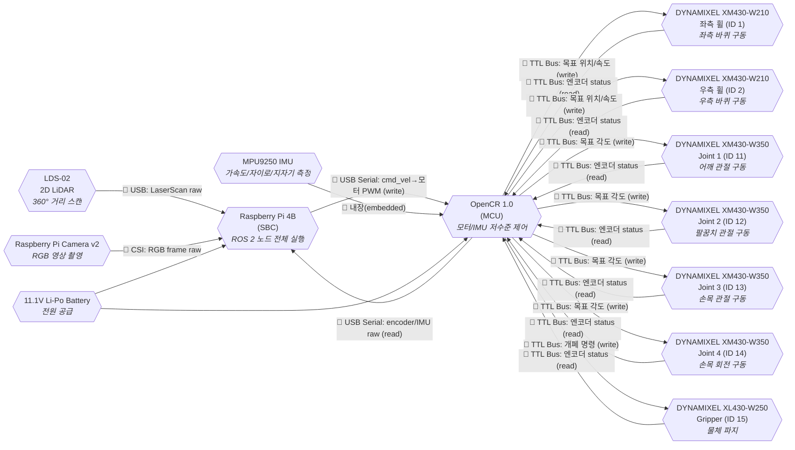
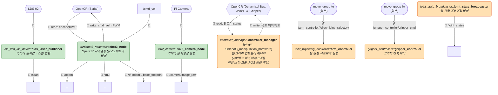
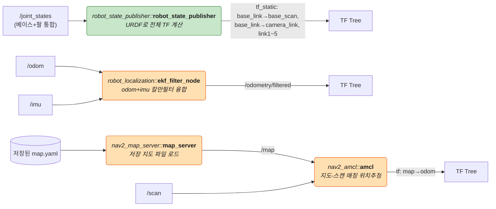
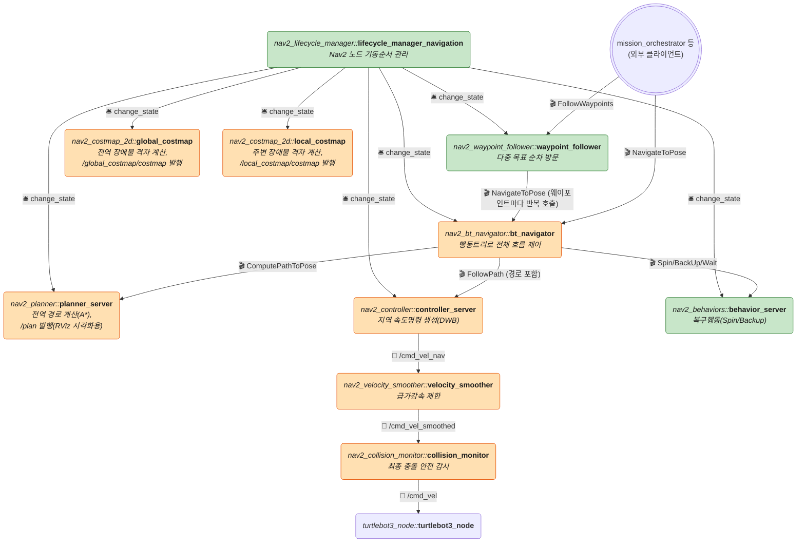
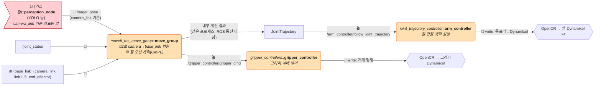
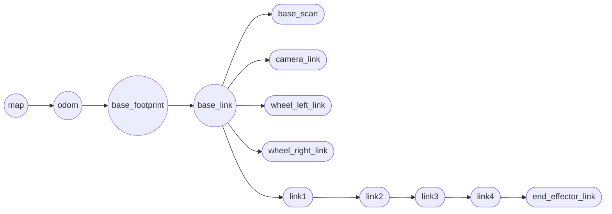
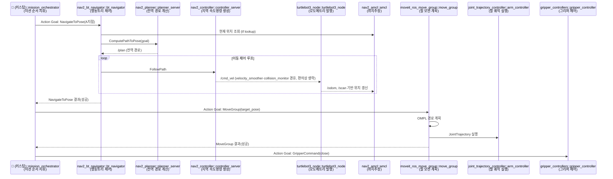
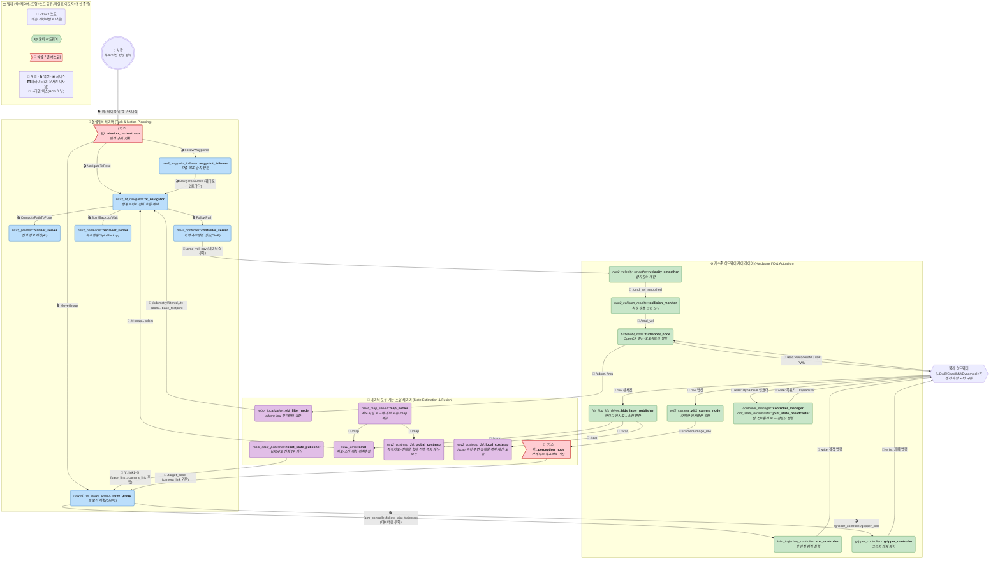
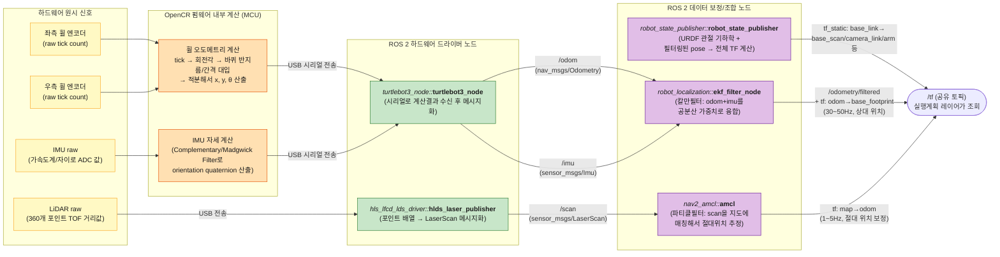

# TurtleBot3 + OpenMANIPULATOR-X 실전 예시 — 룰베이스(Nav2/MoveIt2) 버전

> 🧭 **이 문서는 룰베이스(Nav2 + MoveIt2, 학습 없음) 버전입니다.** 같은 하드웨어를 Sim-to-Real RL 정책으로 대체한 버전은 [ros2-turtlebot3-manipulator-simtoreal-rl.md](./ros2-turtlebot3-manipulator-simtoreal-rl.md) 참고 — 두 문서를 나란히 놓고 비교하면 "Nav2/MoveIt2가 하던 일을 RL 정책 하나가 통째로 대체한다"는 게 한눈에 보입니다.
>
> [ros2-rule-based-architecture.md](./ros2-rule-based-architecture.md) 의 추상적 5-Layer 구조를 **실제 ROBOTIS TurtleBot3 (Waffle Pi) + OpenMANIPULATOR-X** 하드웨어와 **ROS 2 표준 패키지/노드명**으로 구체화한 문서입니다. 하드웨어와 노드를 뭉뚱그리지 않고 각각 개별 박스로 그렸습니다.
>
> ⚠️ 패키지/노드명은 ROBOTIS `turtlebot3`, `turtlebot3_manipulation`, Nav2, MoveIt2 공식 저장소 기준이며, 배포 버전(Humble/Jazzy 등)에 따라 실행파일명이 소폭 다를 수 있습니다.

## 범례 (제공 여부 표시)

| 표시 | 의미 |
|---|---|
| ✅ **완전 제공** | 설치만 하면 바로 실행 가능. 코드 작성 불필요 |
| ⚙️ **제공 + 설정 필요** | 노드/실행파일은 제공되지만 YAML/URDF/SRDF 등 **설정파일은 직접 작성·튜닝**해야 함 |
| 🔧 **직접 구현 필요** | 표준 패키지에 없는 **커스텀 노드**. 코드를 직접 작성해야 함 |

결론부터: 이 문서의 노드 대부분은 ROBOTIS/Nav2/MoveIt2가 **제공**하지만, "이동 완료 후 팔을 뻗어라" 같은 **미션 순서를 지휘하는 노드(Task Orchestrator)는 어떤 표준 패키지에도 없어서 직접 만들어야** 합니다 → [7. 직접 구현/준비해야 하는 것 총정리](#7-직접-구현준비해야-하는-것-총정리) 참고. 노드들을 기능 역할로 재분류한 관점은 [6. 기능별 3-Layer 재분류](#6-기능별-3-layer-재분류-하드웨어제어--데이터보정조합--실행계획) 참고.

---

## 0. 전체 구조 한눈에 보기 (통합 마스터 다이어그램)

물리 하드웨어부터 사람 명령까지 **모든 요소를 하나의 다이어그램**에 담았습니다. 아래 1~6장은 이 큰 그림을 각각 "하드웨어만", "레이어별 노드만", "기능 3계층만", "센서 계산 파이프라인만"으로 **쪼갠 상세 뷰**입니다. 전체 구조를 먼저 훑고, 궁금한 부분만 아래 상세 절로 내려가서 보시면 됩니다.

도형에도 의미를 부여했습니다: **원(사람) / 알약형(일반 ROS 2 노드) / 원기둥(지도·데이터 저장) / 육각형(물리 하드웨어) / 깃발(직접 구현해야 하는 커스텀 노드)** — 색상(레이어)과 도형(노드 종류)이 서로 다른 정보를 동시에 표현합니다.

```mermaid
flowchart TB
    Human((("👤 사람<br/><i>목표/미션 명령 입력</i>")))

    subgraph EXEC["🧭 실행계획 레이어"]
        Orch>"🔧 <i>(커스텀)::</i><b>mission_orchestrator</b><br/><i>미션 순서 지휘(커스텀)</i>"]
        BT("<i>nav2_bt_navigator::</i><b>bt_navigator</b><br/><i>행동트리로 전체 흐름 제어</i>")
        PS("<i>nav2_planner::</i><b>planner_server</b><br/><i>전역 경로 계산(A*)</i>")
        CS("<i>nav2_controller::</i><b>controller_server</b><br/><i>지역 속도명령 생성(DWB)</i>")
        WF("<i>nav2_waypoint_follower::</i><b>waypoint_follower</b><br/><i>다중 목표 순차 방문</i>")
        BS("<i>nav2_behaviors::</i><b>behavior_server</b><br/><i>복구행동(Spin/Backup)</i>")
        MG("<i>moveit_ros_move_group::</i><b>move_group</b><br/><i>팔 모션 계획(OMPL)</i>")
    end

    subgraph DATA["🧮 데이터 보정·계산·조합 레이어"]
        RSP("<i>robot_state_publisher::</i><b>robot_state_publisher</b><br/><i>URDF로 전체 TF 계산</i>")
        EKF("<i>robot_localization::</i><b>ekf_filter_node</b><br/><i>odom+imu 칼만필터 융합</i>")
        AMCL("<i>nav2_amcl::</i><b>amcl</b><br/><i>지도-스캔 매칭 위치추정</i>")
        MapSrv("<i>nav2_map_server::</i><b>map_server</b><br/><i>지도파일 로드해 내부 보유·/map 제공</i>")
        GC("<i>nav2_costmap_2d::</i><b>global_costmap</b><br/><i>전역 장애물 격자 계산,<br/>/global_costmap/costmap 발행</i>")
        LC("<i>nav2_costmap_2d::</i><b>local_costmap</b><br/><i>주변 장애물 격자 계산,<br/>/local_costmap/costmap 발행</i>")
        Perc>"🔧 <i>(커스텀)::</i><b>perception_node</b><br/><i>카메라로 목표좌표 계산(커스텀)</i>"]
    end

    subgraph HWL["⚙️ 저수준 하드웨어 제어 레이어"]
        LidarDrv("<i>hls_lfcd_lds_driver::</i><b>hlds_laser_publisher</b><br/><i>라이다 원시값→스캔 변환</i>")
        CamDrv("<i>v4l2_camera::</i><b>v4l2_camera_node</b><br/><i>카메라 원시영상 발행</i>")
        TB3("<i>turtlebot3_node::</i><b>turtlebot3_node</b><br/><i>OpenCR 통신·오도메트리 발행</i>")
        VS("<i>nav2_velocity_smoother::</i><b>velocity_smoother</b><br/><i>급가감속 제한</i>")
        CM("<i>nav2_collision_monitor::</i><b>collision_monitor</b><br/><i>최종 충돌 안전 감시</i>")
        CtrlMgr("<i>controller_manager::</i><b>controller_manager</b><br/><i>joint_state_broadcaster::</i><b>joint_state_broadcaster</b><br/><i>팔 컨트롤러 로드·관절값 발행</i>")
        ArmCtrl("<i>joint_trajectory_controller::</i><b>arm_controller</b><br/><i>팔 관절 궤적 실행</i>")
        GripCtrl("<i>gripper_controllers::</i><b>gripper_controller</b><br/><i>그리퍼 개폐 제어</i>")
    end

    subgraph PHYS["🔩 물리 하드웨어"]
        RPi{{"Raspberry Pi 4B<br/><i>이 시스템의 모든 ROS 2 소프트웨어<br/>노드를 이 컴퓨터 1대에서 실행</i>"}}
        OpenCR{{"OpenCR 1.0<br/><i>저수준 모터/IMU 제어</i>"}}
        IMUhw{{"MPU9250 IMU<br/><i>가속도/자이로 측정</i>"}}
        LidarHW{{"LDS-02<br/><i>360도 거리 스캔</i>"}}
        CamHW{{"Pi Camera v2<br/><i>RGB 영상 촬영</i>"}}
        WL{{"휠 좌 (XM430)<br/><i>좌측 바퀴 구동</i>"}}
        WR{{"휠 우 (XM430)<br/><i>우측 바퀴 구동</i>"}}
        J{{"팔 관절×4 (XM430)<br/><i>팔 관절 구동</i>"}}
        Grip{{"그리퍼 (XL430)<br/><i>물체 파지</i>"}}
    end

    %% 사람 → 실행계획
    Human -->|"🗣️ 예: '테이블 위 컵 가져다줘'"| Orch
    Orch -->|"🎬 NavigateToPose"| BT
    Orch -->|"🎬 FollowWaypoints"| WF
    WF -->|"🎬 NavigateToPose (웨이포인트마다)"| BT
    Orch -->|"🎬 MoveGroup"| MG
    BT -->|"🎬 ComputePathToPose"| PS
    BT -->|"🎬 FollowPath"| CS
    BT -->|"🎬 Spin/BackUp/Wait"| BS

    %% 데이터 → 실행계획 (ros2 node list 기준 실제 통신만 표시)
    AMCL -->|"📨 /tf: map→odom"| BT
    RSP -->|"📨 /tf (base_link→camera_link 포함)"| MG
    Perc -->|"📨 /target_pose (커스텀,<br/>camera_link 기준 좌표)"| MG

    %% 명령 하향
    CS -->|"📨 /cmd_vel_nav"| VS -->|"📨 /cmd_vel_smoothed"| CM -->|"📨 /cmd_vel"| TB3
    MG -->|"🎬 /arm_controller/follow_joint_trajectory"| ArmCtrl
    MG -->|"🎬 /gripper_controller/gripper_cmd"| GripCtrl

    %% 하드웨어드라이버 → 데이터 (센싱 상향)
    LidarDrv -->|"📨 /scan"| AMCL
    LidarDrv -->|"📨 /scan"| GC
    LidarDrv -->|"📨 /scan"| LC
    TB3 -->|"📨 /odom, /imu"| EKF
    EKF -->|"📨 /odometry/filtered, /tf: odom→base_footprint"| BT
    CamDrv -->|"📨 /camera/image_raw"| Perc
    MapSrv -->|"📨 /map"| AMCL
    MapSrv -->|"📨 /map"| GC
    CtrlMgr -->|"📨 /joint_states"| RSP

    %% 물리 하드웨어 ↔ 드라이버 (ROS 통신 아님, 시리얼/버스 배선)
    LidarHW -->|"🔌 LaserScan raw"| LidarDrv
    CamHW -->|"🔌 RGB frame raw"| CamDrv
    TB3 -->|"🔌 write: cmd_vel→모터 PWM"| OpenCR
    OpenCR -->|"🔌 read: encoder/IMU raw"| TB3
    IMUhw -->|"🔌 내장(embedded)"| OpenCR
    CtrlMgr -->|"🔌 write: 목표각→Dynamixel 명령"| OpenCR
    OpenCR -->|"🔌 read: Dynamixel 엔코더"| CtrlMgr
    OpenCR -->|"🔌 write: 목표 위치/속도"| WL
    WL -->|"🔌 read: 엔코더 status"| OpenCR
    OpenCR -->|"🔌 write: 목표 위치/속도"| WR
    WR -->|"🔌 read: 엔코더 status"| OpenCR
    OpenCR -->|"🔌 write: 목표 각도×4"| J
    J -->|"🔌 read: 엔코더 status×4"| OpenCR
    OpenCR -->|"🔌 write: 개폐 명령"| Grip
    Grip -->|"🔌 read: 엔코더 status"| OpenCR

    subgraph LEGEND["🗂️ 범례 (색=레이어, 도형=노드 종류, 화살표 이모지=통신 종류)"]
        direction LR
        LgHuman((("👤 사람/외부입력")))
        LgNode("💊 ROS 2 노드<br/><i>(색은 레이어별로 다름,<br/>아래 도형 규칙 참고)</i>")
        LgPhys{{"🟡 물리 하드웨어"}}
        LgCustom>"🔴 직접구현(커스텀)"]
        LgComm["📨 토픽 · 🎬 액션 · 🛎️ 서비스<br/>🎛️ 파라미터(이 문서엔 미사용)<br/>🔌 시리얼/버스(ROS 아님)"]
    end

    classDef exec fill:#bbdefb,stroke:#1565c0,color:#1b1b1b;
    classDef data fill:#e1bee7,stroke:#6a1b9a,color:#1b1b1b;
    classDef hw fill:#c8e6c9,stroke:#2e7d32,color:#1b1b1b;
    classDef phys fill:#fff9c4,stroke:#f9a825,color:#1b1b1b;
    classDef custom fill:#ffcdd2,stroke:#c62828,color:#1b1b1b;
    class BT,PS,CS,WF,BS,MG exec;
    class RSP,EKF,AMCL,MapSrv,GC,LC data;
    class LidarDrv,CamDrv,TB3,VS,CM,CtrlMgr,ArmCtrl,GripCtrl hw;
    class RPi,OpenCR,IMUhw,LidarHW,CamHW,WL,WR,J,Grip phys;
    class Orch,Perc custom;
    class LgPhys phys;
    class LgCustom custom;
```

**이 마스터 다이어그램의 4겹 구조** (아래로 갈수록 물리적, 위로 갈수록 논리적, 우측 상단 범례 참고):
1. 🔩 물리 하드웨어(육각형) — 실제 부품 (모터, 센서, 보드) → [상세: 1장]
2. ⚙️ 저수준 하드웨어 제어 레이어(알약형) — 하드웨어 I/O 노드 → [상세: 2장 Layer1, 6-1장]
3. 🧮 데이터 보정·계산·조합 레이어(알약형) — 센서 퓨전/위치추정/지도 → [상세: 2장 Layer2/3, 6-1장]
4. 🧭 실행계획 레이어(+사람=삼중원) — 미션/경로/모션 계획 → [상세: 2장 Layer4/5]

**도형 규칙**: 🔵 삼중원(사람/외부입력) · 💊 알약형(**모든 ROS 2 노드** — `map_server`/`global_costmap`/`local_costmap`처럼 내부에 데이터를 계산·보유하는 노드도 똑같이 알약형이며, "무엇을 보유/계산하는지"는 도형이 아니라 박스 안 설명 문구로 표기) · ⬡ 육각형(물리 하드웨어) · 🚩 깃발(표준 패키지에 없어 직접 구현해야 하는 커스텀 노드). 노드 라벨은 `*패키지명::*` 이탤릭 + `**노드명**` 볼드로 표기합니다.

**화살표 규칙 (단순화)**: 이 다이어그램의 노드는 전부 **`ros2 node list`에 실제로 나오는 단위**이고, 화살표는 전부 `ros2 topic list`/`ros2 service list`/`ros2 action list`로 확인 가능한 **진짜 ROS 통신**만 그렸습니다. 예를 들어 `global_costmap`/`local_costmap`은 `planner_server`/`controller_server`가 내부적으로 참조하지만, 이건 같은 프로세스 안에서 C++ 객체를 직접 소유해서 호출하는 구현 디테일이라 **ROS 그래프에는 안 보입니다** — 그래서 이 다이어그램에서도 그 둘 사이엔 화살표를 그리지 않았습니다(대신 `global_costmap`/`local_costmap` 자신이 실제로 발행하는 `/global_costmap/costmap`·`/local_costmap/costmap` 토픽만 설명에 적어뒀습니다). 같은 이유로 `controller_manager`가 `arm_controller`/`gripper_controller`를 제어루프에서 직접 호출하는 관계도 그리지 않았습니다.

**통신 종류 이모지**: 선 스타일 대신 화살표 라벨 맨 앞에 이모지로 통신 종류를 구분합니다.
- **ROS 2 통신 (4가지가 전부)**: 📨 **토픽**(pub/sub, `/tf`도 포함) · 🎬 **액션**(goal/feedback/result가 있는 장시간 작업) · 🛎️ **서비스**(요청-응답 1회성 호출, 예: lifecycle `change_state`) · 🎛️ **파라미터**(다른 노드의 파라미터를 get/set, 내부적으로 서비스 기반). 다만 **이 문서의 예시에는 🎛️ 파라미터를 쓰는 실제 엣지가 없습니다** — 여기 나온 설정(`nav2_params.yaml`, `ekf.yaml` 등)은 전부 launch 시점에 각 노드가 자기 자신의 파라미터를 정적으로 로드하는 것이라, 다른 노드의 파라미터를 원격으로 get/set하는 진짜 통신이 아니기 때문입니다(정적 설정 파일 목록은 [7장](#7-직접-구현준비해야-하는-것-총정리) 참고). 범례에는 완전성을 위해 정의만 남겨둡니다.
- **ROS가 아닌 통신**: 🔌 **시리얼/버스** — `turtlebot3_node`↔OpenCR의 USB 시리얼, OpenCR↔Dynamixel(바퀴/팔/그리퍼)의 TTL 버스처럼 ROS 그래프 밖에서 일어나는 하드웨어 배선입니다. 명령이 내려가는 방향과 상태값이 올라오는 방향이 서로 다르므로, 양방향 관계는 **화살표 2개(각 방향 1개씩)로 나눠 그리고 각각 무슨 데이터가 오가는지** 적었습니다 (예: `turtlebot3_node → OpenCR`: `cmd_vel→모터 PWM` write / `OpenCR → turtlebot3_node`: `encoder/IMU raw` read).

---

## 1. 물리 하드웨어 구성 (개별 부품)

| 부품 | 모델 | 역할 | 연결 인터페이스 |
|---|---|---|---|
| SBC (메인 컴퓨터) | Raspberry Pi 4B | ROS 2 노드 전체 실행 | — |
| MCU (저수준 제어보드) | OpenCR 1.0 (STM32F746, Cortex-M7) | 모터/IMU 저수준 제어, 실시간 서보 루프 | USB Serial ↔ RPi |
| IMU | MPU9250 (OpenCR 내장) | 가속도/자이로/지자기 | OpenCR 내부 I2C |
| 2D LiDAR | LDS-02 | 360° 거리 스캔 | USB ↔ RPi |
| 카메라 | Raspberry Pi Camera Module v2 | RGB 영상 (Waffle Pi 모델) | CSI ↔ RPi |
| 좌측 휠 모터 | DYNAMIXEL XM430-W210 (ID 1) | 좌측 바퀴 구동 | TTL Dynamixel Bus ↔ OpenCR |
| 우측 휠 모터 | DYNAMIXEL XM430-W210 (ID 2) | 우측 바퀴 구동 | TTL Dynamixel Bus ↔ OpenCR |
| 팔 관절 1~4 | DYNAMIXEL XM430-W350 ×4 (ID 11~14) | OpenMANIPULATOR-X 4-DOF 관절 | TTL Dynamixel Bus ↔ OpenCR |
| 그리퍼 | DYNAMIXEL XL430-W250 (ID 15) | 그리퍼 개폐 | TTL Dynamixel Bus ↔ OpenCR |
| 배터리 | 11.1V Li-Po | 전원 공급 | — |

---

## 2. ROS 2 노드 구성 (레이어별, 개별 노드/패키지명)

### Layer 1 — 하드웨어 드라이버 노드

| 패키지 | 노드(실행파일) | 구독(Sub) | 발행(Pub) | 역할 | 제공 여부 |
|---|---|---|---|---|---|
| `hls_lfcd_lds_driver` | `hlds_laser_publisher` | — | `/scan` (`sensor_msgs/LaserScan`) | LDS-02 raw 데이터 → 라이다 스캔 | ✅ 완전 제공 |
| `turtlebot3_node` | `turtlebot3_node` | `/cmd_vel` | `/odom`, `/imu`, `/battery_state`, `/tf`(odom→base_footprint) | OpenCR와 시리얼 통신, 휠 오도메트리·IMU 발행 | ✅ 완전 제공 |
| `v4l2_camera` (또는 `raspicam2`) | `v4l2_camera_node` | — | `/camera/image_raw` | 카메라 원시 영상 | ✅ 완전 제공 |
| `controller_manager` | `controller_manager` | — | — | 팔/그리퍼용 `ros2_control` 컨트롤러 매니저 (하드웨어 플러그인: `turtlebot3_manipulation_hardware`) | ⚙️ 제공 + `controllers.yaml` 작성 필요 |
| `joint_state_broadcaster` | `joint_state_broadcaster` | — | `/joint_states` (팔 관절) | 팔 관절 엔코더 값 발행 | ⚙️ 제공 + 설정(등록) 필요 |
| `joint_trajectory_controller` | `arm_controller` | `/arm_controller/joint_trajectory` | — | 팔 관절 목표 궤적 실행 | ⚙️ 제공 + 설정(PID/joint 목록) 필요 |
| `gripper_controllers` | `gripper_controller` | Action: `/gripper_controller/gripper_cmd` | — | 그리퍼 개폐 제어 | ⚙️ 제공 + 설정 필요 |

### Layer 2/3 — 상태추정(TF) 노드

| 패키지 | 노드 | 구독 | 발행 | 역할 | 제공 여부 |
|---|---|---|---|---|---|
| `robot_state_publisher` | `robot_state_publisher` | `/joint_states` (베이스+팔 통합) | `/tf`, `/tf_static` (고정 링크: base_link→base_scan, base_link→camera_link, link1~5) | URDF 기반 정적/동적 TF 발행 | ✅ 완전 제공 (표준 조합 그대로 사용 시 URDF도 ROBOTIS가 제공) |
| `robot_localization` | `ekf_filter_node` | `/odom`, `/imu` | `/odometry/filtered` | 휠 오도메트리 + IMU 융합 (선택적, 기본 turtlebot3_node의 odom을 보강) | ⚙️ 제공 + `ekf.yaml` 작성 필요 |
| `nav2_map_server` | `map_server` | — | `/map` | 사전 저장된 `.yaml`/`.pgm` 지도 로드 | ⚙️ 제공 + 지도 파일은 SLAM으로 직접 생성 필요 |
| `nav2_amcl` | `amcl` | `/scan`, `/map` | `/amcl_pose`, `/tf`(map→odom) | 파티클 필터 기반 지도-스캔 매칭 위치추정 | ⚙️ 제공 + 파라미터 튜닝 필요 |
| `slam_toolbox` | `sync_slam_toolbox_node` | `/scan`, `/tf` | `/map`, `/tf`(map→odom) | (매핑 단계에서만 사용, amcl과 동시 실행 안 함) | ✅ 완전 제공 |

### Layer 4 — Nav2 경로계획/제어 노드 (전부 개별 Lifecycle Node)

| 패키지 | 노드 | 역할 | 제공 여부 |
|---|---|---|---|
| `nav2_costmap_2d` | `global_costmap` | 전역 점유격자 (Static+Obstacle+Inflation Layer) | ⚙️ 제공 + `nav2_params.yaml` 튜닝 필요 |
| `nav2_costmap_2d` | `local_costmap` | 로봇 주변 실시간 점유격자 | ⚙️ 제공 + 파라미터 튜닝 필요 |
| `nav2_planner` | `planner_server` | 전역 경로 계획 (플러그인: NavFn/SmacPlanner, A* 계열) | ⚙️ 제공 + 플러그인 선택/파라미터 필요 |
| `nav2_controller` | `controller_server` | 지역 제어 (플러그인: DWB/RegulatedPurePursuit) → `/cmd_vel_nav` (raw, `/cmd_vel`과 이름 충돌 방지용 remap) | ⚙️ 제공 + 플러그인 선택/튜닝 필요 |
| `nav2_behaviors` | `behavior_server` | Spin/BackUp/Wait 등 복구 행동 | ✅ 완전 제공 (기본값으로 대부분 충분) |
| `nav2_bt_navigator` | `bt_navigator` | Behavior Tree 오케스트레이션, Action: `NavigateToPose` | ✅ 제공 (기본 BT XML 포함, 커스텀 행동 추가 시만 직접 작성) |
| `nav2_waypoint_follower` | `waypoint_follower` | 다중 목표 지점 순차 방문 (Action 서버: `FollowWaypoints`. 내부적으로 각 지점마다 `bt_navigator`의 `NavigateToPose` 액션을 액션 **클라이언트**로 호출 — `bt_navigator`가 이걸 부르는 게 아니라 반대) | ✅ 완전 제공 |
| `nav2_velocity_smoother` | `velocity_smoother` | 급가속/급정지 제한 | ⚙️ 제공 + 파라미터 필요 |
| `nav2_collision_monitor` | `collision_monitor` | 최종 충돌 안전 감시 | ⚙️ 제공 + 파라미터 필요 |
| `nav2_lifecycle_manager` | `lifecycle_manager_navigation` | 위 노드들의 Configure/Activate 순서 관리 | ✅ 완전 제공 |

### Layer 5 — 매니퓰레이터 계획 노드 (MoveIt2)

| 패키지 | 노드 | 역할 | 제공 여부 |
|---|---|---|---|
| `moveit_ros_move_group` | `move_group` | 모션 플래닝 서버 (플러그인: OMPL, 샘플링 기반 — 학습 아님), Action: `/move_action` | ⚙️ 제공 + MoveIt Setup Assistant로 SRDF/config 패키지 생성 필요 |
| `moveit_ros_planning` | (move_group 내부) `planning_scene_monitor` | 충돌 회피용 3D 환경 모델 관리 | ✅ 완전 제공 (move_group 내부 자동 실행) |
| `moveit_servo` (선택) | `servo_node` | 실시간 조이스틱/원격 팔 제어 | ⚙️ 제공 + 설정 필요 (선택 사항) |
| RViz2 `moveit_rviz_plugin` | `rviz2` | 계획 시각화/목표 지정 (Interactive Marker) | ✅ 완전 제공 |
| — | (없음: 카메라로 "집을 대상 좌표" 계산) | 물체 인식 → 목표 Pose 추정 (**camera_link 기준**으로 출력, base_link 변환은 `move_group`이 `/tf`로 직접 수행) | 🔧 **직접 구현 필요** (YOLO/Isaac ROS 등 통합) |

> **Eye-in-Hand vs Eye-to-Hand는 URDF 문제일 뿐, 코드는 안 바뀝니다.** 이 TurtleBot3 예시의 Pi Camera는 몸통 상단에 고정된 **Eye-to-Hand**라 URDF에서 `camera_link`가 `base_link`의 (고정) 자식입니다. Eye-in-Hand(그리퍼에 카메라 부착)였다면 `camera_link`가 팔 마지막 링크(`tool0`)의 자식이 되어 관절이 움직일 때마다 위치가 바뀌겠지만, 어느 쪽이든 `robot_state_publisher`가 URDF를 그대로 계산해서 `/tf`를 내주므로 **`perception_node`와 `move_group`은 코드를 전혀 바꿀 필요가 없습니다.** 카메라를 실제로 어디에 달았는지 측정해서 URDF(또는 Hand-Eye Calibration 결과)에 정확히 반영하는 것만 설치 시 1회 필요합니다.

---

## 3. 전체 TF 트리 (실제 프레임명)

- `map → odom`: `amcl` (Layer3) 실시간 발행 (누적 오차 보정, 저빈도)
- `odom → base_footprint`: `turtlebot3_node` 또는 `ekf_filter_node` 발행 (고빈도, 30~50Hz)
- `base_link → {base_scan, camera_link, link1..link4, end_effector_link}`: `robot_state_publisher`가 URDF 기준 계산 (고정/관절 각도 반영)

---

## 4. 통합 시나리오: "A지점으로 이동 후 물체 집기"

> `mission_orchestrator`는 **표준 패키지에 없는 노드**입니다. "이동 액션 완료를 기다렸다가 팔 액션을 호출하고, 그 다음 그리퍼를 닫는다"는 **미션 순서 자체가 애플리케이션 로직**이라 Nav2/MoveIt2 어디에도 대신 짜주는 코드가 없습니다. Python `rclpy` action client 2~3개(`NavigateToPose`, `MoveGroup`, `GripperCommand`)를 순서대로 호출하는 수십 줄짜리 노드를 직접 작성해야 합니다.

---

## 5. 실제 브링업 launch 구조 (참고)

| 단계 | launch 파일 | 패키지 |
|---|---|---|
| 1. 베이스 하드웨어 기동 | `robot.launch.py` | `turtlebot3_bringup` |
| 2. 팔/그리퍼 하드웨어 기동 | `hardware.launch.py` | `turtlebot3_manipulation_bringup` |
| 3. 지도 기반 위치추정 + Nav2 | `bringup_launch.py` (map_server, amcl, planner_server, controller_server, bt_navigator 등 일괄 기동) | `nav2_bringup` |
| 4. 매니퓰레이터 모션플래닝 | `move_group.launch.py` | `turtlebot3_manipulation_moveit_config` |
| (매핑 시에만) | `online_async_launch.py` | `slam_toolbox` |

---

## 6. 기능별 3-Layer 재분류 (하드웨어제어 / 데이터보정·조합 / 실행계획)

앞선 레이어 구분(L1~L5)이 **ROS 2 패키지 단위**였다면, 이번엔 같은 노드들을 **기능적 역할** 기준 3계층으로 다시 묶은 것입니다.

> **Q. 사람이 명령 내리는 게 실행계획 레이어 맞나?** → **맞습니다.** 목표(Goal Pose)나 미션 명령을 입력하는 지점은 "무엇을 할지 결정"하는 계획의 시작점이므로 실행계획 레이어 최상단에 위치합니다.

| 레이어 | 정의 | 이 안 도는 것 |
|---|---|---|
| 🧭 **실행계획 레이어** | "무엇을, 어떤 순서로 할지" 결정 (사람의 명령 포함) | 사람의 목표 입력, `mission_orchestrator`, `bt_navigator`, `planner_server`, `controller_server`, `waypoint_follower`, `behavior_server`, `move_group` |
| 🧮 **데이터 보정·계산·조합 레이어** | 원시 센서를 정제·융합해서 "현재 상태(위치/지도/장애물/물체좌표)"를 계산 | `robot_state_publisher`, `ekf_filter_node`, `amcl`, `map_server`, `global_costmap`, `local_costmap`, 물체 인식/목표 Pose 추정 |
| ⚙️ **저수준 하드웨어 제어 레이어** | 실제 센서 I/O 및 모터 구동 (계획된 명령의 최종 실행) | `hlds_laser_publisher`, `v4l2_camera_node`, `turtlebot3_node`, `velocity_smoother`, `collision_monitor`, `controller_manager`, `joint_state_broadcaster`, `arm_controller`, `gripper_controller` |

**흐름 읽는 법**:
- **도형 규칙**: 💊 알약형(**모든 ROS 2 노드**, `map_server`/`global_costmap`/`local_costmap`처럼 데이터를 계산·보유하는 노드도 동일 도형 — 무엇을 하는지는 박스 안 설명 문구로 표기) · ⬡ 육각형(물리 하드웨어) · 🚩 깃발(직접 구현 커스텀 노드) · ⏺ 삼중원(사람)
- **화살표는 전부 `ros2 node list` 기준 실제 ROS 통신만** 표시하며, 라벨 앞 이모지로 종류를 구분합니다: 📨 토픽 · 🎬 액션 · 🛎️ 서비스. `global_costmap`/`local_costmap`이 `planner_server`/`controller_server`에게 격자를 넘기는 것처럼 같은 프로세스 안에서 C++ 객체를 직접 호출하는 구현 디테일은 ROS 그래프에 안 보이므로 화살표를 그리지 않았습니다.
- **센싱(상향)**: 저수준 하드웨어 제어 레이어의 센서 드라이버 → 데이터 보정 레이어에서 융합/보정 → 실행계획 레이어가 "현재 상태"로 참조 (위로 올라가는 📨 토픽들)
- **명령(하향, 데이터층 우회)**: 실행계획 레이어가 결정한 📨 `/cmd_vel`/🎬 액션 명령은 **데이터 보정 레이어를 거치지 않고** 저수준 하드웨어 제어 레이어로 직행 — 계획은 "이미 계산된 상태값"만 참고할 뿐, 명령 실행 경로에는 관여하지 않음
- 이 구조는 로보틱스의 고전적인 **Sense → Plan → Act** 루프를 3계층에 그대로 대응시킨 것입니다.

### 6-1. "encoder/lidar 원시값 → 보정 → 좌표계산" 상세 파이프라인

위 다이어그램은 `turtlebot3_node`, `ekf_filter_node`처럼 이미 계산이 끝난 노드 단위로 뭉쳐 있어서, **엔코더/라이다 원시값이 실제로 어떤 계산 단계를 거쳐 좌표가 되는지**는 안 보입니다. 그 내부를 펼치면 다음과 같습니다.

| 단계 | 무엇을 하는가 | 어디서 계산되는가 |
|---|---|---|
| ① 원시 신호 획득 | 엔코더 tick 카운트, IMU ADC 값, 라이다 TOF 거리값을 그대로 읽음 | 물리 센서 (계산 없음) |
| ② 저수준 보정/변환 | tick → 바퀴 회전각·속도 → 로봇 이동거리 적분(오도메트리 역기구학), IMU 노이즈 필터링 | **OpenCR 펌웨어(MCU)** 내부 |
| ③ 메시지화 | 계산된 값을 ROS 2 표준 메시지(`Odometry`, `Imu`, `LaserScan`)로 포장 | `turtlebot3_node`, `hlds_laser_publisher` |
| ④ 센서 퓨전/매칭 | 여러 센서 값을 신뢰도(공분산) 가중치로 합치거나(EKF), 지도와 대조해서 절대위치 산출(AMCL) | `ekf_filter_node`, `amcl` |
| ⑤ 좌표계 완성 | `robot_state_publisher`(URDF 기하학, `base_link→`)·`ekf_filter_node`(`odom→base_footprint`)·`amcl`(`map→odom`) **셋이 각자 자기 담당 구간만** 계산해서 **같은 `/tf` 토픽에 독립적으로 발행** — 하나로 합치는 노드는 없음 | `robot_state_publisher`, `ekf_filter_node`, `amcl` |

즉 "받아와서 보정하고 좌표 계산하는" 부분은 ①~⑤ 전체 과정이며, ②(오도메트리 계산)는 이미 **ROBOTIS OpenCR 펌웨어가 제공**하므로 직접 구현할 필요는 없고, ④~⑤도 `robot_localization`/`nav2_amcl`/`robot_state_publisher`가 제공합니다 — 즉 이 파이프라인 전체가 ✅ 제공됨 범주입니다.

> ⚠️ **`/tf`는 특수한 토픽입니다.** `/cmd_vel`처럼 발행자가 둘이면 충돌하는 일반 토픽과 달리, `/tf`(`tf2_msgs/TFMessage`)는 **여러 노드가 동시에 발행하는 게 정상**입니다 — 각자 자기가 아는 부모-자식 프레임 쌍(`robot_state_publisher`는 `base_link→arm_link1` 등, `ekf_filter_node`는 `odom→base_footprint`, `amcl`은 `map→odom`)만 조각조각 발행하고, 그걸 구독하는 쪽(`tf2_ros::Buffer`)이 클라이언트 사이드에서 전체 트리로 합쳐서 조회합니다. 그래서 위 다이어그램에서 세 노드가 전부 같은 `Out` 하나로 화살표가 모이는 겁니다 — 서로가 서로를 호출/구독하는 게 아니라 각자 따로 발행하는 것뿐입니다.

---

## 7. 직접 구현/준비해야 하는 것 총정리

이 문서에 나온 노드 중 **완전히 코드를 새로 짜야 하는 것은 사실 1~2개뿐**입니다. 나머지는 전부 ROBOTIS/Nav2/MoveIt2가 제공하고, "설정파일 작성/튜닝"만 하면 됩니다.

### 🔧 직접 구현해야 하는 커스텀 노드

| 노드 | 왜 없는가 | 최소 구현 내용 |
|---|---|---|
| `mission_orchestrator` (미션 순서 지휘) | "이동 후 팔 뻗기" 같은 **미션 시퀀스는 애플리케이션 고유 로직**이라 표준 패키지가 대신 짤 수 없음 | `rclpy` Action Client로 `NavigateToPose` → `MoveGroup`(또는 `moveit_py`) → `GripperCommand` 순서 호출 |
| 물체 인식/목표 Pose 추정 (선택) | "카메라로 어디 있는 무엇을 집을지"는 로봇마다 다른 비전 문제라 표준 패키지가 정의할 수 없음 | YOLO/OpenCV 등으로 픽셀 좌표 검출 → Depth와 결합해 `PoseStamped`로 변환 → `move_group`에 전달 |

### ⚙️ 직접 작성해야 하는 설정 파일 (코드는 아니지만 준비 필수)

| 파일 | 용도 | 관련 노드 |
|---|---|---|
| `nav2_params.yaml` | costmap 크기/해상도, planner/controller 플러그인 파라미터 | `global_costmap`, `local_costmap`, `planner_server`, `controller_server`, `velocity_smoother`, `collision_monitor` |
| `ekf.yaml` | 어떤 센서 값(odom/imu)을 얼마나 신뢰할지 공분산 설정 | `ekf_filter_node` |
| `map.yaml` / `map.pgm` | SLAM으로 사전 매핑한 결과물 | `map_server`, `amcl` |
| `controllers.yaml` | 팔/그리퍼 컨트롤러 목록, PID 게인, joint 이름 | `controller_manager`, `joint_state_broadcaster`, `arm_controller`, `gripper_controller` |
| SRDF + `moveit_controllers.yaml` | MoveIt Setup Assistant로 생성 — 플래닝 그룹, 충돌 매트릭스 | `move_group` |
| (커스텀 행동 추가 시) BT XML | 기본 제공 트리 외에 특수 행동을 넣을 때만 | `bt_navigator` |

### 결론

**"바퀴로 돌아다니고 팔 뻗어서 집는다"는 표준 조합 자체는 ROS 2 생태계가 90% 이상 완성해서 제공**합니다. 사용자가 진짜 손으로 짜야 하는 건 ① 미션 순서를 지휘하는 오케스트레이터 노드, ② (물체를 인식해서 집는 시나리오라면) 비전 기반 목표 좌표 추정 노드, 그리고 ③ 위 설정 파일들뿐입니다.

---

## 8. 참고: 이 문서와 다른 문서들의 관계

- **개념/레이어 정의**: [ros2-rule-based-architecture.md](./ros2-rule-based-architecture.md) — 룰베이스 5-Layer 추상 구조
- **본 문서**: 위 구조를 TurtleBot3 + OpenMANIPULATOR-X 실물로 구체화 (하드웨어·노드 1:1 매핑, 룰베이스/Nav2·MoveIt2 버전)
- **같은 하드웨어의 RL 버전**: [ros2-turtlebot3-manipulator-simtoreal-rl.md](./ros2-turtlebot3-manipulator-simtoreal-rl.md) — Nav2/MoveIt2 대신 Sim-to-Real RL 정책으로 대체한 버전. 하드웨어(1장)와 Layer1(하드웨어 드라이버)은 동일, Layer4/5만 통째로 교체됨
- **같은 하드웨어의 VLA 버전**: [ros2-turtlebot3-manipulator-vla.md](./ros2-turtlebot3-manipulator-vla.md) — 계획과 제어를 분리하지 않고 신경망 하나로 묶는 VLA(Vision-Language-Action) 버전
- **같은 하드웨어의 End-to-End 버전**: [ros2-turtlebot3-manipulator-e2e.md](./ros2-turtlebot3-manipulator-e2e.md) — 언어 없이 좌표만으로 동작하는 가장 원초적인 버전. 네 버전 종합 비교표는 그 문서 8장 참고
- **같은 하드웨어의 하이브리드 버전**: [ros2-turtlebot3-manipulator-hybrid.md](./ros2-turtlebot3-manipulator-hybrid.md) — 이 문서의 Nav2 스택을 대부분 그대로 재사용하면서 `controller_server`의 로컬 제어 플러그인만 RL로 교체한 버전
- **개념적 대안 구조**: [ros2-architecture.md](./ros2-architecture.md) — 같은 하드웨어에 LLM/VLM+RL을 얹는 학습기반 대안 아키텍처 (추상 버전)
