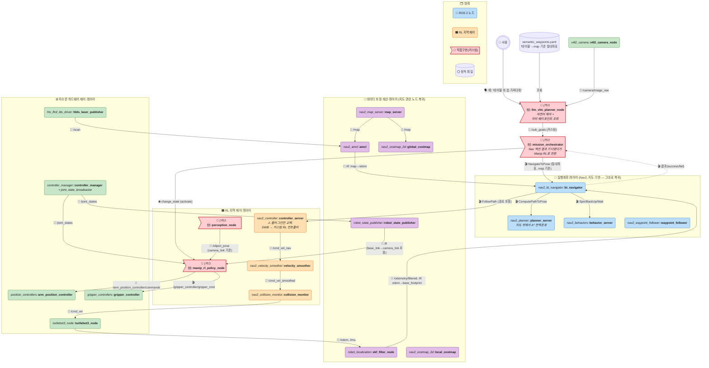
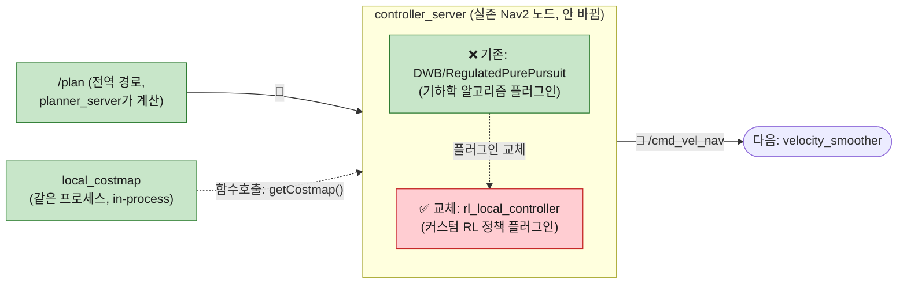
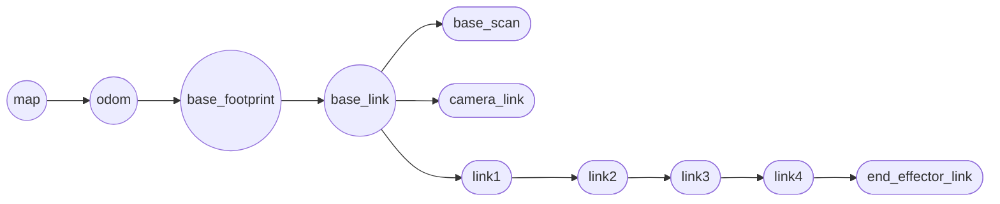
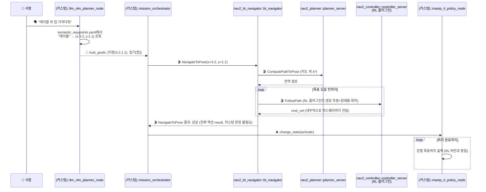

# TurtleBot3 + OpenMANIPULATOR-X 실전 예시 — 하이브리드(Nav2 전역 + RL 지역) 버전

> 🧭 **다섯 번째 자매 문서**입니다: [룰베이스](./ros2-turtlebot3-manipulator-example.md) · [End-to-End](./ros2-turtlebot3-manipulator-e2e.md) · [RL(Mapless)](./ros2-turtlebot3-manipulator-simtoreal-rl.md) · [VLA](./ros2-turtlebot3-manipulator-vla.md)에 이어, **"안 보이는 곳으로 가라"는 명령을 처리하려면 결국 지도가 필요하다**는 문제를 원래 PDF 대화의 **"방식 B: 하이브리드"**로 해결한 버전입니다.
>
> **한 줄 요약**: Nav2의 지도 기반 **전역** 경로계획(어디로 가야 하는지)은 그대로 살리고, 장애물을 피하는 **지역** 제어(어떻게 움직일지)만 RL로 바꿉니다. RL(Mapless) 문서가 "지도 없이 눈앞만 보고 반응"했다면, 이 문서는 "지도로 큰 그림을 잡고, RL로 순간순간 잘 피해가는" 조합입니다.

---

## 0. 전체 구조 한눈에 보기 (통합 마스터 다이어그램)

**RL(Mapless) 버전과 비교했을 때 가장 크게 눈에 띄는 것**: `map_server`/`amcl`/`global_costmap`/`planner_server`/`bt_navigator` 등 **Nav2 노드 대부분이 그대로 돌아옵니다.** 유일하게 바뀌는 건 `controller_server`가 로드하는 **플러그인**입니다 — DWB(기하학 알고리즘) 대신 **RL 정책을 담은 커스텀 C++ 플러그인**을 로드합니다. `controller_server`라는 **노드 자체는 실존 Nav2 노드 그대로**입니다.

**이 구조가 앞의 "안 보이는 곳으로 가라" 문제를 어떻게 푸는가**:
1. `llm_vlm_planner_node`가 "테이블"을 `semantic_waypoints.yaml`에서 **미리 저장해둔 map 기준 절대좌표**로 조회합니다 (카메라에 지금 안 보여도 상관없음).
2. 그 절대좌표를 그대로 `bt_navigator`의 **진짜 `NavigateToPose` 액션**에 넣습니다 — Nav2가 지도 위에서 A*로 전역 경로를 계산하므로, 벽 뒤·다른 방이어도 갈 수 있습니다.
3. 로컬 구간(가는 도중 갑자기 나타난 사람/장애물 회피)만 `controller_server`의 RL 플러그인이 실시간으로 처리합니다.
4. 부가 이득: `bt_navigator`의 액션 자체가 성공/실패를 알려주므로, RL(Mapless) 버전에서 `mission_orchestrator`가 직접 만들어야 했던 커스텀 `/distance_to_goal`(도달 판정) 신호가 **더 이상 필요 없습니다.**

---

## 1. 물리 하드웨어 구성

**네 자매 문서와 100% 동일**합니다. [룰베이스 문서 1장](./ros2-turtlebot3-manipulator-example.md#1-물리-하드웨어-구성-개별-부품) 참고.

---

## 2. ROS 2 노드 구성

### Layer 1 — 하드웨어 드라이버 (RL 버전과 동일)

변경 없음.

### Layer 2/3 — 상태추정 & 지도 (map_server/amcl **복귀**)

| 패키지 | 노드 | 역할 | 제공 여부 |
|---|---|---|---|
| `robot_state_publisher` | `robot_state_publisher` | URDF 기반 TF | ✅ 완전 제공 |
| `robot_localization` | `ekf_filter_node` | odom+imu 융합 | ⚙️ 제공 + 설정 필요 |
| `nav2_map_server` | `map_server` | **복귀.** 사전 SLAM으로 만든 지도 로드 | ⚙️ 제공 + 사전 SLAM 매핑 필요 |
| `nav2_amcl` | `amcl` | **복귀.** 지도-스캔 매칭 절대 위치추정 | ⚙️ 제공 + 파라미터 필요 |

### Layer 4 — Nav2 전역 + RL 지역 제어 (핵심 변경 지점)

| 패키지 | 노드 | 역할 | 제공 여부 |
|---|---|---|---|
| `nav2_costmap_2d` | `global_costmap` | 지도+장애물 합쳐 전역 격자 | ⚙️ 제공 (룰베이스와 동일) |
| `nav2_costmap_2d` | `local_costmap` | 주변 실시간 격자 | ⚙️ 제공 (룰베이스와 동일) |
| `nav2_planner` | `planner_server` | 지도 위 A* 전역 경로 계획 — **변경 없음, 그대로 재사용** | ⚙️ 제공 (룰베이스와 동일) |
| `nav2_controller` | `controller_server` | **노드는 그대로, 플러그인만 교체**: `DWB`/`RegulatedPurePursuit` 대신 `rl_local_controller`(커스텀, `nav2_core::Controller` 인터페이스 구현) 로드 | ⚙️ 노드는 제공 + 🔧 **RL 플러그인은 직접 구현 필요** |
| `nav2_bt_navigator` | `bt_navigator` | Behavior Tree — **변경 없음** | ⚙️ 제공 (룰베이스와 동일) |
| `nav2_behaviors`, `nav2_waypoint_follower`, `nav2_velocity_smoother`, `nav2_collision_monitor`, `nav2_lifecycle_manager` | — | **전부 변경 없음** | ⚙️ 제공 (룰베이스와 동일) |

> **`nav2_core::Controller` 플러그인 인터페이스**: Nav2는 `computeVelocityCommands(pose, velocity, ...)` 함수 하나만 구현하면 어떤 알고리즘이든 `controller_server`에 꽂을 수 있게 설계되어 있습니다. DWB는 이 함수 안에서 여러 궤적 후보를 샘플링해 점수를 매기지만, RL 플러그인은 같은 함수 안에서 **그냥 신경망 forward pass 한 번**을 돌려서 속도값을 리턴합니다. `controller_server` 노드·런치·서비스 인터페이스는 전혀 안 바뀌고, **plugin 클래스 하나만 새로 짜서 `nav2_params.yaml`에 등록**하면 됩니다.

### Layer 5 — Manip RL 제어 (RL 버전과 완전 동일)

변경 없음 — [RL 버전 Layer5](./ros2-turtlebot3-manipulator-simtoreal-rl.md#layer-5--manip-rl-제어-moveit2-전체를-대체) 그대로. 조작은 지도가 필요 없는 문제라 하이브리드로 바꿀 이유가 없습니다.

### Layer 6 — 고차원 계획 (LLM/VLM + 의미 웨이포인트)

| 패키지 | 노드 | 역할 | 제공 여부 |
|---|---|---|---|
| (커스텀) | `llm_vlm_planner_node` | 자연어 명령 해석. **"테이블"처럼 안 보이는 대상은 `semantic_waypoints.yaml`에서 절대좌표 조회**, 보이는 물체는 카메라로 직접 추정 | 🔧 **직접 구현 필요** |
| (설정 파일) | `semantic_waypoints.yaml` | `{"테이블": {x: 3.2, y: 1.1, frame: "map"}, ...}` — 라벨↔map 좌표 매핑. 로봇이 각 장소를 처음 방문했을 때 AMCL 좌표를 저장해두는 방식(1회성 "가르치기") | ⚙️ **직접 준비 필요** (최초 매핑 시 1회 작성/갱신) |

---

## 3. 전체 TF 트리 (`map` 프레임 **복귀**)

RL(Mapless)/VLA/E2E 버전과 달리 **`map` 프레임이 다시 존재**합니다 — `amcl`이 `map→odom`을 발행합니다. 이게 바로 "안 보이는 곳"도 갈 수 있게 해주는 핵심 조각입니다.

---

## 4. 통합 시나리오: "A지점으로 이동 후 물체 집기" (하이브리드 버전)

---

## 5. 실제 브링업 launch 구조

| 단계 | 내용 |
|---|---|
| 1~2. 베이스/팔 하드웨어 기동 | 동일 |
| 3. 사전 SLAM (1회) | `slam_toolbox`로 지도 제작 + 주요 지점 `semantic_waypoints.yaml`에 기록 |
| 4. Nav2 기동 | `nav2_bringup`으로 map_server/amcl/costmap×2/planner_server/behavior_server/bt_navigator/waypoint_follower/velocity_smoother/collision_monitor/lifecycle_manager 기동 — **`nav2_params.yaml`에서 `controller_server`의 플러그인만 `rl_local_controller`로 지정** |
| 5. Manip RL 기동 | `manip_rl_policy_node` (RL 버전과 동일) |
| 6. 고차원 계획 기동 | `llm_vlm_planner_node` + `mission_orchestrator` |

---

## 6. 기능별 재분류

| 레이어 | 정의 | 이 안에 있는 것 |
|---|---|---|
| 🧠 **고차원 계획** | 자연어 해석 + 의미 웨이포인트 조회 | 사람, `llm_vlm_planner_node` |
| 🧭 **실행계획 (Nav2, 지도 기반)** | 전역 경로/행동 결정 | `mission_orchestrator`, `bt_navigator`, `planner_server`, `behavior_server`, `waypoint_follower` |
| 🟧 **RL 지역 제어** | 실시간 반응형 제어 | `controller_server`(RL 플러그인), `manip_rl_policy_node`, `perception_node`, `velocity_smoother`, `collision_monitor` |
| 🧮 **데이터 보정·지도** | 위치추정 및 지도 관리 | `robot_state_publisher`, `ekf_filter_node`, `map_server`, `amcl`, `global_costmap`, `local_costmap` |
| ⚙️ **하드웨어 제어** | 센서 I/O·모터 구동 | Layer1 노드 전부 |

RL(Mapless) 버전에는 없던 🧮 레이어의 지도 관련 노드 4개(`map_server`/`amcl`/`global_costmap`/`local_costmap`)가 **룰베이스 문서 그대로 복귀**한 게 이 문서의 정체성입니다.

---

## 7. 직접 구현/준비해야 하는 것 총정리

### 🔧 직접 구현해야 하는 것

| 항목 | 종류 | 내용 |
|---|---|---|
| `llm_vlm_planner_node` | 노드 | 자연어 해석 + 의미 웨이포인트 조회 |
| `mission_orchestrator` | 노드 | sub-goal 순서 실행 (Nav는 액션 result 대기, Manip은 lifecycle) |
| `manip_rl_policy_node` | 노드 | 조작 정책 추론 (RL 버전과 동일) |
| `perception_node` | 노드 | 물체 인식 (RL 버전과 동일) |
| `rl_local_controller` | **Nav2 플러그인** (`nav2_core::Controller` 구현) | Sim-to-Real 학습한 지역 제어 정책을 `computeVelocityCommands()` 안에서 추론 |
| `semantic_waypoints.yaml` | 설정 파일 | 라벨↔map 좌표 매핑, 최초 매핑 시 수집 |

### ⚙️ 표준 Nav2/ros2_control 패키지로 제공되는 것 (룰베이스 수준으로 복귀)

`map_server`, `amcl`, `global_costmap`, `local_costmap`, `planner_server`, `bt_navigator`, `behavior_server`, `waypoint_follower`, `velocity_smoother`, `collision_monitor`, `lifecycle_manager`, `controller_server`(노드 자체), Layer1 전부, `position_controllers`, `gripper_controllers`.

### 결론

이 문서는 **"커스텀 코드는 최소, 학습은 꼭 필요한 지역 제어에만"**이라는 실무형 절충안입니다. Nav2가 이미 잘하는 것(지도 관리, 전역 경로, BT 오케스트레이션, 안전 계층)은 전부 그대로 쓰고, **Nav2가 상대적으로 약한 부분(사람이 갑자기 끼어드는 등 예측 못 한 동적 장애물 회피)만** RL 플러그인 하나로 보강합니다. 그 결과 커스텀 코드량은 RL(Mapless) 버전보다 적으면서(별도 Nav RL 정책 노드+안 보이는 목표 처리 로직이 통째로 사라짐), "안 보이는 곳으로 가라"는 요구는 완벽히 해결됩니다.

---

## 8. 다섯 버전 종합 비교

| 구분 | 룰베이스 | E2E | RL (Mapless) | **하이브리드 (본 문서)** | VLA |
|---|---|---|---|---|---|
| 지도 유무 | 있음 | 없음 | 없음 | **있음 (Nav2 그대로)** | 없음 |
| "안 보이는 곳으로 가라" | ✅ 가능 | ❌ 불가 | ❌ 불가 (탐색행동 필요) | **✅ 가능** | ❌ 불가 (학습 범위 내만) |
| 지역 장애물 회피 | 규칙 기반(DWB) | 학습 | 학습 | **학습 (RL 플러그인)** | 학습(모델 내부) |
| 커스텀 노드/구성요소 수 | 2개 | 3개 | 5개 | **6개 (플러그인 1 포함)** | 2개 |
| Nav2 재사용 비율 | 100% | 0% | 0% | **~90%** (controller 플러그인만 교체) | 0% |
| 도달 판정 | Nav2 액션 result | 하드코딩 타임아웃 | 커스텀 `/distance_to_goal` | **Nav2 액션 result (공짜)** | 학습된 종료 조건(불안정) |

전체 5개 문서 비교는 [ros2-turtlebot3-manipulator-e2e.md 8장](./ros2-turtlebot3-manipulator-e2e.md#8-네-버전-종합-비교)의 4-way 표에 이 하이브리드 관점을 더해서 읽으면 됩니다.

---

## 9. 참고: 다른 문서와의 관계

- **룰베이스 버전**: [ros2-turtlebot3-manipulator-example.md](./ros2-turtlebot3-manipulator-example.md) — 이 문서의 Layer4 대부분이 그대로 재사용하는 원본
- **RL(Mapless) 버전**: [ros2-turtlebot3-manipulator-simtoreal-rl.md](./ros2-turtlebot3-manipulator-simtoreal-rl.md) — 이 문서와 정확히 대비되는 "지도 없이" 버전
- **VLA 버전**: [ros2-turtlebot3-manipulator-vla.md](./ros2-turtlebot3-manipulator-vla.md)
- **End-to-End 버전**: [ros2-turtlebot3-manipulator-e2e.md](./ros2-turtlebot3-manipulator-e2e.md)
- **개념적 원형**: [ros2-architecture.md](./ros2-architecture.md) — "방식 B: 하이브리드 결합 방식" 논의의 추상 버전
