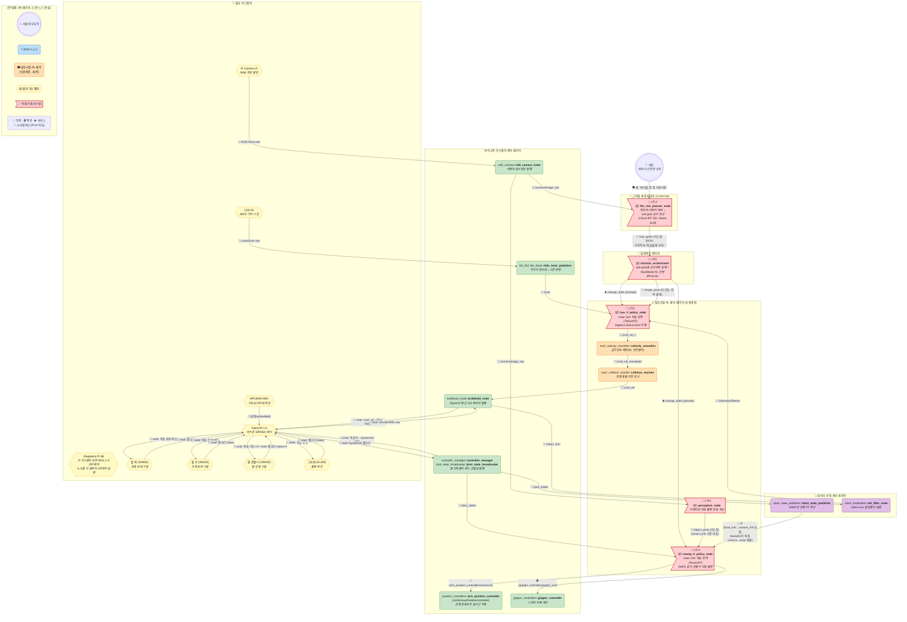
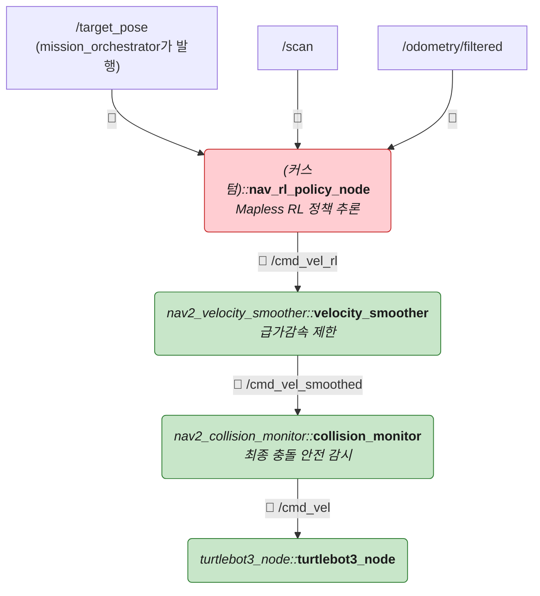
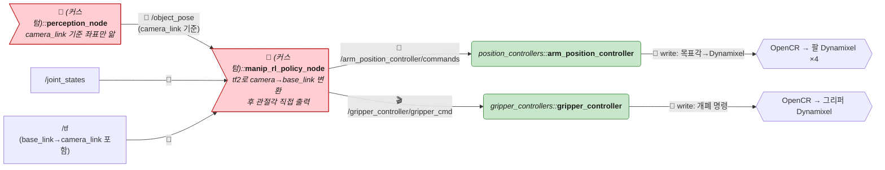
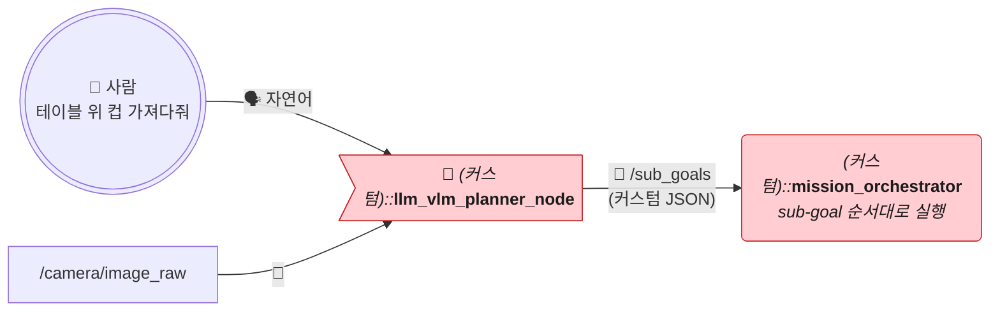
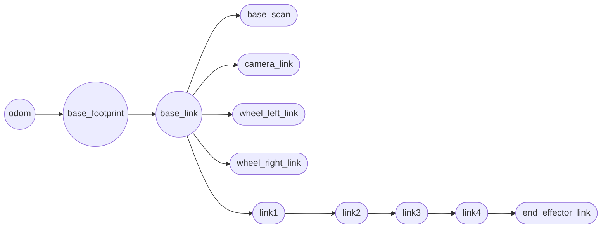
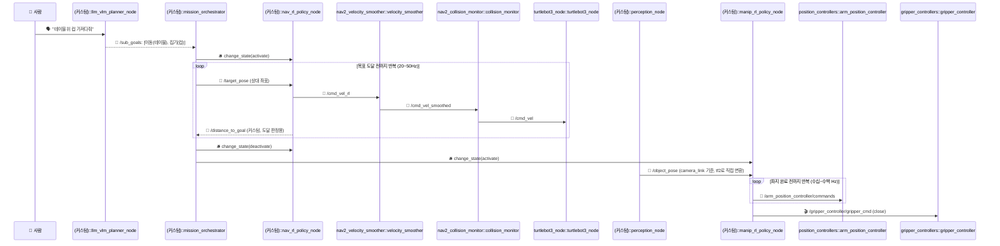
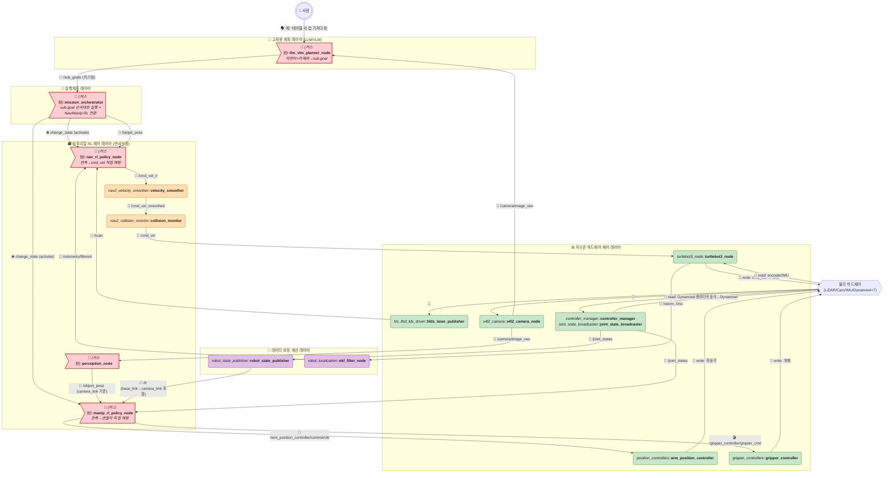

# TurtleBot3 + OpenMANIPULATOR-X 실전 예시 — Sim-to-Real RL 버전

> 🧭 **이 문서는 [ros2-turtlebot3-manipulator-example.md](./ros2-turtlebot3-manipulator-example.md)(룰베이스 Nav2/MoveIt2 버전)의 자매 문서**입니다. 물리 하드웨어와 Layer1(하드웨어 드라이버)은 완전히 동일하고, **Nav2 경로계획/제어(Layer4)와 MoveIt2 모션플래닝(Layer5)을 Sim-to-Real RL 정책으로 교체**하면서, 자연어 명령을 이해하는 **`llm_vlm_planner_node`(고차원 계획 레이어)**를 새로 추가했습니다. 도형/색상/화살표 이모지 규칙(💊 알약형=노드, ⬡ 육각형=하드웨어, 🚩 깃발=커스텀, 📨 토픽·🎬 액션·🛎️ 서비스·🔌 시리얼)은 룰베이스 문서와 **완전히 동일**하므로, 자세한 규칙 설명은 그쪽을 참고하세요.
>
> ⚠️ `llm_vlm_planner_node`/`nav_rl_policy_node`/`manip_rl_policy_node`는 **표준 ROS 2 패키지가 아니라 이 예시를 위해 직접 구현하는 커스텀 노드**입니다. `nav_rl_policy_node`/`manip_rl_policy_node`는 Isaac Sim에서 학습한 정책을 TensorRT로 추론하는 실행 파일이고, `llm_vlm_planner_node`는 기성 LLM/VLM(Cloud API 또는 온디바이스 SLM)을 호출/서빙하는 래퍼입니다. 정확한 인터페이스(토픽명 등)는 팀 컨벤션에 따라 달라질 수 있습니다.

---

## 0. 전체 구조 한눈에 보기 (통합 마스터 다이어그램)

**룰베이스 버전과 비교했을 때 가장 크게 눈에 띄는 것**: Nav2/MoveIt2가 있던 자리를 **전부 커스텀(🔴 깃발) 노드**가 대체합니다 — 자연어를 이해하는 `llm_vlm_planner_node`(신규 레이어), 순서만 지휘하는 `mission_orchestrator`, 그리고 실제로 움직이는 `nav_rl_policy_node`/`manip_rl_policy_node`까지 **4개가 전부 직접 구현 대상**입니다. `velocity_smoother`/`collision_monitor`만 Nav2에서 그대로 재사용되는데, 이건 "RL이 이상 동작해도 물리적으로 다치지 않게" 막아주는 안전망 역할이라 남겨뒀습니다.

---

## 1. 물리 하드웨어 구성

**룰베이스 버전과 100% 동일**합니다 (로봇 몸체를 바꾼 게 아니라 그 몸체를 움직이는 소프트웨어만 바꾼 것이므로). 부품 목록과 배선 다이어그램은 [ros2-turtlebot3-manipulator-example.md 1장](./ros2-turtlebot3-manipulator-example.md#1-물리-하드웨어-구성-개별-부품)을 그대로 참고하세요.

---

## 2. ROS 2 노드 구성 (레이어별)

### Layer 1 — 하드웨어 드라이버 노드 (거의 동일, 팔 컨트롤러 타입만 변경)

| 패키지 | 노드(실행파일) | 역할 | 제공 여부 |
|---|---|---|---|
| `hls_lfcd_lds_driver` | `hlds_laser_publisher` | LDS-02 raw → `/scan` | ✅ 완전 제공 (룰베이스와 동일) |
| `turtlebot3_node` | `turtlebot3_node` | OpenCR 시리얼 통신, 오도메트리/IMU 발행, `/cmd_vel` 수신 | ✅ 완전 제공 (룰베이스와 동일) |
| `v4l2_camera` | `v4l2_camera_node` | 카메라 원시 영상 | ✅ 완전 제공 (룰베이스와 동일) |
| `controller_manager` | `controller_manager` | 팔 컨트롤러 매니저 | ⚙️ 제공 + 설정 필요 (룰베이스와 동일) |
| `joint_state_broadcaster` | `joint_state_broadcaster` | 팔 관절 엔코더 발행 | ⚙️ 제공 + 설정 필요 (룰베이스와 동일) |
| `position_controllers` | `arm_position_controller` (**변경**) | 관절 목표 위치를 실시간 스트리밍으로 추종 (`~/commands`, `std_msgs/Float64MultiArray`) | ⚙️ 제공 + 설정 필요 |
| `gripper_controllers` | `gripper_controller` | 그리퍼 개폐 (Action 서버) | ⚙️ 제공 + 설정 필요 (룰베이스와 동일) |

> **왜 컨트롤러 타입이 바뀌나?** 룰베이스는 MoveIt2가 미리 계산한 **궤적(Trajectory)**을 한 번에 넘기므로 `JointTrajectoryController`(액션 기반)가 맞습니다. RL 정책은 매 스텝(수십~수백 Hz)마다 "지금 이 각도로 가라"는 **순간 목표값**을 계속 스트리밍하므로, 액션이 아니라 **토픽으로 연속 수신하는 `JointGroupPositionController`**가 훨씬 자연스럽습니다. 둘 다 `ros2_controllers` 저장소가 제공하는 **실존 패키지**이며, 커스텀 코드가 아닙니다.

### Layer 2/3 — 상태추정 노드 (map_server/amcl 삭제 — Mapless)

| 패키지 | 노드 | 역할 | 제공 여부 |
|---|---|---|---|
| `robot_state_publisher` | `robot_state_publisher` | URDF 기반 TF 발행 (`base_link→...`) | ✅ 완전 제공 |
| `robot_localization` | `ekf_filter_node` | 휠 오도메트리 + IMU 융합 → `/odometry/filtered` | ⚙️ 제공 + `ekf.yaml` 필요 |
| ~~`nav2_map_server`~~ | ~~`map_server`~~ | **삭제** — 지도 자체가 없음 (Mapless) | — |
| ~~`nav2_amcl`~~ | ~~`amcl`~~ | **삭제** — 절대 위치 보정 없이 상대 좌표(odom)만 사용 | — |

### Layer 4 — Nav RL 제어 (Nav2 경로계획/제어 전체를 대체)

| 패키지 | 노드 | 역할 | 제공 여부 |
|---|---|---|---|
| (커스텀) | `nav_rl_policy_node` | Isaac Sim에서 학습한 정책(.onnx→.engine)을 Jetson TensorRT로 추론. 입력: `/scan`, `/odometry/filtered`, `/target_pose`. 출력: `/cmd_vel_rl` (Mapless End-to-End, costmap/전역경로 없음) | 🔧 **직접 구현 필요** |
| `nav2_velocity_smoother` | `velocity_smoother` | 급가감속 제한 (Nav2에서 그대로 재사용) | ⚙️ 제공 + 파라미터 필요 |
| `nav2_collision_monitor` | `collision_monitor` | 최종 충돌 안전 감시 (Nav2에서 그대로 재사용) | ⚙️ 제공 + 파라미터 필요 |

### Layer 5 — Manip RL 제어 (MoveIt2 전체를 대체)

| 패키지 | 노드 | 역할 | 제공 여부 |
|---|---|---|---|
| (커스텀) | `manip_rl_policy_node` | Isaac Sim에서 학습한 조작 정책을 TensorRT로 추론. 입력: `/joint_states`, `/tf`, `/object_pose`. **`/object_pose`(camera_link 기준)를 `/tf`로 직접 base_link 기준으로 변환해서 사용**. 출력: 관절 목표위치 (OMPL 경로계획 없이 직접 출력) | 🔧 **직접 구현 필요** |
| (커스텀) | `perception_node` | 카메라로 집을 물체의 3D 좌표 계산 → `/object_pose` (**camera_link 기준**, `robot_state_publisher`가 계산한 `base_link→camera_link` TF는 모름/알 필요 없음) | 🔧 **직접 구현 필요** (룰베이스와 동일하게 필요) |
| `position_controllers` | `arm_position_controller` | 관절 목표위치 실시간 추종 | ⚙️ 제공 + 설정 필요 |
| `gripper_controllers` | `gripper_controller` | 그리퍼 개폐 | ⚙️ 제공 + 설정 필요 |
| ~~`moveit_ros_move_group`~~ | ~~`move_group`~~ | **삭제** — OMPL 샘플링 기반 경로계획 자체가 없음 | — |

> **Eye-in-Hand vs Eye-to-Hand는 URDF 문제일 뿐, 코드는 안 바뀝니다.** 이 TurtleBot3 예시의 Pi Camera는 몸통 상단에 고정된 **Eye-to-Hand**라 URDF에서 `camera_link`가 `base_link`의 (고정) 자식입니다. 만약 그리퍼에 카메라를 붙인 **Eye-in-Hand**였다면 `camera_link`가 팔 마지막 링크(`tool0`)의 자식이 되어 관절이 움직일 때마다 위치가 바뀌겠지만, 어느 쪽이든 `robot_state_publisher`가 URDF를 그대로 계산해서 `/tf`를 내주므로 **`perception_node`와 `manip_rl_policy_node`는 코드를 전혀 바꿀 필요가 없습니다.** 카메라를 실제로 어디에 달았는지 측정해서 URDF(또는 Hand-Eye Calibration 결과)에 정확히 반영하는 것만 설치 시 1회 필요합니다.

### Layer 6 — 고차원 계획 (LLM/VLM, 룰베이스엔 없던 신규 레이어)

룰베이스 문서는 사람 명령을 바로 `mission_orchestrator`가 받았지만, 그건 "이동→집기"처럼 **미리 정해둔 순서를 재생**하는 것뿐이었습니다. RL 버전에서도 `mission_orchestrator` 자체는 여전히 하드코딩된 상태전환기라, **자연어를 실제로 "이해"하는 주체가 따로 필요**합니다 — 그게 이 레이어입니다.

| 패키지 | 노드 | 역할 | 제공 여부 |
|---|---|---|---|
| (커스텀) | `llm_vlm_planner_node` | 사람의 자연어 명령 + 카메라 프레임을 입력받아, "1. 테이블로 이동 → 2. 컵 인식 → 3. 집기" 같은 **sub-goal 순서(JSON)**를 생성. Cloud API(GPT-4o/Claude 등) 호출 방식이나 Jetson 온디바이스 SLM(Llama-3-8B, Qwen2-VL 등) 중 선택 | 🔧 **직접 구현 필요** (API 연동 또는 모델 서빙 코드) |

> **VLM은 학습(Sim-to-Real) 대상이 아닙니다.** `nav_rl_policy_node`/`manip_rl_policy_node`는 Isaac Sim에서 처음부터 학습시키지만, `llm_vlm_planner_node`는 이미 웹 규모 데이터로 사전학습된 기성 모델(GPT-4o, Qwen2-VL, Florence-2 등)을 그대로 쓰거나 가볍게 파인튜닝만 합니다 — 역할과 학습 방식이 RL 정책과 완전히 다릅니다.

---

## 3. 전체 TF 트리 (Mapless — `map` 프레임 자체가 없음)

- **`map` 프레임 없음**: `amcl`이 없으므로 절대 좌표계가 아예 존재하지 않습니다. 로봇은 "켜진 시점(0,0)" 기준 상대 좌표(`odom`)만 압니다.
- `odom → base_footprint`: `ekf_filter_node`(또는 `turtlebot3_node`)가 그대로 발행 — 룰베이스와 동일.
- `base_link → {...}`: `robot_state_publisher`가 URDF 기준 계산 — 룰베이스와 동일.
- `nav_rl_policy_node`/`manip_rl_policy_node`는 `map`이 필요 없습니다. 목표 지점은 항상 **"현재 위치에서 상대 거리/각도"**로 주어집니다.

---

## 4. 통합 시나리오: "A지점으로 이동 후 물체 집기" (RL 버전)

> 룰베이스 버전의 시퀀스 다이어그램과 결정적으로 다른 점: **Action(goal/feedback/result) 대신 토픽을 반복 발행/구독하는 루프**로 바뀝니다. RL 정책은 "언제 끝났는지"를 스스로 판단하지 않고 매 스텝 반응만 하므로, "목표에 도달했다"는 **판정 자체를 `mission_orchestrator`가 거리 임계값 등으로 별도 구현**해야 합니다 — 이것도 🔧 커스텀 몫입니다.

---

## 5. 실제 브링업 launch 구조 (참고)

| 단계 | 내용 | 패키지/방식 |
|---|---|---|
| 1. 베이스 하드웨어 기동 | 동일 | `turtlebot3_bringup` (변경 없음) |
| 2. 팔 하드웨어 기동 | 컨트롤러 설정만 `arm_position_controller`(JointGroupPositionController)로 교체 | 커스텀 `controllers.yaml` |
| 3. Nav RL 기동 | `nav_rl_policy_node` + `velocity_smoother` + `collision_monitor`만 기동 (map_server/amcl/costmap/planner 없음) | 커스텀 launch |
| 4. Manip RL 기동 | `manip_rl_policy_node` + `perception_node` 기동 (move_group 없음) | 커스텀 launch |
| (오프라인, 로봇엔 없음) | Isaac Sim 학습 → `.onnx` → TensorRT `.engine` 변환 | PC/워크스테이션에서 사전 준비 |

---

## 6. 기능별 3-Layer 재분류

룰베이스 문서의 3계층(실행계획/데이터보정/하드웨어제어) 틀은 유지하되, **`nav_rl_policy_node`/`manip_rl_policy_node`는 어느 쪽에도 깔끔히 안 들어갑니다** — "계획"도 아니고 "센서 보정"도 아닌, 감각→행동을 바로 잇는 **반사신경(Reflex)** 역할이라 별도 색(🟧)으로 표시했습니다.

| 레이어 | 정의 | 이 안에 있는 것 |
|---|---|---|
| 🧠 **고차원 계획 레이어** (신규) | 자연어+시각 정보를 이해해서 sub-goal로 분해 | 사람, `llm_vlm_planner_node` |
| 🧭 **실행계획 레이어** | sub-goal을 순서대로 실행 | `mission_orchestrator` (계획이라기보다 "상태 전환"만 담당) |
| 🟧 **심투리얼 RL 제어 레이어** (신규) | 센서 관측 → 행동을 곧바로 매핑 (학습된 반사신경) | `nav_rl_policy_node`, `manip_rl_policy_node`, `perception_node`, `velocity_smoother`, `collision_monitor` |
| 🧮 **데이터 보정·계산 레이어** | 원시 센서를 정제·융합 | `robot_state_publisher`, `ekf_filter_node` |
| ⚙️ **저수준 하드웨어 제어 레이어** | 실제 센서 I/O 및 모터 구동 | `hlds_laser_publisher`, `v4l2_camera_node`, `turtlebot3_node`, `controller_manager`, `joint_state_broadcaster`, `arm_position_controller`, `gripper_controller` |

**결정적 차이**: 룰베이스에서는 "계획(Nav2 경로탐색/BT)"이 실행계획 레이어에 있었지만, RL 버전에서는 **계획이라는 개념 자체가 사라지고** 학습된 정책이 센서→행동을 즉시 매핑합니다. `mission_orchestrator`는 이제 "무슨 경로로 갈지"가 아니라 "지금 Nav를 쓸 차례인지 Manip을 쓸 차례인지"만 결정합니다.

---

## 7. 직접 구현/준비해야 하는 것 총정리

룰베이스 버전([해당 문서 6장](./ros2-turtlebot3-manipulator-example.md#6-직접-구현준비해야-하는-것-총정리))에서는 커스텀 노드가 **2개**(`mission_orchestrator`, 물체인식)뿐이었습니다. RL 버전은 **5개**(`llm_vlm_planner_node` 포함)로 늘고, 거기에 더해 로봇 코드와는 완전히 별개인 **ML 학습 파이프라인 전체**가 추가로 필요합니다.

### 🔧 직접 구현해야 하는 커스텀 노드

| 노드 | 역할 |
|---|---|
| `llm_vlm_planner_node` | 자연어+카메라 해석 → sub-goal 순서 생성 (Cloud API 또는 Jetson SLM) |
| `mission_orchestrator` | sub-goal을 순서대로 실행 + Nav RL ↔ Manip RL 전환(lifecycle) + 목표 도달 판정 |
| `nav_rl_policy_node` | 학습된 주행 정책 추론 (TensorRT) |
| `manip_rl_policy_node` | 학습된 조작 정책 추론 (TensorRT) |
| `perception_node` | 물체 인식/목표 Pose 추정 (룰베이스와 동일하게 필요) |

### ⚙️ 여전히 표준 패키지로 제공되는 것

Layer1 하드웨어 드라이버 전부, `velocity_smoother`, `collision_monitor`, `position_controllers`, `gripper_controllers`, `robot_state_publisher`, `ekf_filter_node` — **이 부분은 룰베이스와 차이가 없습니다.**

### 🆕 룰베이스에는 아예 없던, 완전히 새로운 작업 (ML 엔지니어링)

이건 "설정 파일 하나 더 쓰는" 수준이 아니라 **별도 프로젝트급 작업**입니다.

| 작업 | 내용 |
|---|---|
| 시뮬레이션 환경 구성 | Isaac Sim/Isaac Gym에 로봇 URDF 임포트, 물리 파라미터(마찰·질량·모터 특성) 설정 |
| 보상 함수 설계 | `R = R_goal + R_progress + R_collision + R_smoothness` 등, 목적에 맞게 직접 설계·튜닝 |
| Domain Randomization | 마찰계수·질량·센서 노이즈·제어 지연을 학습 중 무작위로 흔들어 Sim-to-Real Gap 축소 |
| 대규모 강화학습 | 수백만~수천만 스텝 학습 (병렬 시뮬레이션 GPU 필요) |
| 모델 변환 | 학습된 PyTorch 모델 → ONNX → TensorRT `.engine` (Jetson용 경량화) |
| Sim-to-Real 검증 | 실기 테스트 → 실패 패턴 확인 → 시뮬레이션 재조정 → 재학습 (반복) |

### 결론

로봇을 "움직이게만" 하려면 룰베이스가 훨씬 적은 노력으로 끝납니다. RL 버전은 **커스텀 노드 수가 2배**로 늘 뿐 아니라, 그 노드 안에 들어갈 **정책 자체를 처음부터 학습시켜야** 하므로 실질적인 개발 부담은 룰베이스와 비교가 안 될 정도로 큽니다. 대신 좁은 통로, 미끄러운 바닥처럼 **규칙으로 짜기 어려운 상황에 강건해질 잠재력**을 얻습니다 — 이 트레이드오프가 두 문서를 비교하는 핵심 포인트입니다.

---

## 8. 참고: 다른 문서와의 관계

- **하드웨어·Layer1 동일**: [ros2-turtlebot3-manipulator-example.md](./ros2-turtlebot3-manipulator-example.md) — 룰베이스(Nav2/MoveIt2) 버전, 본 문서와 나란히 비교할 것
- **같은 하드웨어의 VLA 버전**: [ros2-turtlebot3-manipulator-vla.md](./ros2-turtlebot3-manipulator-vla.md) — 계획(LLM/VLM)과 제어(RL)를 분리하지 않고 신경망 하나로 묶는 버전
- **같은 하드웨어의 End-to-End 버전**: [ros2-turtlebot3-manipulator-e2e.md](./ros2-turtlebot3-manipulator-e2e.md) — 언어 없이 좌표만으로 동작하는 가장 원초적인 버전. 네 버전 종합 비교표는 그 문서 8장
- **같은 하드웨어의 하이브리드 버전**: [ros2-turtlebot3-manipulator-hybrid.md](./ros2-turtlebot3-manipulator-hybrid.md) — 이 문서가 Mapless라 못 푸는 "안 보이는 곳으로 가라" 문제를 Nav2 지도를 다시 들여와서 해결한 버전
- **개념적 원형**: [ros2-architecture.md](./ros2-architecture.md) — LLM/VLM + Sim-to-Real RL 계층형 구조의 추상 버전 (`nav_rl_policy_node`/`manip_rl_policy_node`가 여기서 말하는 "Layer 2 Sim-to-Real RL Policy"에 해당)
- **룰베이스 레이어 정의**: [ros2-rule-based-architecture.md](./ros2-rule-based-architecture.md) — 이 문서가 대체한 Nav2 표준 스택의 추상 구조
