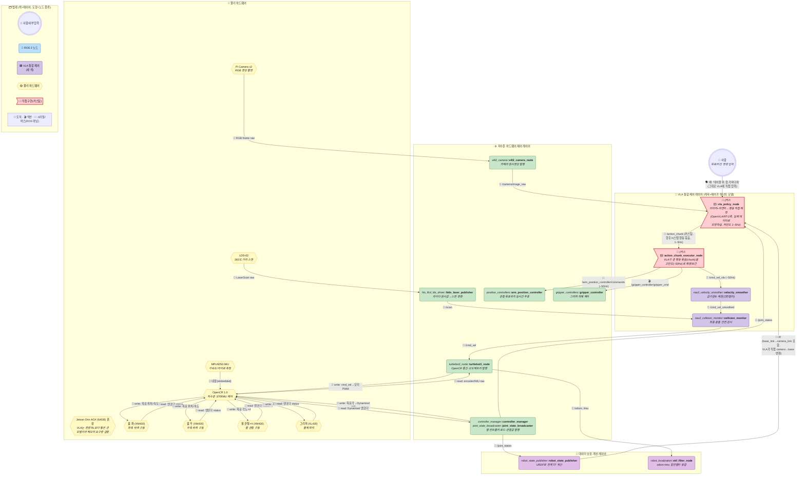
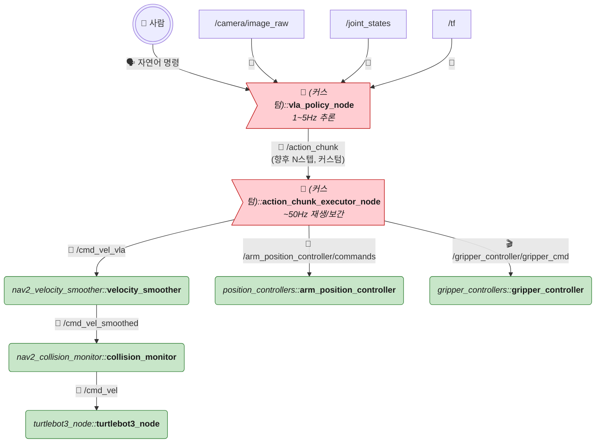
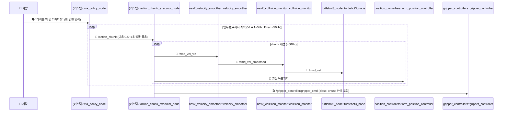

# TurtleBot3 + OpenMANIPULATOR-X 실전 예시 — VLA(Vision-Language-Action) 버전

> 🧭 **이 문서는 세 번째 자매 문서**입니다: [ros2-turtlebot3-manipulator-example.md](./ros2-turtlebot3-manipulator-example.md)(룰베이스 Nav2/MoveIt2), [ros2-turtlebot3-manipulator-simtoreal-rl.md](./ros2-turtlebot3-manipulator-simtoreal-rl.md)(LLM/VLM + Sim-to-Real RL 계층형)에 이어, 이번엔 **"고차원 계획 + 저차원 제어"를 아예 나누지 않고 신경망 하나로 통째로 묶는 VLA** 버전입니다. 하드웨어는 100% 동일, 도형/색상/이모지 규칙도 동일합니다.
>
> ⚠️ `vla_policy_node`/`action_chunk_executor_node`는 커스텀 노드입니다. VLA는 OpenVLA·RT-2·π0(Physical Intelligence)류의 **실제 로봇 데이터로 모방학습(Imitation Learning)한 거대 모델**을 가리키는 개념이며, 표준 ROS 2 패키지가 아닙니다.

---

## 0. 전체 구조 한눈에 보기 (통합 마스터 다이어그램)

**가장 먼저 봐야 할 것**: RL 버전에 있던 `llm_vlm_planner_node` + `mission_orchestrator` + `nav_rl_policy_node` + `manip_rl_policy_node` + `perception_node`, **5개 커스텀 노드가 실질적으로 2개로 줄어듭니다.** VLA 모델 하나가 "언어 이해 + 시각 인식 + 계획 + 저수준 제어"를 전부 한 신경망 안에서 처리하기 때문입니다.

**RL 버전과 비교했을 때 가장 크게 눈에 띄는 것**:
1. **레이어 자체가 하나 사라졌습니다** — "🧠 고차원 계획"과 "🟧 심투리얼 RL 제어"가 "🧬 VLA 통합 제어" 하나로 합쳐졌습니다. `mission_orchestrator`의 Nav↔Manip 전환(lifecycle activate/deactivate)도 **완전히 사라졌습니다** — VLA는 "지금 이동할 차례인지 조작할 차례인지"조차 스스로 학습된 행동에서 판단하지, 외부에서 상태를 전환해주지 않습니다.
2. **`perception_node`도 사라졌습니다** — "컵이 어디 있는지" 인식하는 것도 VLA 모델 내부(시각 인코더)에 이미 통합되어 있어서, 별도 물체 인식 노드가 필요 없습니다.
3. 대신 **`vla_policy_node`가 너무 느려서(1~5Hz)** 실시간 제어(20~50Hz)를 못 맞추는 문제를 해결하려고 **`action_chunk_executor_node`**가 새로 생겼습니다 — VLA가 "앞으로 1초 동안 할 행동 묶음"을 한 번에 뱉으면, 이 노드가 그걸 고빈도로 재생합니다.

---

## 1. 물리 하드웨어 구성

**몸체는 룰베이스/RL 버전과 100% 동일**합니다. 부품 목록·배선도는 [ros2-turtlebot3-manipulator-example.md 1장](./ros2-turtlebot3-manipulator-example.md#1-물리-하드웨어-구성-개별-부품) 참고. 다만 **컴퓨팅 보드 사양은 상향이 필요**합니다 — VLA는 VLM 백본(수억~수십억 파라미터)을 통째로 얹고 다니는 모델이라, 경량 RL 정책(수 MB 짜리 신경망)보다 메모리·연산량이 훨씬 큽니다. Jetson Orin Nano(8GB)로는 버겁고 **Orin AGX(32~64GB)급**이 현실적입니다.

---

## 2. ROS 2 노드 구성

### Layer 1 — 하드웨어 드라이버 노드 (RL 버전과 동일)

RL 버전과 완전히 동일합니다 ([해당 문서 Layer1](./ros2-turtlebot3-manipulator-simtoreal-rl.md#layer-1--하드웨어-드라이버-노드-거의-동일-팔-컨트롤러-타입만-변경) 참고) — `arm_position_controller`(JointGroupPositionController) 그대로 사용. VLA도 매 스텝 관절 목표값을 스트리밍으로 내야 하므로 액션 기반 궤적 컨트롤러보다 이쪽이 맞습니다.

### Layer 2/3 — 상태추정 노드 (RL 버전과 동일, Mapless)

`robot_state_publisher`, `ekf_filter_node`만 사용. `map_server`/`amcl` 없음.

### Layer 4 — VLA 통합 제어 (Nav RL + Manip RL + LLM/VLM + 오케스트레이터를 전부 대체)

| 패키지 | 노드 | 역할 | 제공 여부 |
|---|---|---|---|
| (커스텀) | `vla_policy_node` | 실제 로봇 시연 데이터로 모방학습한 대형 모델(OpenVLA/RT-2/π0류)을 추론. 입력: 자연어 명령, `/camera/image_raw`, `/joint_states`, `/tf`. 출력: `/action_chunk`(향후 N스텝 행동 묶음, 커스텀 메시지). 시각 인식·계획·저수준 제어를 **모두 이 모델 하나**가 담당 | 🔧 **직접 구현 필요** (모델 서빙 + 학습 파이프라인 전체) |
| (커스텀) | `action_chunk_executor_node` | `/action_chunk`을 받아 고빈도(~50Hz)로 하나씩 재생/보간 → `/cmd_vel_vla`, 관절 목표위치, 그리퍼 명령을 연속 발행. VLA가 다음 chunk를 계산하는 동안(1~5Hz) 로봇이 멈추지 않게 해주는 **필수 버퍼** | 🔧 **직접 구현 필요** |
| `nav2_velocity_smoother` | `velocity_smoother` | 급가감속 제한 (안전망, 재사용) | ⚙️ 제공 + 파라미터 필요 |
| `nav2_collision_monitor` | `collision_monitor` | 최종 충돌 안전 감시 (안전망, 재사용) | ⚙️ 제공 + 파라미터 필요 |
| ~~`llm_vlm_planner_node`~~ | — | **삭제** — 언어 이해가 VLA 내부에 통합됨 | — |
| ~~`mission_orchestrator`~~ | — | **삭제** — 태스크 전환 개념 자체가 없음 | — |
| ~~`nav_rl_policy_node` / `manip_rl_policy_node`~~ | — | **삭제** — 하나의 VLA로 통합 | — |
| ~~`perception_node`~~ | — | **삭제** — 물체 인식이 VLA 내부에 통합됨 | — |

> **왜 `action_chunk_executor_node`가 필요한가?** VLA는 백본이 커서(수억+ 파라미터) 한 번 추론에 200ms~1초씩 걸립니다(≈1~5Hz). 그런데 바퀴/관절 제어는 최소 20~50Hz는 되어야 로봇이 덜덜 떨지 않습니다. 그래서 최신 VLA(ACT, OpenVLA 등)는 **한 번에 미래 행동을 여러 스텝(예: 0.5~1초치) 묶어서(action chunking)** 내놓고, 별도의 가벼운 실행기가 그걸 시간에 맞춰 하나씩 꺼내 쓰면서, 그 사이 VLA는 다음 chunk를 미리 계산합니다. RL 정책(경량 신경망)은 자체가 이미 20~100Hz로 도니까 이런 버퍼가 필요 없었는데, VLA는 몸집이 커서 이 구조가 **사실상 필수**입니다.

---

## 3. 전체 TF 트리 (RL 버전과 동일 — Mapless)

`map` 프레임 없음. `odom → base_footprint → base_link → {...}` 구조 그대로. [RL 버전 3장](./ros2-turtlebot3-manipulator-simtoreal-rl.md#3-전체-tf-트리-mapless--map-프레임-자체가-없음) 참고.

`perception_node`가 없으므로 카메라 좌표계 관련 코드도 없습니다 — VLA가 이미지를 통째로 받아서 내부적으로 "어디에 뭐가 있는지"를 스스로 인코딩하기 때문에, camera_link→base_link 변환은 VLA 모델 자신이 `/tf`를 보고 학습 때 배운 대로 알아서 처리합니다 (Eye-in-Hand든 Eye-to-Hand든 학습 데이터에 그 카메라 배치가 반영되어 있어야 함 — 카메라 위치를 바꾸면 **재학습이 필요할 수 있습니다**, RL/룰베이스보다 이 부분이 더 민감합니다).

---

## 4. 통합 시나리오: "A지점으로 이동 후 물체 집기" (VLA 버전)

> 룰베이스·RL 버전과 결정적으로 다른 점: **"이동 단계"와 "조작 단계"를 나누는 시퀀스 자체가 없습니다.** 사람이 명령을 한 번 주면, 그 뒤로는 VLA가 알아서 "지금은 이동할 때인지 손을 뻗을 때인지"까지 판단하며 하나의 연속된 루프만 돕니다. `mission_orchestrator`의 상태전환 로직이 통째로 사라진 결과입니다.

---

## 5. 실제 브링업 launch 구조 (참고)

| 단계 | 내용 |
|---|---|
| 1~2. 베이스/팔 하드웨어 기동 | RL 버전과 동일 |
| 3. VLA 제어 기동 | `vla_policy_node` + `action_chunk_executor_node` + `velocity_smoother` + `collision_monitor`만 기동 (map/amcl/costmap/planner/LLM 없음) |
| (오프라인, 로봇엔 없음) | 실제 로봇 시연 데이터 수집(텔레오퍼레이션) → VLA 모방학습 → 양자화/TensorRT-LLM 변환 |

---

## 6. 기능별 재분류 — 왜 3계층이 아니라 2계층이 되는가

룰베이스(3계층: 실행계획/데이터보정/하드웨어제어)와 RL 버전(4계층: +고차원계획/+RL제어)에 있던 **"계획" 레이어가 VLA에서는 아예 사라집니다.** 계획과 제어가 물리적으로 다른 노드였던 적이 VLA에는 없기 때문입니다.

| 레이어 | 정의 | 이 안에 있는 것 |
|---|---|---|
| 🟪 **VLA 통합 제어 레이어** | 언어 이해+시각 인식+계획+저수준 제어를 하나의 모델이 전부 담당 | 사람, `vla_policy_node`, `action_chunk_executor_node`, `velocity_smoother`, `collision_monitor` |
| 🧮 **데이터 보정·계산 레이어** | 원시 센서를 정제·융합 | `robot_state_publisher`, `ekf_filter_node` |
| ⚙️ **저수준 하드웨어 제어 레이어** | 실제 센서 I/O 및 모터 구동 | `hlds_laser_publisher`, `v4l2_camera_node`, `turtlebot3_node`, `controller_manager`, `joint_state_broadcaster`, `arm_position_controller`, `gripper_controller` |

---

## 7. 직접 구현/준비해야 하는 것 총정리

### 🔧 직접 구현해야 하는 커스텀 노드 (RL 버전 5개 → 2개)

| 노드 | 역할 |
|---|---|
| `vla_policy_node` | 언어+시각→행동 통합 모델 서빙 |
| `action_chunk_executor_node` | 저빈도 VLA 출력을 고빈도로 재생/보간 |

### ⚙️ 여전히 표준 패키지로 제공되는 것

Layer1 하드웨어 드라이버 전부, `velocity_smoother`, `collision_monitor`, `position_controllers`, `gripper_controllers`, `robot_state_publisher`, `ekf_filter_node` — **세 버전 다 동일합니다.**

### 🆕 룰베이스·RL 어디에도 없던, VLA만의 새로운 작업

| 작업 | 내용 | RL(Sim-to-Real)과 다른 점 |
|---|---|---|
| 실제 로봇 시연 데이터 수집 | 사람이 로봇을 텔레오퍼레이션(조이스틱/VR 등)으로 조작하며 "성공 시연" 수백~수천 개 녹화 | RL은 **시뮬레이션**에서 수백만 번 시행착오로 배우지만, VLA는 **실제 로봇 데이터**(또는 Open-X-Embodiment 같은 공개 데이터셋)로 배움 — 실기 시간이 훨씬 많이 듦 |
| 사전학습 백본 확보 | 이미 웹 데이터로 학습된 VLM(PaliGemma, Llama 계열 등)을 베이스로 가져옴 | 시뮬레이션 물리엔진 자체가 필요 없음 |
| 액션 헤드 파인튜닝 | 베이스 모델 뒤에 "관절각/속도를 출력하는 층"만 붙여서 로봇 시연 데이터로 미세조정 (LoRA 등) | RL은 신경망을 처음부터 보상함수로 학습, VLA는 **모방학습(Behavior Cloning)**이 기본 |
| Action Chunking 학습 | 한 번에 여러 스텝 행동을 예측하도록 학습(ACT류 기법) | RL 정책은 보통 매 스텝 하나씩만 출력(청크 불필요) |
| 로봇 교체 시 재학습 | 관절 수·바퀴 구성이 다른 로봇으로 옮기면 Action Space가 달라 파인튜닝 필요 (Cross-Robot Training, RT-X류) | RL도 로봇마다 재학습 필요하지만, VLA는 **카메라 위치가 조금만 바뀌어도** 민감하게 성능이 떨어질 수 있음 |

### 결론

VLA는 **커스텀 노드 개수 자체는 가장 적습니다**(2개) — 아키텍처가 제일 단순해 보입니다. 하지만 그 2개 중 하나(`vla_policy_node`)를 실제로 동작하게 만들려면 **실제 로봇으로 데이터를 모으는 노동집약적 과정**이 필요해서, "노드 개수"와 "실제 프로젝트 난이도"가 정반대로 움직이는 구간입니다.

---

## 8. 세 버전 종합 비교

| 구분 | 룰베이스 | RL (LLM/VLM + Sim-to-Real RL) | VLA |
|---|---|---|---|
| 커스텀 노드 수 | 2개 | 5개 | **2개** |
| 계획과 제어 | 분리 (Nav2 BT / MoveIt2) | 분리 (LLM/VLM ≠ RL 정책) | **하나의 모델** |
| 태스크 전환(Nav↔Manip) | BT 조건 분기 | `mission_orchestrator`가 lifecycle로 명시 전환 | **없음** (모델이 암묵적으로 처리) |
| 학습 필요 여부 | 없음 | RL 정책만 학습 (Isaac Sim) | **전체 정책을 모방학습** (실제 로봇 데이터) |
| 학습 데이터 출처 | — | 시뮬레이션 (Domain Randomization) | **실제 로봇 시연** (또는 Open-X-Embodiment) |
| 제어 주기 | 20~100Hz (실시간) | 20~100Hz (경량 정책이라 빠름) | **1~5Hz 추론 + 청크 실행기로 보완** |
| 카메라 위치 변경 시 | 코드 변경 없음 (URDF만) | 코드 변경 없음 (URDF만) | **재학습 필요할 수 있음** |
| 로봇 교체 시 | 코드 재사용 (URDF만 교체) | RL 정책 재학습 필요 | **Cross-Robot 파인튜닝 필요** |
| 필요 컴퓨팅 | MCU~소형 SBC | Jetson Orin Nano면 충분 | **Jetson Orin AGX급 필요** |
| 강점 | 검증 용이, 디버깅 쉬움 | 규칙으로 짜기 힘든 상황에 강건 | 새 태스크에 일반화 잠재력 최대 |
| 약점 | 정해진 규칙 밖 상황에 취약 | 개발 부담 큼 (Sim 구축+학습) | 실기 데이터 수집 비용 최대, 느림 |

> 언어 없이 좌표만으로 동작하는 **가장 원초적인 End-to-End 버전**까지 포함한 **4-way 종합 비교표**는 [ros2-turtlebot3-manipulator-e2e.md 8장](./ros2-turtlebot3-manipulator-e2e.md#8-네-버전-종합-비교) 참고.

---

## 9. 참고: 다른 문서와의 관계

- **룰베이스 버전**: [ros2-turtlebot3-manipulator-example.md](./ros2-turtlebot3-manipulator-example.md)
- **End-to-End 버전**: [ros2-turtlebot3-manipulator-e2e.md](./ros2-turtlebot3-manipulator-e2e.md) — 언어 없이 좌표만으로 동작하는 가장 원초적인 버전 (VLA와 정반대 극단)
- **LLM/VLM + Sim-to-Real RL 버전**: [ros2-turtlebot3-manipulator-simtoreal-rl.md](./ros2-turtlebot3-manipulator-simtoreal-rl.md)
- **하이브리드(Nav2+RL) 버전**: [ros2-turtlebot3-manipulator-hybrid.md](./ros2-turtlebot3-manipulator-hybrid.md) — Nav2 지도를 유지한 채 지역 제어만 RL로 바꾼 실무형 절충안
- **개념적 원형**: [ros2-architecture.md](./ros2-architecture.md) — VLA vs (VLM+RL) 역할 분담 논의의 추상 버전
